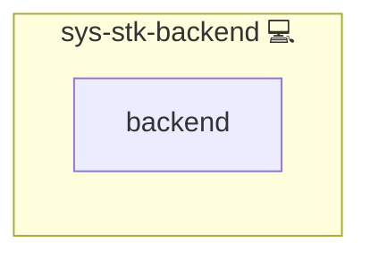

# Database Docker Composition

## Description

This role combines the central RDBMS role (`sys-svc-rdbms`) with Docker Compose to deliver a ready-to-use containerized database environment.

## Overview

This role combines Docker Compose with a central RDBMS role to automatically provision database containers with backup, user, and permission management.

## Cosmos

The diagram places Database Docker Composition in the Infinito.Nexus cosmos: the components it deploys (capabilities), the central services it consumes (dependencies), and its outward reach (federation and bridged external networks).

Solid `1:1` edges are fixed relationships; dashed `0..1` edges are conditional (enabled only in matching deployments). Node markers show the role's deploy modes (💻 host, 🐳 compose, 🐝 swarm); ❌ marks a service that is explicitly turned off, and ⚙️ an Ansible role dependency declared in `meta/main.yml`.

## Features

- **Central RDBMS Integration**  
  Includes the `sys-svc-rdbms` role, which handles backups, restores, user and permission management for your relational database system (PostgreSQL, MariaDB, etc.).

- **Docker Compose**  
  Utilizes the standalone `compose` role to define and bring up containers, networks, and volumes automatically.

The role will load both sub-roles and satisfy all dependencies transparently.

## Task Breakdown

1. **Set Fact** `database_application_id` to work around lazy‐loading ordering.
2. **Include Vars** in the specified order.
3. **Invoke** `compose` role to create containers, networks, and volumes.
4. **Invoke** `sys-svc-rdbms` role to provision the database, backups, and users.

## Credits

Implemented by **[Kevin Veen-Birkenbach](https://www.veen.world)**.
Part of the [Infinito.Nexus Project](https://s.infinito.nexus/code) and maintained by [Kevin Veen-Birkenbach](https://www.veen.world).
Licensed under the [Infinito.Nexus Community License (Non-Commercial)](https://s.infinito.nexus/license).
