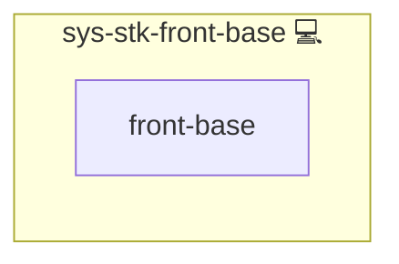

# Front Base (HTTPS + Cloudflare + Handlers)

## Description

**sys-stk-front-base** bootstraps the front layer that most web-facing apps need:

- Ensures the HTTPS base via `sys-svc-webserver-https`
- (Optional) Cloudflare bootstrap (zone lookup, dev mode, purge)
- Wires OpenResty/NGINX handlers
- Leaves per-domain certificate issuance to consumer roles (or pass-through vars to `sys-util-csp-cert` if needed)

> This role is intentionally small and reusable. It prepares the ground so app roles can just render their vHost.

## Overview

This role front bootstrap for web apps: HTTPS base, optional Cloudflare setup, and handler wiring.

## Cosmos

The diagram places Front Base (HTTPS + Cloudflare + Handlers) in the Infinito.Nexus cosmos: the components it deploys (capabilities), the central services it consumes (dependencies), and its outward reach (federation and bridged external networks).

Solid `1:1` edges are fixed relationships; dashed `0..1` edges are conditional (enabled only in matching deployments). Node markers show the role's deploy modes (💻 host, 🐳 compose, 🐝 swarm); ❌ marks a service that is explicitly turned off, and ⚙️ an Ansible role dependency declared in `meta/main.yml`.

## Features

- **Automated provisioning:** Configured by Ansible without manual steps.

## Responsibilities

- Include `sys-svc-webserver-https` (once per host)
- Include Cloudflare tasks when `DNS_PROVIDER == "cloudflare"`
- Load handler utilities (e.g., `svc-prx-openresty`)
- Stay domain-agnostic: expect `domain` to be provided by the consumer

## Outputs

- Handler wiring completed
- HTTPS base ready (NGINX, ACME webroot)
- Cloudflare prepared (optional)

## Credits

Implemented by **[Kevin Veen-Birkenbach](https://www.veen.world)**.
Part of the [Infinito.Nexus Project](https://s.infinito.nexus/code) and maintained by [Kevin Veen-Birkenbach](https://www.veen.world).
Licensed under the [Infinito.Nexus Community License (Non-Commercial)](https://s.infinito.nexus/license).
