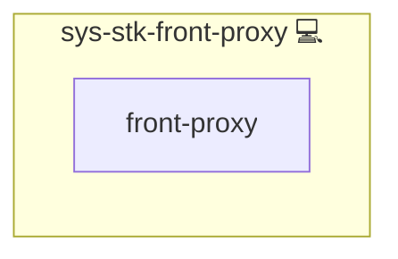

# NGINX Domain Setup

## Description

This role bootstraps **per-domain NGINX configuration**: it requests TLS certificates, applies global modifiers, deploys a ready-made vHost file, and can optionally lock down access via OAuth2.

## Overview

A higher-level orchestration wrapper, *sys-stk-front-proxy* ties together several lower-level roles:

1. **`sys-front-inj-all`** – applies global tweaks and includes.  
2. **`sys-svc-certs`** – obtains Let’s Encrypt certificates.  
3. **Domain template deployment** – copies a Jinja2 vHost from *sys-svc-proxy*.  
4. **`web-app-keycloak`'s SSO-proxy sidecar** *(optional)* – protects the site with OAuth2.

The result is a complete, reproducible domain rollout in a single playbook task.

## Cosmos

The diagram places NGINX Domain Setup in the Infinito.Nexus cosmos: the components it deploys (capabilities), the central services it consumes (dependencies), and its outward reach (federation and bridged external networks).

Solid `1:1` edges are fixed relationships; dashed `0..1` edges are conditional (enabled only in matching deployments). Node markers show the role's deploy modes (💻 host, 🐳 compose, 🐝 swarm); ❌ marks a service that is explicitly turned off, and ⚙️ an Ansible role dependency declared in `meta/main.yml`.

## Purpose

Provide **one-stop, idempotent domain provisioning** for NGINX-based homelabs or small production environments.

## Features

- **End-to-end TLS**: certificate retrieval and secure headers included.  
- **Template-driven vHosts**: choose *basic* or *ws_generic* flavours (or your own).  
- **Conditional OAuth2**: easily toggle authentication per application.  
- **Handler-safe**: automatically triggers an NGINX reload when templates change.  
- **Composable**: designed to be called repeatedly for many domains.

## Credits

Implemented by **[Kevin Veen-Birkenbach](https://www.veen.world)**.
Part of the [Infinito.Nexus Project](https://s.infinito.nexus/code) and maintained by [Kevin Veen-Birkenbach](https://www.veen.world).
Licensed under the [Infinito.Nexus Community License (Non-Commercial)](https://s.infinito.nexus/license).
