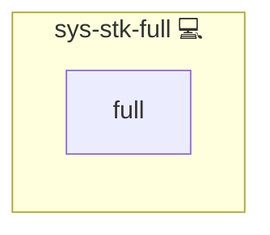

# Database Docker with Web Proxy

## Description

This role builds on `sys-stk-backend` by adding a reverse-proxy frontend for HTTP access to your database service.

## Overview

This role extends sys-stk-backend by adding an HTTP reverse proxy via sys-stk-front-proxy.

## Cosmos

The diagram places Database Docker with Web Proxy in the Infinito.Nexus cosmos: the components it deploys (capabilities), the central services it consumes (dependencies), and its outward reach (federation and bridged external networks).

Solid `1:1` edges are fixed relationships; dashed `0..1` edges are conditional (enabled only in matching deployments). Node markers show the role's deploy modes (💻 host, 🐳 compose, 🐝 swarm); ❌ marks a service that is explicitly turned off, and ⚙️ an Ansible role dependency declared in `meta/main.yml`.

## Features

- **Database Composition**  
  Leverages the `sys-stk-backend` role to stand up your containerized database (PostgreSQL, MariaDB, etc.) with backups and user management.

- **Reverse Proxy**  
  Includes the `sys-stk-front-proxy` role to configure a proxy (e.g. NGINX) for routing HTTP(S) traffic to your database UI or management endpoint.

## Credits

Implemented by **[Kevin Veen-Birkenbach](https://www.veen.world)**.
Part of the [Infinito.Nexus Project](https://s.infinito.nexus/code) and maintained by [Kevin Veen-Birkenbach](https://www.veen.world).
Licensed under the [Infinito.Nexus Community License (Non-Commercial)](https://s.infinito.nexus/license).
