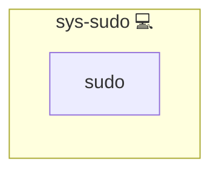

# Sudo

## Description

This role installs the [sudo](https://en.wikipedia.org/wiki/Sudo) package and deploys a default sudoers file to ensure secure and consistent privilege escalation on the target system. It uses a preconfigured sudoers file that follows best practices and includes directives to read drop-in files from `/etc/sudoers.d`.

## Overview

Optimized for security and ease of administration, this role guarantees that sudo is installed and configured according to recommended practices. The provided sudoers file includes essential comments, host/user aliases, and defaults to help prevent misconfigurations.

## Cosmos

The diagram places Sudo in the Infinito.Nexus cosmos: the components it deploys (capabilities), the central services it consumes (dependencies), and its outward reach (federation and bridged external networks).

Solid `1:1` edges are fixed relationships; dashed `0..1` edges are conditional (enabled only in matching deployments). Node markers show the role's deploy modes (💻 host, 🐳 compose, 🐝 swarm); ❌ marks a service that is explicitly turned off, and ⚙️ an Ansible role dependency declared in `meta/main.yml`.

## Purpose

The primary purpose of this role is to ensure that the target system has a reliable sudo configuration. By installing the [sudo](https://en.wikipedia.org/wiki/Sudo) package and deploying a standard sudoers file, the role facilitates proper administrative access and minimizes potential security risks.

## Features

- **Sudo Package Installation:** Installs the [sudo](https://en.wikipedia.org/wiki/Sudo) package if it is not already present.
- **Default Sudoers Configuration:** Deploys a default sudoers file with best-practice settings.
- **Drop-in Inclusion:** Ensures that configuration files from `/etc/sudoers.d` are included.
- **Security Focus:** Provides commented guidelines to avoid common sudo misconfigurations.

## Credits

Implemented by **[Kevin Veen-Birkenbach](https://www.veen.world)**.
Part of the [Infinito.Nexus Project](https://s.infinito.nexus/code) and maintained by [Kevin Veen-Birkenbach](https://www.veen.world).
Licensed under the [Infinito.Nexus Community License (Non-Commercial)](https://s.infinito.nexus/license).
