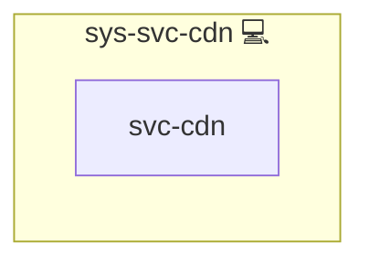

# Content Delivery Network

CDN helper role for building a consistent asset tree, URLs, and on-disk layout.

## Description

Provides compact filters and defaults to define CDN paths, turn them into public URLs, collect required directories, and prepare the filesystem (including a `latest` release link).

## Overview

Defines a per-role CDN structure under `roles/<application_id>/<version>` plus shared and vendor areas. Exposes ready-to-use variables (`cdn`, `cdn_dirs`, `cdn_urls`) and ensures directories exist. Optionally links the current release to `latest`.

## Cosmos

The diagram places Content Delivery Network in the Infinito.Nexus cosmos: the components it deploys (capabilities), the central services it consumes (dependencies), and its outward reach (federation and bridged external networks).

Solid `1:1` edges are fixed relationships; dashed `0..1` edges are conditional (enabled only in matching deployments). Node markers show the role's deploy modes (💻 host, 🐳 compose, 🐝 swarm); ❌ marks a service that is explicitly turned off, and ⚙️ an Ansible role dependency declared in `meta/main.yml`.

## Features

* Jinja filters: `cdn_paths`, `cdn_urls`, `cdn_dirs`
* Variables: `CDN_ROOT`, `CDN_VERSION`, `CDN_BASE_URL`, `cdn`, `cdn_dirs`, `cdn_urls`
* Creates shared/vendor/release directories
* Maintains `roles/<id>/latest` symlink (when version ≠ `latest`)
* Plays nicely with `web-svc-cdn` without circular inclusion

## Credits

Implemented by **[Kevin Veen-Birkenbach](https://www.veen.world)**.
Part of the [Infinito.Nexus Project](https://s.infinito.nexus/code) and maintained by [Kevin Veen-Birkenbach](https://www.veen.world).
Licensed under the [Infinito.Nexus Community License (Non-Commercial)](https://s.infinito.nexus/license).
