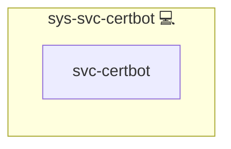

# Certbot

## Description

This Ansible role automates the installation and configuration of [Certbot](https://certbot.eff.org/), a free and open-source tool for automating the deployment of [Let's Encrypt](https://letsencrypt.org/) certificates. It also handles the setup of DNS plugins for ACME challenges.

## Overview

Optimized for Archlinux, this role ensures secure SSL/TLS certificate generation with minimal manual intervention. It supports both `webroot` and `DNS-01` validation methods, providing flexibility based on your infrastructure needs.

### Key Features

- **Automatic Installation:** Installs `certbot` and the necessary DNS plugin via pacman.
- **Dynamic DNS Plugin Support:** Automatically installs the correct `certbot-dns-<provider>` package based on your selected challenge method.
- **Credential Management:** Creates secure credential files for DNS API tokens when using DNS-01 validation.
- **Idempotent Execution:** Tasks are intelligently executed only once per playbook run.

## Cosmos

The diagram places Certbot in the Infinito.Nexus cosmos: the components it deploys (capabilities), the central services it consumes (dependencies), and its outward reach (federation and bridged external networks).

Solid `1:1` edges are fixed relationships; dashed `0..1` edges are conditional (enabled only in matching deployments). Node markers show the role's deploy modes (💻 host, 🐳 compose, 🐝 swarm); ❌ marks a service that is explicitly turned off, and ⚙️ an Ansible role dependency declared in `meta/main.yml`.

## Purpose

The Certbot role provides a ready-to-use, automated solution for SSL/TLS management in your infrastructure. Whether you're managing traditional servers or containerized environments, this role ensures your certificates are always in place and valid.

## Features

- **Certbot Installation:** Ensures the latest version of Certbot is installed.
- **DNS Plugin Installation:** Installs a matching plugin based on your configured ACME challenge method.
- **Credential Directory Management:** Creates a secured `/etc/certbot` directory with proper permissions.
- **API Token File Setup:** Manages API token files securely for DNS challenge authentication.

## Learn More

- [Certbot Official Website](https://certbot.eff.org/)
- [Let's Encrypt](https://letsencrypt.org/)
- [ACME Challenge Types (Wikipedia)](https://en.wikipedia.org/wiki/Automated_Certificate_Management_Environment)

## Credits

Implemented by **[Kevin Veen-Birkenbach](https://www.veen.world)**.
Part of the [Infinito.Nexus Project](https://s.infinito.nexus/code) and maintained by [Kevin Veen-Birkenbach](https://www.veen.world).
Licensed under the [Infinito.Nexus Community License (Non-Commercial)](https://s.infinito.nexus/license).
