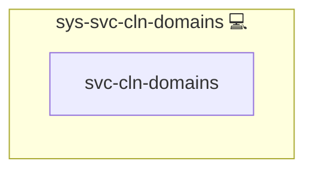

# sys-svc-cln-domains

## Description

This Ansible role removes NGINX configuration files and revokes and deletes Certbot certificates for domains marked as deprecated.

## Overview

Optimized for idempotent cleanup operations, this role:

- Deletes NGINX server configuration files in `/etc/NGINX/conf.d/http/servers/` for each domain listed in `deprecated_domains`.
- Revokes and deletes corresponding Certbot certificates.
- Ensures cleanup tasks execute only once per playbook run.
- Notifies NGINX to restart after removing configurations.

## Cosmos

The diagram places sys-svc-cln-domains in the Infinito.Nexus cosmos: the components it deploys (capabilities), the central services it consumes (dependencies), and its outward reach (federation and bridged external networks).

Solid `1:1` edges are fixed relationships; dashed `0..1` edges are conditional (enabled only in matching deployments). Node markers show the role's deploy modes (💻 host, 🐳 compose, 🐝 swarm); ❌ marks a service that is explicitly turned off, and ⚙️ an Ansible role dependency declared in `meta/main.yml`.

## Purpose

Streamline the decommissioning of outdated or deprecated domains by automating the removal of NGINX server blocks and their SSL certificates.

## Features

- **NGINX Cleanup:** Safely removes server configuration files.
- **Certbot Integration:** Revokes and deletes certificates without manual intervention.
- **Idempotent Execution:** Utilizes a `run_once` flag to prevent repeated runs.
- **Service Notification:** Triggers an NGINX restart handler upon cleanup.

## Credits

Implemented by **[Kevin Veen-Birkenbach](https://www.veen.world)**.
Part of the [Infinito.Nexus Project](https://s.infinito.nexus/code) and maintained by [Kevin Veen-Birkenbach](https://www.veen.world).
Licensed under the [Infinito.Nexus Community License (Non-Commercial)](https://s.infinito.nexus/license).
