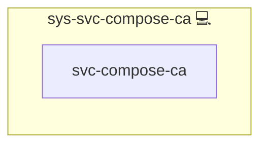

# sys-svc-compose-ca

## Description

Internal helper role that installs CA-trust injection assets used by Docker
Compose stacks. It ships a small wrapper plus the `inject` script and
validates that the project CA certificate is present on the host before
container builds rely on it.

## Overview

This role installs CA trust injection assets for compose (wrapper + inject
script) and validates CA cert presence.

## Cosmos

The diagram places sys-svc-compose-ca in the Infinito.Nexus cosmos: the components it deploys (capabilities), the central services it consumes (dependencies), and its outward reach (federation and bridged external networks).

Solid `1:1` edges are fixed relationships; dashed `0..1` edges are conditional (enabled only in matching deployments). Node markers show the role's deploy modes (💻 host, 🐳 compose, 🐝 swarm); ❌ marks a service that is explicitly turned off, and ⚙️ an Ansible role dependency declared in `meta/main.yml`.

## Features

- **Automated provisioning:** Configured by Ansible without manual steps.

## Credits

Implemented by **[Kevin Veen-Birkenbach](https://www.veen.world)**.
Part of the [Infinito.Nexus Project](https://s.infinito.nexus/code) and maintained by [Kevin Veen-Birkenbach](https://www.veen.world).
Licensed under the [Infinito.Nexus Community License (Non-Commercial)](https://s.infinito.nexus/license).
