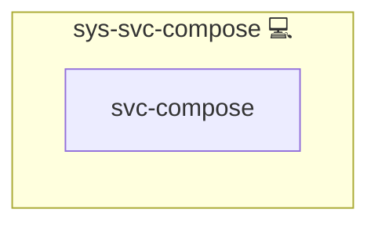

# Docker Compose

## Description

This Ansible role manages Docker Compose project structures and workflows for applications on Arch Linux. It creates dedicated instance directories, manages `.env` and `compose.yml` files, and provides automation logic for project reset, rebuild, and startup sequences.

Refer to the [Docker Compose documentation](https://docs.docker.com/compose/) and the [Arch Wiki – Docker](https://wiki.archlinux.org/title/Docker) for more details.

## Overview

This role creates a flexible directory layout for managing Docker Compose projects across environments. It ensures directories are initialized, optionally reset, and kept clean using internal flags like `MODE_RESET` or `MODE_CLEANUP`.

## Cosmos

The diagram places Docker Compose in the Infinito.Nexus cosmos: the components it deploys (capabilities), the central services it consumes (dependencies), and its outward reach (federation and bridged external networks).

Solid `1:1` edges are fixed relationships; dashed `0..1` edges are conditional (enabled only in matching deployments). Node markers show the role's deploy modes (💻 host, 🐳 compose, 🐝 swarm); ❌ marks a service that is explicitly turned off, and ⚙️ an Ansible role dependency declared in `meta/main.yml`.

## Purpose

To offer a centralized, extensible system for managing containerized applications using Docker Compose within the Infinito.Nexus architecture. The role allows easy integration of services, secrets, configurations, and custom behaviors per application.

## Features

- **Dynamic Directory Structure:** Creates per-application instance folders for Compose setups.
- **Reset Logic:** Cleans previous Compose project files and data when `MODE_RESET` is enabled.
- **Handlers for Runtime Control:** Automatically builds, sets up, or restarts containers based on handlers.
- **Template-ready Service Files:** Predefined service base and health check templates.
- **Integration Support:** Compatible with `sys-svc-proxy` and other Infinito.Nexus service roles.

## Credits

Implemented by **[Kevin Veen-Birkenbach](https://www.veen.world)**.
Part of the [Infinito.Nexus Project](https://s.infinito.nexus/code) and maintained by [Kevin Veen-Birkenbach](https://www.veen.world).
Licensed under the [Infinito.Nexus Community License (Non-Commercial)](https://s.infinito.nexus/license).
