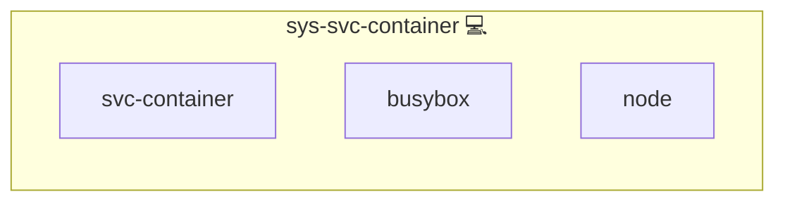

# Docker Server

## Description

This role installs and maintains the Docker service, including Docker Compose, on Linux systems.  
It is part of the [Infinito.Nexus Project](https://s.infinito.nexus/code), maintained and developed by [Kevin Veen-Birkenbach](https://www.veen.world/).

## Overview

The role ensures that Docker and Docker Compose are present, integrates essential backup, repair, and health check roles, and supports cleanup or full reset modes for a fresh Docker environment.  
When enabled via `MODE_CLEANUP` or `MODE_RESET`, it will automatically prune unused Docker resources.  
`MODE_RESET` additionally restarts the Docker service after cleanup.

## Cosmos

The diagram places Docker Server in the Infinito.Nexus cosmos: the components it deploys (capabilities), the central services it consumes (dependencies), and its outward reach (federation and bridged external networks).

Solid `1:1` edges are fixed relationships; dashed `0..1` edges are conditional (enabled only in matching deployments). Node markers show the role's deploy modes (💻 host, 🐳 compose, 🐝 swarm); ❌ marks a service that is explicitly turned off, and ⚙️ an Ansible role dependency declared in `meta/main.yml`.

## Features

- **Automated Installation**  
  Installs Docker and Docker Compose via the system package manager.

- **Integrated Dependencies**  
  Includes backup, repair, and health check sub-roles
  
- **Cleanup & Reset Modes**  
  - `MODE_CLEANUP`: Removes unused Docker containers, networks, images, and volumes.  
  - `MODE_RESET`: Performs cleanup and restarts the Docker service.

- **Handler Integration**  
  Restart handler ensures the Docker daemon is reloaded when necessary.

## License

This role is released under the Infinito.Nexus Community License (Non-Commercial) (CNCL).  
See [license details](https://s.infinito.nexus/license).

## Credits

Implemented by **[Kevin Veen-Birkenbach](https://www.veen.world)**.
Part of the [Infinito.Nexus Project](https://s.infinito.nexus/code) and maintained by [Kevin Veen-Birkenbach](https://www.veen.world).
Licensed under the [Infinito.Nexus Community License (Non-Commercial)](https://s.infinito.nexus/license).
