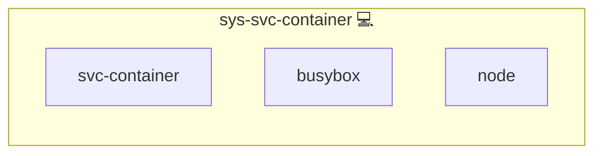

# Docker Server

## Description

This role installs and maintains the Docker service, including Docker Compose, on Linux systems.  
It is part of the [Infinito.Nexus Project](https://s.infinito.nexus/code), maintained and developed by [Kevin Veen-Birkenbach](https://www.veen.world/).

## Overview

The role ensures that Docker and Docker Compose are present, integrates essential backup, repair, and health check roles, and supports cleanup or full reset modes for a fresh Docker environment.  
When enabled via `MODE_CLEANUP` or `MODE_RESET`, it will automatically prune unused Docker resources.  
`MODE_RESET` additionally restarts the Docker service after cleanup.

## Cosmos

The diagram places Docker Server in the Infinito.Nexus cosmos: the components it deploys (capabilities), the central services it consumes (dependencies), and its outward reach (federation and bridged external networks).


```mermaid
flowchart LR
    subgraph role [sys-svc-container 💻]
        svc_svc_container["svc-container"]
        svc_busybox["busybox"]
        svc_node["node"]
    end
```

Solid `1:1` edges are fixed relationships; dashed `0..1` edges are conditional (enabled only in matching deployments); red `0..0` edges are turned off in this role. Node markers show the role's deploy modes (💻 host, 🐳 compose, 🐝 swarm); ❌ marks a service that is explicitly turned off, and ⚙️ an Ansible role dependency declared in `meta/main.yml`.

## Features

- **Automated Installation**  
  Installs Docker and Docker Compose via the system package manager.

- **Integrated Dependencies**  
  Includes backup, repair, and health check sub-roles
  
- **Cleanup & Reset Modes**  
  - `MODE_CLEANUP`: Removes unused Docker containers, networks, images, and volumes.  
  - `MODE_RESET`: Performs cleanup and restarts the Docker service.

- **Handler Integration**  
  Restart handler ensures the Docker daemon is reloaded when necessary.

## Credits

Implemented by **[Kevin Veen-Birkenbach](https://social.infinito.nexus/profile/kevinveenbirkenbach/profile)**.
Part of the [Infinito.Nexus Project](https://s.infinito.nexus/code) and maintained by [Kevin Veen-Birkenbach](https://www.veen.world).
Licensed under the [Infinito.Nexus Community License (Non-Commercial)](https://s.infinito.nexus/license).

## Resource limits

[resource.yml.j2](templates/resource.yml.j2) renders the compose `cpus`, `mem_reservation`, `mem_limit` and `pids_limit` of every service, and [deploy.yml.j2](templates/deploy.yml.j2) renders the swarm equivalents. Each value comes from `services.<service>.<key>` of the role's `meta/services.yml`, overridable per host in the inventory, and falls back to the fair share `lookup('resource', …)` computes from the host.

`cpus` also takes a percentage, which is read against `RESOURCE_HOST_CPUS`: the host's raw core count, without the two-CPU host reserve and without the division by running containers that the fair-share default applies. `100%` is the whole machine, `50%` is half of it:

```yaml
applications:
  web-app-docs:
    services:
      docs:
        cpus: 50%
```

A percentage is the only portable way to size against the machine. Docker refuses a `cpus` above the host's core count (`range of CPUs is from 0.01 to N.00`), so `cpus: "4"` is a hard failure on a two-core host while `50%` is valid everywhere. `100%` resolves to exactly that ceiling and can never be rejected.

Shares are rounded to `0.01`, Docker's granularity, and never fall below it. A percentage above 100 is refused, and so is a bare `cpus: 0` — Docker reads a zero as *uncapped* rather than as none, so it has to be written as `100%` to mean the machine.

A role that needs the number itself, to size a worker pool or a thread count, reads it with [`lookup('cpus', application_id, '<service>')`](../../plugins/lookup/cpus.py). Reaching for `services.<service>.cpus` through `lookup('config', …)` returns the raw text and would size that pool from the string `95%`.

Two limits:

- It caps, it does not reserve. Handing one container every CPU removes the backpressure that keeps it from crowding out a parallel deploy, and nothing stops several services from each claiming `100%`.
- The resource budget the `ressources` CLI and the variant lint compute parses `cpus` as a plain float, so a service written as a percentage contributes nothing to that total.

## License

This role is released under the Infinito.Nexus Community License (Non-Commercial) (CNCL).  
See [license details](https://s.infinito.nexus/license).
