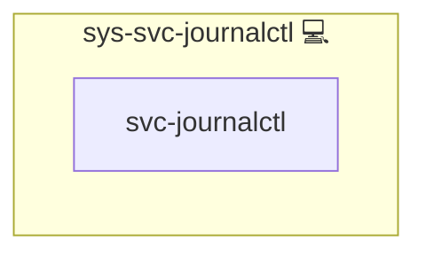

# Journalctl

This Ansible role manages the configuration of `systemd-journald` on target hosts.

## Description

- Copies a customized `journald.conf` to `/etc/systemd/journald.conf`  
- Ensures log retention for one week  
- Restarts the `systemd-journald` service when configuration changes  
- Supports live log streaming via `journalctl -f`

## Overview

1. **Template deployment**  
   The role places your `journald.conf.j2` template into `/etc/systemd/journald.conf`.
2. **Service handler**  
   On change, it notifies a handler to restart `systemd-journald`.
3. **Monitoring**  
   You can follow logs in real time with `journalctl -f`.

## Cosmos

The diagram places Journalctl in the Infinito.Nexus cosmos: the components it deploys (capabilities), the central services it consumes (dependencies), and its outward reach (federation and bridged external networks).



Solid `1:1` edges are fixed relationships; dashed `0..1` edges are conditional (enabled only in matching deployments). Node markers show the role's deploy modes (💻 host, 🐳 compose, 🐝 swarm); ❌ marks a service that is explicitly turned off, and ⚙️ an Ansible role dependency declared in `meta/main.yml`.

## Features

- Customizable retention and runtime limits  
- Seamless restarts on config update  
- Integration with `sys-ctl-hlth-journalctl` for downstream monitoring

## Usage

```yaml
- hosts: all
  roles:
    - role: sys-svc-journalctl
```

## Credits

Implemented by **[Kevin Veen-Birkenbach](https://www.veen.world)**.
Part of the [Infinito.Nexus Project](https://s.infinito.nexus/code) and maintained by [Kevin Veen-Birkenbach](https://www.veen.world).
Licensed under the [Infinito.Nexus Community License (Non-Commercial)](https://s.infinito.nexus/license).
