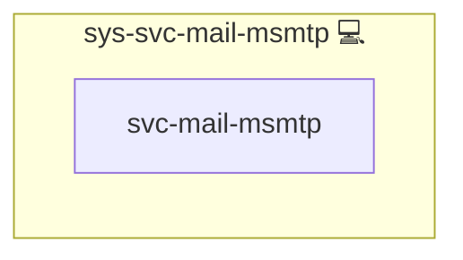

# msmtp

## Description

This Ansible role installs and configures **msmtp** (plus optional sendmail compatibility) across the default Infinito distro set: Arch Linux, Debian, Ubuntu, Fedora and CentOS. It provides a lightweight SMTP client that serves as a drop-in replacement for traditional sendmail workflows, enabling reliable email delivery via an external SMTP server. For more background on SMTP, see [SMTP on Wikipedia](https://en.wikipedia.org/wiki/SMTP).

## Overview

The role installs **msmtp**, handles distro-specific package differences (including EPEL bootstrap on EL-family hosts when required), and deploys a pre-configured `msmtprc` file via Jinja2. For distros without a dedicated `msmtp-mta` package, it configures a direct `/usr/bin/sendmail` compatibility symlink to `msmtp`.

## Cosmos

The diagram places msmtp in the Infinito.Nexus cosmos: the components it deploys (capabilities), the central services it consumes (dependencies), and its outward reach (federation and bridged external networks).

Solid `1:1` edges are fixed relationships; dashed `0..1` edges are conditional (enabled only in matching deployments). Node markers show the role's deploy modes (💻 host, 🐳 compose, 🐝 swarm); ❌ marks a service that is explicitly turned off, and ⚙️ an Ansible role dependency declared in `meta/main.yml`.

## Purpose

The purpose of this role is to automate the setup of a lightweight SMTP client that acts as a sendmail replacement. By configuring msmtp, the role facilitates direct email sending using your SMTP server credentials, making it a simple yet effective solution for system notifications and other email-based communications.

## Features

- **Installs msmtp cross-distro:** Uses distro-aware package handling for Arch, Debian, Ubuntu, Fedora, and CentOS.
- **Handles sendmail compatibility:** Installs `msmtp-mta` where available, otherwise provisions a compatible sendmail symlink.
- **Customizable SMTP Configuration:** Deploys a customizable msmtprc configuration file with parameters for TLS, authentication, and server details.
- **Drop-in sendmail Replacement:** Configures msmtp to serve as the default sendmail command.
- **Idempotent Setup:** Ensures the tasks run only once with internal flagging.
- **Integration Ready:** Easily integrates with other system roles within the Infinito.Nexus environment for automated notifications.

## Credits

Implemented by **[Kevin Veen-Birkenbach](https://www.veen.world)**.
Part of the [Infinito.Nexus Project](https://s.infinito.nexus/code) and maintained by [Kevin Veen-Birkenbach](https://www.veen.world).
Licensed under the [Infinito.Nexus Community License (Non-Commercial)](https://s.infinito.nexus/license).
