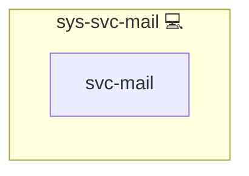

# sys-svc-mail

## Description

The `sys-svc-mail` role acts as the **central mail orchestration layer** in the Infinito.Nexus stack.  
It wires together:

- [Stalwart](https://stalw.art/) as a full-featured mail server (when available),
- [msmtp](https://marlam.de/msmtp/) as a lightweight sendmail-compatible SMTP client, and
- an optional local SMTP relay (Postfix) for hosts **without** Stalwart.

For more background on the underlying protocol, see [Simple Mail Transfer Protocol (SMTP) on Wikipedia](https://en.wikipedia.org/wiki/Simple_Mail_Transfer_Protocol).

## Overview

This role provides a **unified mail setup** for your hosts:

- If the host is part of the active mail provider's group (`MAIL_PROVIDER`), it:
  - asserts the provider endpoint was preloaded (submission token present),
  - and prepares the system to send emails through the provider using the `sys-svc-mail-msmtp` role.

- If the host is **not** running Stalwart, it:
  - optionally configures a local SMTP relay via `sys-svc-mail-smtp` (Postfix on `localhost:25`),
  - and still configures `msmtp` as a sendmail-compatible client.

This makes `sys-svc-mail` the canonical entrypoint for “mail capabilities” on a node, abstracting away whether the actual delivery happens via Stalwart or a local relay.

## Cosmos

The diagram places sys-svc-mail in the Infinito.Nexus cosmos: the components it deploys (capabilities), the central services it consumes (dependencies), and its outward reach (federation and bridged external networks).

Solid `1:1` edges are fixed relationships; dashed `0..1` edges are conditional (enabled only in matching deployments). Node markers show the role's deploy modes (💻 host, 🐳 compose, 🐝 swarm); ❌ marks a service that is explicitly turned off, and ⚙️ an Ansible role dependency declared in `meta/main.yml`.

## Purpose

The main purpose of this role is to:

- Provide a **consistent mail-sending interface** for all hosts in the Infinito.Nexus ecosystem.
- Automatically choose between:
  - **Stalwart-backed delivery** (with authentication tokens), or
  - a **local SMTP relay on localhost**,
  depending on the presence of `web-app-stalwart` in the host’s groups.
- Ensure that system services and applications can always send notifications (e.g. health checks, alerts, job results) without each role having to care about the underlying mail plumbing.

## Features

- 🔄 **Mail-provider integration (when available)**  
  - Asserts the active provider's submission token was provisioned before configuring external mail.  
  - Routes outbound mail through the provider via `sys-svc-mail-msmtp`.

- 💡 **Smart Fallback to Localhost**  
  - If no `web-app-stalwart` is present, the role can configure a local Postfix-based SMTP relay via `sys-svc-mail-smtp`.  
  - Combined with `sys-svc-mail-msmtp`, this enables sending mail via `localhost:25` without additional configuration in other roles.

- 📨 **msmtp Client Configuration**  
  - Delegates installation and configuration of msmtp to `sys-svc-mail-msmtp`.  
  - Supports both authenticated Stalwart delivery and unauthenticated localhost-based delivery.

- 🧩 **Composable Design**  
  - Uses internal `run_once_*` flags to avoid repeated setup.  
  - Cleanly integrates with the Infinito.Nexus stack and shared utilities.

## Further Resources

- Mail server:
  - Stalwart: <https://stalw.art/>
  - SMTP (protocol): <https://en.wikipedia.org/wiki/Simple_Mail_Transfer_Protocol>
- SMTP client:
  - msmtp: <https://marlam.de/msmtp/>
  - msmtp on Wikipedia: <https://en.wikipedia.org/wiki/Msmtp>
- Infinito.Nexus:
  - Main repository: <https://s.infinito.nexus/code>
  - Documentation: <https://docs.infinito.nexus>

## Credits

Implemented by **[Kevin Veen-Birkenbach](https://www.veen.world)**.
Part of the [Infinito.Nexus Project](https://s.infinito.nexus/code) and maintained by [Kevin Veen-Birkenbach](https://www.veen.world).
Licensed under the [Infinito.Nexus Community License (Non-Commercial)](https://s.infinito.nexus/license).
