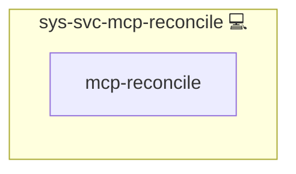

# sys-svc-mcp-reconcile

## Description

Post-application MCP convergence for every deployed client, run at the **end of a play** once all providers have provisioned.

## Overview

This role re-invokes each deployed MCP client's own reconciliation from the complete provider set.

## Cosmos

The diagram places sys-svc-mcp-reconcile in the Infinito.Nexus cosmos: the components it deploys (capabilities), the central services it consumes (dependencies), and its outward reach (federation and bridged external networks).



Solid `1:1` edges are fixed relationships; dashed `0..1` edges are conditional (enabled only in matching deployments). Node markers show the role's deploy modes (💻 host, 🐳 compose, 🐝 swarm); ❌ marks a service that is explicitly turned off, and ⚙️ an Ansible role dependency declared in `meta/main.yml`.

## Features

- Converges every deployed MCP client from one complete provider set.
- Enumerates the clients from their own declarations, so a new client role joins by declaring one.
- Skips any client that is not deployed on this host, or whose `mcp` block is disabled or unshared.

## How it works

A provider writes its credential to the token store during its own role run, and each client resolves the providers it
may reach from that store. This role runs at the end of the server stage, after every provider has written and before
the end-to-end tests read the converged state.

The client list comes from [`roles_with_service`](../../plugins/lookup/roles_with_service.py) with `topic='mcp'` and
`direction='client'`, which returns the roles on this host whose `meta/mcp.yml` declares a client side and is both
enabled and shared. Each is then included through the entrypoint every client role carries:

```yaml
tasks_from: utils/mcp.yml
```

`tasks/utils/` is the repository's home for unnumbered, includable task files, so the entrypoint carries no step number.

That file brings the client to its desired MCP state from scratch, so the same file serves the role's own run and this
one. `tests/lint/ansible/services/test_mcp_client_entrypoint.py` fails when a client role lacks it.

## Further Resources

- [Model Context Protocol](https://modelcontextprotocol.io/)

## Credits

Implemented by **[Kevin Veen-Birkenbach](https://www.veen.world)**.
Part of the [Infinito.Nexus Project](https://s.infinito.nexus/code) and maintained by [Kevin Veen-Birkenbach](https://www.veen.world).
Licensed under the [Infinito.Nexus Community License (Non-Commercial)](https://s.infinito.nexus/license).
