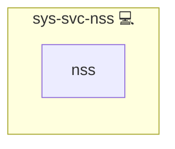

# NSS

## Description

This Ansible role guarantees that a target resolves the `*.localhost` names it serves, without going through DNS.

## Overview

A deployment that keeps the shipped `DOMAIN_PRIMARY` serves names under `infinito.localhost`. Those exist in no zone, so a task that reaches the deployment's own domain from the host depends on the `myhostname` NSS module, which maps any `*.localhost` name to loopback per RFC 6761.

- Installs the module where it is packaged separately (Debian family) and no-ops where it ships inside systemd (Arch, RedHat)
- Appends `myhostname` to the `hosts:` line of `/etc/nsswitch.conf`, idempotently
- Runs once per play

## Cosmos

The diagram places NSS in the Infinito.Nexus cosmos: the components it deploys (capabilities), the central services it consumes (dependencies), and its outward reach (federation and bridged external networks).

Solid `1:1` edges are fixed relationships; dashed `0..1` edges are conditional (enabled only in matching deployments); red `0..0` edges are turned off in this role. Node markers show the role's deploy modes (💻 host, 🐳 compose, 🐝 swarm); ❌ marks a service that is explicitly turned off, and ⚙️ an Ansible role dependency declared in `meta/main.yml`.

## Features

- **Distro-agnostic:** the package list is empty on families that ship the module with systemd
- **Idempotent:** both tasks are no-ops once the module is present
- **Narrow:** it configures name resolution and nothing else, so callers that only need resolution do not also change the system hostname

## Credits

Implemented by **Kevin Veen-Birkenbach**.
Part of the [Infinito.Nexus Project](https://s.infinito.nexus/code) and maintained by [Kevin Veen-Birkenbach](https://www.veen.world).
Licensed under the [Infinito.Nexus Community License (Non-Commercial)](https://s.infinito.nexus/license).
