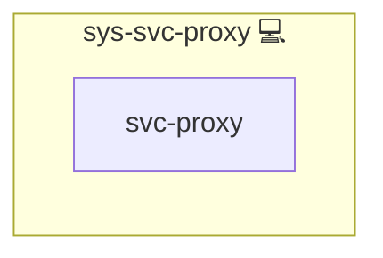

# NGINX Docker Reverse Proxy

## Description

This Ansible role deploys **NGINX** as a high-performance [reverse proxy](https://en.wikipedia.org/wiki/Reverse_proxy) in front of Docker-hosted services.  
It provides automatic TLS integration, WebSocket support, and a flexible templating system for per-application configuration.

## Overview

Optimised for Arch Linux, the role installs NGINX, prepares opinionated configuration snippets and exposes a simple interface for other roles to drop in new virtual-hosts.  
It plays well with **Let’s Encrypt**, **OAuth2 Proxy**, and your existing Docker stack.

## Cosmos

The diagram places NGINX Docker Reverse Proxy in the Infinito.Nexus cosmos: the components it deploys (capabilities), the central services it consumes (dependencies), and its outward reach (federation and bridged external networks).

Solid `1:1` edges are fixed relationships; dashed `0..1` edges are conditional (enabled only in matching deployments). Node markers show the role's deploy modes (💻 host, 🐳 compose, 🐝 swarm); ❌ marks a service that is explicitly turned off, and ⚙️ an Ansible role dependency declared in `meta/main.yml`.

## Purpose

The goal of this role is to deliver a **hassle-free, production-ready reverse proxy** for self-hosted containers, suitable for homelabs and small-scale production workloads.

## Features

- **Automatic TLS & HSTS**: integrates with the *sys-svc-webserver-https* role for certificate management.  
- **Flexible vHost templates**: *basic* and *ws_generic* flavours cover standard HTTP and WebSocket applications.  
- **Security headers**: sensible defaults plus optional X-Frame-Options / CSP based on application settings.  
- **WebSocket & HTTP/2 aware**: upgrades, keep-alive tuning, and gzip already configured.  
- **OAuth2 gating**: drop-in support when *web-app-keycloak's SSO-proxy sidecar* is present.  
- **Modular includes**: headers, locations, and global snippets are factored for easy extension.

## Credits

Implemented by **[Kevin Veen-Birkenbach](https://www.veen.world)**.
Part of the [Infinito.Nexus Project](https://s.infinito.nexus/code) and maintained by [Kevin Veen-Birkenbach](https://www.veen.world).
Licensed under the [Infinito.Nexus Community License (Non-Commercial)](https://s.infinito.nexus/license).
