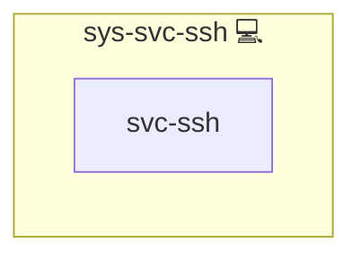

# SSH Service (Client)

## Description

This role installs the SSH client packages required to enable secure remote access and key-based authentication on Linux systems. It ensures that the appropriate SSH client is installed depending on the target distribution and that the installation is executed only once.

The role provides the foundation for SSH-based workflows and is designed to be used as a dependency by other roles that require SSH functionality.

## Overview

Optimized for portability and idempotency, this role performs the following tasks:

- Installs the SSH client using the system package manager
- Automatically selects the correct package name for the target Linux distribution
- Ensures the installation runs only once using a shared run-once mechanism
- Serves as a reusable system-level SSH dependency for other roles

## Cosmos

The diagram places SSH Service (Client) in the Infinito.Nexus cosmos: the components it deploys (capabilities), the central services it consumes (dependencies), and its outward reach (federation and bridged external networks).

Solid `1:1` edges are fixed relationships; dashed `0..1` edges are conditional (enabled only in matching deployments). Node markers show the role's deploy modes (💻 host, 🐳 compose, 🐝 swarm); ❌ marks a service that is explicitly turned off, and ⚙️ an Ansible role dependency declared in `meta/main.yml`.

## Purpose

The primary purpose of this role is to guarantee that an SSH client is available on the system before executing any SSH-related operations, such as key generation, remote access, or automated provisioning.

It is intentionally lightweight and does **not** configure the SSH server or modify SSH configuration files.

## Supported Distributions

The role installs the correct SSH client package for the following platforms:

- Debian / Ubuntu → `openssh-client`
- Arch Linux → `openssh`
- Fedora / Red Hat / CentOS → `openssh-clients`
- Alpine Linux → `openssh-client`

## Features

- **Distribution-aware package selection**
- **Idempotent execution** using a run-once flag
- **Minimal scope** (client-only, no server configuration)
- **Reusable dependency role** for higher-level SSH workflows
- **Best practices compliant** with modern SSH usage

## Credits

Implemented by **[Kevin Veen-Birkenbach](https://www.veen.world)**.
Part of the [Infinito.Nexus Project](https://s.infinito.nexus/code) and maintained by [Kevin Veen-Birkenbach](https://www.veen.world).
Licensed under the [Infinito.Nexus Community License (Non-Commercial)](https://s.infinito.nexus/license).
