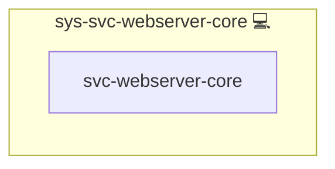

# Webserver

## Description

This Ansible role installs and configures **NGINX** as a core HTTP/stream server on Arch Linux systems. It provides:

* **HTTP serving** with MIME types, gzip compression, caching, and custom `NGINX.conf` templating.
* **TCP/UDP stream support** via the NGINX Streams module.
* **Directory management** for configuration, `sites-available`/`enabled`, cache, and data.
* **Debugging helpers**: log formats and instructions for general and detailed troubleshooting.

## Overview

This role installs and configures Nginx HTTP and stream modules with performance-tuned defaults.

## Cosmos

The diagram places Webserver in the Infinito.Nexus cosmos: the components it deploys (capabilities), the central services it consumes (dependencies), and its outward reach (federation and bridged external networks).

Solid `1:1` edges are fixed relationships; dashed `0..1` edges are conditional (enabled only in matching deployments). Node markers show the role's deploy modes (💻 host, 🐳 compose, 🐝 swarm); ❌ marks a service that is explicitly turned off, and ⚙️ an Ansible role dependency declared in `meta/main.yml`.

## Features

* **Package installation** of `NGINX` and `NGINX-mod-stream`.
* **Idempotent setup**: tasks run only once per host.
* **Configurable reset and cleanup** modes to purge and recreate directories.
* **Custom `NGINX.conf`** template with sensible defaults for performance and security.
* **Stream proxy support**: includes `stream` block for TCP/UDP proxies.
* **Cache directory management**: cleanup and recreation based on `MODE_CLEANUP`.

## Debugging Tips

* **General logs**: `journalctl -f -u NGINX`
* **Filter by host**: `journalctl -u NGINX -f | grep "{{ inventory_hostname }}"`
* **Enable detailed format**: set `MODE_DEBUG: true` and reload NGINX.

## Credits

Implemented by **[Kevin Veen-Birkenbach](https://www.veen.world)**.
Part of the [Infinito.Nexus Project](https://s.infinito.nexus/code) and maintained by [Kevin Veen-Birkenbach](https://www.veen.world).
Licensed under the [Infinito.Nexus Community License (Non-Commercial)](https://s.infinito.nexus/license).
