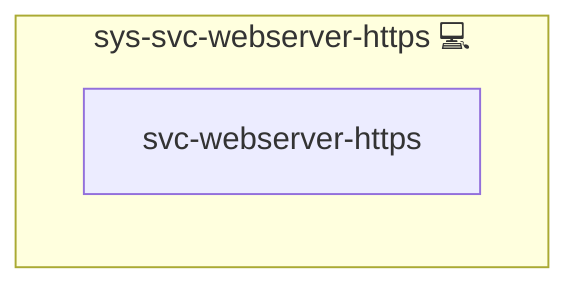

# Webserver HTTPS Provisioning

## Description

The **sys-svc-webserver-https** role extends a basic NGINX installation by wiring in everything you need to serve content over HTTPS:

1. Ensures your NGINX server is configured for SSL/TLS.
2. Pulls in Let’s Encrypt ACME challenge handling.
3. Applies global cleanup of unused domain configs.

This role is built on top of your existing `sys-svc-webserver-core` role, and it automates the end-to-end process of turning HTTP sites into secure HTTPS sites.

---

## Overview

When you apply **sys-svc-webserver-https**, it will:

1. **Include** the `sys-svc-webserver-core` role to install and configure NGINX.  
2. **Clean up** any stale vHost files under `sys-svc-cln-domains`.  
3. **Deploy** the Let’s Encrypt challenge-and-redirect snippet from `sys-svc-letsencrypt`.  
4. **Reload** NGINX automatically when any template changes.

All tasks are idempotent. Once your certificates are in place and your configuration is set, Ansible will skip unchanged steps on subsequent runs.

---

## Cosmos

The diagram places Webserver HTTPS Provisioning in the Infinito.Nexus cosmos: the components it deploys (capabilities), the central services it consumes (dependencies), and its outward reach (federation and bridged external networks).

Solid `1:1` edges are fixed relationships; dashed `0..1` edges are conditional (enabled only in matching deployments). Node markers show the role's deploy modes (💻 host, 🐳 compose, 🐝 swarm); ❌ marks a service that is explicitly turned off, and ⚙️ an Ansible role dependency declared in `meta/main.yml`.

## Features

- 🔒 **Automatic HTTPS Redirect**  
  Sets up port 80 → 443 redirect and serves `/.well-known/acme-challenge/` for Certbot.

- 🔑 **Let’s Encrypt Integration**  
  Pulls in challenge configuration and CAA-record management for automatic certificate issuance and renewal.

- 🧹 **Domain Cleanup**  
  Removes obsolete or orphaned server blocks before enabling HTTPS.

- 🚦 **Handler-Safe**  
  Triggers an NGINX reload only when necessary, minimizing service interruptions.

---

## License

This role is released under the **Infinito.Nexus Community License (Non-Commercial)**.
See [https://s.infinito.nexus/license](https://s.infinito.nexus/license) for details.

---

## Credits

Implemented by **[Kevin Veen-Birkenbach](https://www.veen.world)**.
Part of the [Infinito.Nexus Project](https://s.infinito.nexus/code) and maintained by [Kevin Veen-Birkenbach](https://www.veen.world).
Licensed under the [Infinito.Nexus Community License (Non-Commercial)](https://s.infinito.nexus/license).
