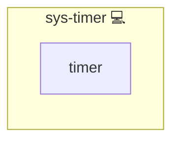

# Systemd Timer

## Description

This role configures a systemd timer to periodically start a corresponding service. It uses a Jinja2 template to create a timer unit file that specifies the scheduling parameters (such as OnCalendar and RandomizedDelaySec) and then restarts the timer service accordingly.

## Overview

Optimized for automated task scheduling in a [systemd](https://en.wikipedia.org/wiki/Systemd) environment, this role:

- Generates a timer unit file for a given service (using the `system_service_timer_service` variable).
- Reloads and restarts the timer using systemd to ensure that changes take effect.
- Supports dynamic configuration of scheduling parameters via variables like `system_service_on_calendar` and `RANDOMIZED_DELAY_SEC`.

## Cosmos

The diagram places Systemd Timer in the Infinito.Nexus cosmos: the components it deploys (capabilities), the central services it consumes (dependencies), and its outward reach (federation and bridged external networks).

Solid `1:1` edges are fixed relationships; dashed `0..1` edges are conditional (enabled only in matching deployments). Node markers show the role's deploy modes (💻 host, 🐳 compose, 🐝 swarm); ❌ marks a service that is explicitly turned off, and ⚙️ an Ansible role dependency declared in `meta/main.yml`.

## Purpose

The primary purpose of this role is to provide a reusable mechanism for scheduling recurring tasks on a system. By creating and managing a systemd timer unit, the role ensures that specified services are automatically started at defined intervals, enhancing system automation and reliability.

## Features

- **Dynamic Timer Configuration:** Uses a Jinja2 template to create a timer unit file based on provided variables.
- **Automated Service Management:** Automatically reloads the systemd daemon and restarts the timer when changes are detected.
- **Flexible Scheduling:** Supports configuration of parameters such as OnCalendar and RandomizedDelaySec for precise control over task timing.
- **Persistent Timers:** Optionally enables persistent timer behavior to ensure missed activations are handled.

## Credits

Implemented by **[Kevin Veen-Birkenbach](https://www.veen.world)**.
Part of the [Infinito.Nexus Project](https://s.infinito.nexus/code) and maintained by [Kevin Veen-Birkenbach](https://www.veen.world).
Licensed under the [Infinito.Nexus Community License (Non-Commercial)](https://s.infinito.nexus/license).
