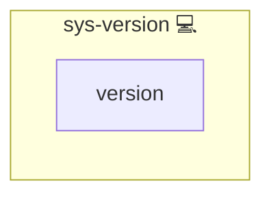

# System Version ️

## Description

This Ansible role extracts the project version from the local `pyproject.toml` (using `playbook_dir`)
and writes it as a system-wide environment variable into `/etc/environment` on the managed host.

## Overview

This role extracts the local pyproject.toml version and writes it as an environment variable in /etc/environment on the target host.

## Cosmos

The diagram places System Version ️ in the Infinito.Nexus cosmos: the components it deploys (capabilities), the central services it consumes (dependencies), and its outward reach (federation and bridged external networks).

Solid `1:1` edges are fixed relationships; dashed `0..1` edges are conditional (enabled only in matching deployments). Node markers show the role's deploy modes (💻 host, 🐳 compose, 🐝 swarm); ❌ marks a service that is explicitly turned off, and ⚙️ an Ansible role dependency declared in `meta/main.yml`.

## Features

- Extracts `version = "..."` from `pyproject.toml` on the control node
- Persists the version as an environment variable in `/etc/environment`
- Updates the existing variable idempotently (no duplicates)
- Creates `/etc/environment` if missing

## Variables

- `FILE_ENVIRONMENT` (default: `/etc/environment`)
- `INFINITO_VERSION_ENV_NAME` (default: `INFINITO_VERSION`)

## Credits

Implemented by **[Kevin Veen-Birkenbach](https://www.veen.world)**.
Part of the [Infinito.Nexus Project](https://s.infinito.nexus/code) and maintained by [Kevin Veen-Birkenbach](https://www.veen.world).
Licensed under the [Infinito.Nexus Community License (Non-Commercial)](https://s.infinito.nexus/license).
