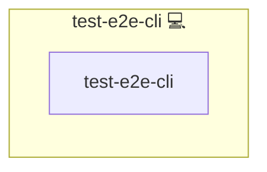

# Test E2E Cli

## Description

[Test E2E Cli](https://example.com/) is an application.

## Overview

This role deploys Test E2E Cli.

## Cosmos

The diagram places Test E2E Cli in the Infinito.Nexus cosmos: the components it deploys (capabilities), the central services it consumes (dependencies), and its outward reach (federation and bridged external networks).



Solid `1:1` edges are fixed relationships; dashed `0..1` edges are conditional (enabled only in matching deployments); red `0..0` edges are turned off in this role. Node markers show the role's deploy modes (💻 host, 🐳 compose, 🐝 swarm); ❌ marks a service that is explicitly turned off, and ⚙️ an Ansible role dependency declared in `meta/main.yml`.

## Features

- **Feature:** Describe a capability.

## Credits

Implemented by **[Alejandro Roman Ibanez](https://social.infinito.nexus/profile/alexromanibanez/profile)**.
Part of the [Infinito.Nexus Project](https://s.infinito.nexus/code) and maintained by [Kevin Veen-Birkenbach](https://www.veen.world).
Licensed under the [Infinito.Nexus Community License (Non-Commercial)](https://s.infinito.nexus/license).

## Per-role settings

A tested role declares its CLI-test settings under `cli:` in its own `meta/tests.yml`, read through `lookup('role_tests', application_id, 'cli.<key>')`:

| Key | Purpose |
|---|---|
| `timeout` | Seconds for the test script, for a test that legitimately outlasts `TEST_E2E_CLI_TIMEOUT` |
| `container_service_key` | Service key whose container the test runs against |
| `once` | `true` runs the test in the sync pass only, so `full_cycle` does not run it a second time |

```yaml
cli:
  once: true
  timeout: 14400
```
