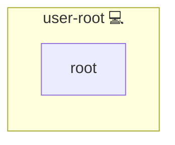

# Root User

## Description

This role manages the generation and handling of an SSH key for the [root user](https://en.wikipedia.org/wiki/Superuser) on a target system. It ensures that an SSH key is generated if one does not already exist and outputs the public key, enabling secure SSH access for the root user in automated environments.

## Overview

Optimized for secure system administration, this role performs the following tasks:

- Verifies the existence of a root SSH public key.
- Generates a new [RSA 4096-bit](https://en.wikipedia.org/wiki/RSA_(cryptosystem)) SSH key pair for the root user if one is missing.
- Displays and outputs the generated public SSH key.
- Ensures that the key generation and display tasks run only once to maintain idempotency.
- Facilitates secure remote access using best practices for [SSH](https://en.wikipedia.org/wiki/Secure_Shell).

## Cosmos

The diagram places Root User in the Infinito.Nexus cosmos: the components it deploys (capabilities), the central services it consumes (dependencies), and its outward reach (federation and bridged external networks).

Solid `1:1` edges are fixed relationships; dashed `0..1` edges are conditional (enabled only in matching deployments). Node markers show the role's deploy modes (💻 host, 🐳 compose, 🐝 swarm); ❌ marks a service that is explicitly turned off, and ⚙️ an Ansible role dependency declared in `meta/main.yml`.

## Purpose

The primary purpose of this role is to enhance the security of the system by ensuring that a valid SSH key is available for the [root user](https://en.wikipedia.org/wiki/Superuser). By automating the generation and output of the public key, it reduces manual intervention and helps maintain a secure configuration for administrative access.

## Features

- **SSH Key Verification:** Checks whether a root SSH public key exists.
- **SSH Key Generation:** Generates a new [RSA 4096-bit](https://en.wikipedia.org/wiki/RSA_(cryptosystem)) SSH key pair for the root user if needed.
- **Public Key Output:** Displays and outputs the generated public SSH key.
- **Idempotency:** Ensures that key generation and output tasks execute only once.
- **Secure Remote Access:** Facilitates secure remote access by providing a verified public key for use with [SSH](https://en.wikipedia.org/wiki/Secure_Shell).

## Credits

Implemented by **[Kevin Veen-Birkenbach](https://www.veen.world)**.
Part of the [Infinito.Nexus Project](https://s.infinito.nexus/code) and maintained by [Kevin Veen-Birkenbach](https://www.veen.world).
Licensed under the [Infinito.Nexus Community License (Non-Commercial)](https://s.infinito.nexus/license).
