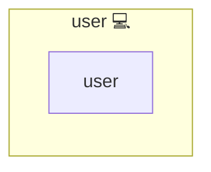

# User

## Description

This role configures a basic user environment (shell dotfiles and SSH authorized_keys)
for a user selected via `user_key`.

## Overview

This role executes common tasks for user environment configuration.

## Cosmos

The diagram places User in the Infinito.Nexus cosmos: the components it deploys (capabilities), the central services it consumes (dependencies), and its outward reach (federation and bridged external networks).

Solid `1:1` edges are fixed relationships; dashed `0..1` edges are conditional (enabled only in matching deployments). Node markers show the role's deploy modes (💻 host, 🐳 compose, 🐝 swarm); ❌ marks a service that is explicitly turned off, and ⚙️ an Ansible role dependency declared in `meta/main.yml`.

## Features

- **Automated provisioning:** Configured by Ansible without manual steps.

## User data resolution

User data is resolved via `lookup('users', user_key)` and referenced via `user_key`.
Callers may pass `user_config` to override the resolved lookup result for one invocation.

Resolution rules:

- `user_username` is resolved from `lookup('users', user_key).username` (fallback: `user_key`)
- Home path and ownership are based on `user_username`
- SSH keys are read from `lookup('users', user_key).authorized_keys`

## Required input

- `user_key`

## Optional user fields

- `lookup('users', user_key).username` (defaults to `user_key`)
- `lookup('users', user_key).authorized_keys` (list; may be empty)
- optional include-role var `user_config` to override the lookup result for the current call

## Credits

Implemented by **[Kevin Veen-Birkenbach](https://www.veen.world)**.
Part of the [Infinito.Nexus Project](https://s.infinito.nexus/code) and maintained by [Kevin Veen-Birkenbach](https://www.veen.world).
Licensed under the [Infinito.Nexus Community License (Non-Commercial)](https://s.infinito.nexus/license).
