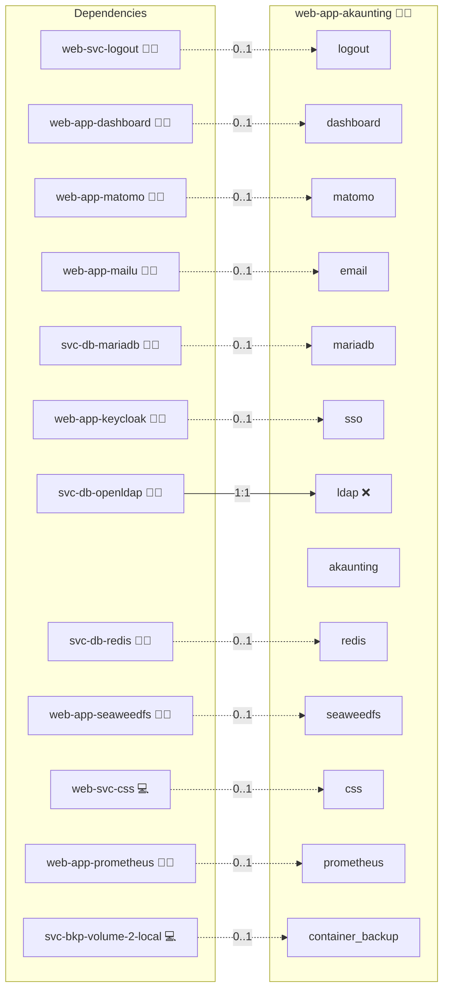

# Akaunting

## Description

This Ansible role sets up and manages Akaunting, an innovative online accounting software, using Docker and Docker Compose. Empower your financial management with Akaunting, a dynamic and feature-rich accounting platform designed to simplify your bookkeeping and boost your business growth. Enjoy intuitive tools, real-time insights, and an energetic approach to your finances.

For detailed administration and troubleshooting, see [Administration.md](./Administration.md).

## Overview

This role provides a comprehensive Dockerized environment for running Akaunting. It deploys the Akaunting application alongside a MariaDB database, configures environment variables, and integrates with NGINX as a reverse proxy. This setup is ideal for both production and development environments.

### Key Features

- **Complete Dockerized Deployment**: Uses Docker Compose to run Akaunting and its associated database.
- **Environment Configuration**: Automatically creates and configures the necessary environment files.
- **NGINX Integration**: Sets up NGINX for handling domain-specific requests and SSL termination.
- **Manual Update and Log Access**: Provides guidance for viewing logs, accessing containers, and performing manual updates.

## Cosmos

The diagram places Akaunting in the Infinito.Nexus cosmos: the components it deploys (capabilities), the central services it consumes (dependencies), and its outward reach (federation and bridged external networks).



Solid `1:1` edges are fixed relationships; dashed `0..1` edges are conditional (enabled only in matching deployments). Node markers show the role's deploy modes (💻 host, 🐳 compose, 🐝 swarm); ❌ marks a service that is explicitly turned off, and ⚙️ an Ansible role dependency declared in `meta/main.yml`.

## Features

- **Automated provisioning:** Configured by Ansible without manual steps.

## Quick Setup

### Development

Clone, set up the workstation, and deploy Akaunting onto the local stack:

```bash
git clone https://github.com/infinito-nexus/core.git
cd core
make onboard
make compose-deploy mode=reinstall apps=web-app-akaunting full_cycle=false
```

### Production

Run the published image to provision the inventory and deploy Akaunting to a managed server (the mounted volume persists the inventory):

```bash
APP=web-app-akaunting
HOST=<your-server>
TLS_MODE=self_signed
SSH_PUBLIC_KEY="<your-ssh-public-key>"

docker run --rm -it \
  -v "$PWD/inventories:/etc/infinito.nexus/inventories" \
  -e APP="$APP" -e HOST="$HOST" -e TLS_MODE="$TLS_MODE" -e SSH_PUBLIC_KEY="$SSH_PUBLIC_KEY" \
  ghcr.io/infinito-nexus/core/debian bash -c '
    INVENTORY=/etc/infinito.nexus/inventories/production
    infinito administration inventory provision "$INVENTORY" \
      --inventory-file "$INVENTORY/devices.yml" \
      --host "$HOST" \
      --include "$APP" \
      --vars "{\"TLS_MODE\": \"$TLS_MODE\", \"users\": {\"administrator\": {\"authorized_keys\": [\"$SSH_PUBLIC_KEY\"]}}}" &&
    infinito administration deploy dedicated "$INVENTORY/devices.yml" \
      --password-file "$INVENTORY/.password" \
      --diff -vv'
```

## Credits

Implemented by **[Kevin Veen-Birkenbach](https://www.veen.world)**.
Part of the [Infinito.Nexus Project](https://s.infinito.nexus/code) and maintained by [Kevin Veen-Birkenbach](https://www.veen.world).
Licensed under the [Infinito.Nexus Community License (Non-Commercial)](https://s.infinito.nexus/license).
