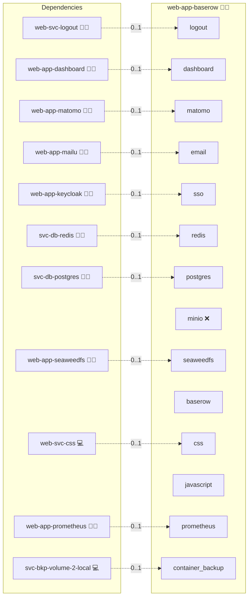

# Baserow

## Description

Empower your data management with Baserow, an innovative platform that makes building and managing databases both fun and efficient. Enjoy a dynamic interface, seamless collaboration, and energetic tools that supercharge your workflow.

## Overview

This role deploys Baserow using Docker Compose, integrating key components such as PostgreSQL for the database, Redis for caching, and NGINX for secure domain management and certificate handling. It is designed to offer a robust, scalable solution for running your own Baserow instance in a containerized environment.

## Cosmos

The diagram places Baserow in the Infinito.Nexus cosmos: the components it deploys (capabilities), the central services it consumes (dependencies), and its outward reach (federation and bridged external networks).



Solid `1:1` edges are fixed relationships; dashed `0..1` edges are conditional (enabled only in matching deployments). Node markers show the role's deploy modes (💻 host, 🐳 compose, 🐝 swarm); ❌ marks a service that is explicitly turned off, and ⚙️ an Ansible role dependency declared in `meta/main.yml`.

## Features

- **Intuitive Database Management:** Easily build, manage, and interact with your databases through a user-friendly interface.
- **Seamless Collaboration:** Collaborate in real time with team members, ensuring smooth data sharing and project management.
- **Dynamic Customization:** Adapt workflows and database structures to suit your specific needs.
- **Scalable Architecture:** Efficiently handle increasing workloads while maintaining high performance.
- **Robust API Integration:** Leverage a comprehensive API to extend functionalities and integrate with other systems.

## Quick Setup

### Development

Clone, set up the workstation, and deploy Baserow onto the local stack:

```bash
git clone https://github.com/infinito-nexus/core.git
cd core
make onboard
make compose-deploy mode=reinstall apps=web-app-baserow full_cycle=false
```

### Production

Run the published image to provision the inventory and deploy Baserow to a managed server (the mounted volume persists the inventory):

```bash
APP=web-app-baserow
HOST=<your-server>
TLS_MODE=self_signed
SSH_PUBLIC_KEY="<your-ssh-public-key>"

docker run --rm -it \
  -v "$PWD/inventories:/etc/infinito.nexus/inventories" \
  -e APP="$APP" -e HOST="$HOST" -e TLS_MODE="$TLS_MODE" -e SSH_PUBLIC_KEY="$SSH_PUBLIC_KEY" \
  ghcr.io/infinito-nexus/core/debian bash -c '
    INVENTORY=/etc/infinito.nexus/inventories/production
    infinito administration inventory provision "$INVENTORY" \
      --inventory-file "$INVENTORY/devices.yml" \
      --host "$HOST" \
      --include "$APP" \
      --vars "{\"TLS_MODE\": \"$TLS_MODE\", \"users\": {\"administrator\": {\"authorized_keys\": [\"$SSH_PUBLIC_KEY\"]}}}" &&
    infinito administration deploy dedicated "$INVENTORY/devices.yml" \
      --password-file "$INVENTORY/.password" \
      --diff -vv'
```

## Further Resources

- [Baserow Homepage](https://baserow.io/)
- [Enable Single Sign-On (SSO)](https://baserow.io/user-docs/enable-single-sign-on-sso)

## SSO

The official Baserow SSO feature is Enterprise-only. This role instead gates the
community image with the shared Keycloak oauth2-proxy and installs a small
trusted-header bridge in the Baserow backend. The bridge trusts the identity
headers injected by nginx after oauth2-proxy authentication and converts them
into native Baserow JWT refresh/access tokens for the frontend.

Directory-backed identities are handled before they reach this role: Keycloak
can federate external user stores and then expose the result to Baserow via OIDC.

## Bootstrap Admin (Django Superuser)

This role can optionally bootstrap a Django superuser inside the Baserow container (useful for initial setup and automation).

- The user is created idempotently (safe to run multiple times).
- The password is passed via environment variables (robust with special characters).
- Note: Django superuser enables access to `/admin`. Workspace permissions inside Baserow still need to be configured in Baserow UI/API.

Configuration is controlled via `applications.<app>.bootstrap_admin.*`:

- `enabled` (bool)
- `username`
- `email`
- `password` (should come from vault/credentials)

## Security: SECRET_KEY

Baserow requires Django `SECRET_KEY` for correct backend operation (e.g., JWT, sessions).
This role reads it from `credentials.secret_key` and writes it into the container environment file.

## Credits

Implemented by **[Kevin Veen-Birkenbach](https://www.veen.world)**.
Part of the [Infinito.Nexus Project](https://s.infinito.nexus/code) and maintained by [Kevin Veen-Birkenbach](https://www.veen.world).
Licensed under the [Infinito.Nexus Community License (Non-Commercial)](https://s.infinito.nexus/license).
