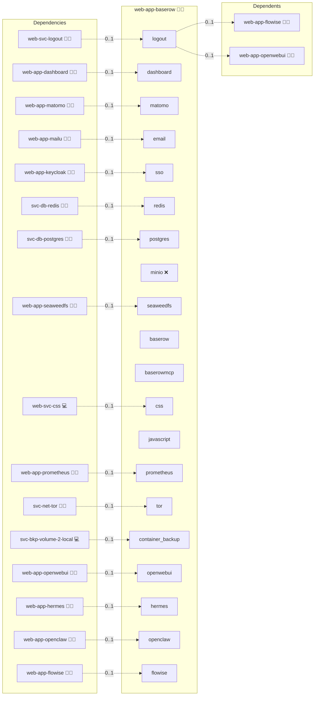

# Baserow

## Description

Empower your data management with Baserow, an innovative platform that makes building and managing databases both fun and efficient. Enjoy a dynamic interface, seamless collaboration, and energetic tools that supercharge your workflow.

## Overview

This role deploys Baserow using Docker Compose, integrating key components such as PostgreSQL for the database, Redis for caching, and NGINX for secure domain management and certificate handling. It is designed to offer a robust, scalable solution for running your own Baserow instance in a containerized environment.

## Cosmos

The diagram places Baserow in the Infinito.Nexus cosmos: the components it deploys (capabilities), the central services it consumes (dependencies), and its outward reach (federation and bridged external networks).


```mermaid
flowchart LR
    subgraph deps [Dependencies]
        dep_svc_bkp_volume_2_local["svc-bkp-volume-2-local 💻"]
        dep_svc_db_postgres["svc-db-postgres 🐳🐝"]
        dep_svc_db_redis["svc-db-redis 🐳🐝"]
        dep_svc_net_tor["svc-net-tor 🐳🐝"]
        dep_web_app_dashboard["web-app-dashboard 🐳🐝"]
        dep_web_app_flowise["web-app-flowise 🐳🐝"]
        dep_web_app_hermes["web-app-hermes 🐳🐝"]
        dep_web_app_keycloak["web-app-keycloak 🐳🐝"]
        dep_web_app_mailu["web-app-mailu 🐳🐝"]
        dep_web_app_matomo["web-app-matomo 🐳🐝"]
        dep_web_app_openclaw["web-app-openclaw 🐳🐝"]
        dep_web_app_openwebui["web-app-openwebui 🐳🐝"]
        dep_web_app_prometheus["web-app-prometheus 🐳🐝"]
        dep_web_app_seaweedfs["web-app-seaweedfs 🐳🐝"]
        dep_web_svc_css["web-svc-css 💻"]
        dep_web_svc_logout["web-svc-logout 🐳🐝"]
    end
    subgraph role [web-app-baserow 🐳🐝]
        svc_logout["logout"]
        svc_dashboard["dashboard"]
        svc_matomo["matomo"]
        svc_email["email"]
        svc_sso["sso"]
        svc_redis["redis"]
        svc_postgres["postgres"]
        svc_minio["minio ❌"]
        svc_seaweedfs["seaweedfs"]
        svc_baserow["baserow"]
        svc_baserowmcp["baserowmcp"]
        svc_css["css"]
        svc_javascript["javascript"]
        svc_prometheus["prometheus"]
        svc_tor["tor"]
        svc_container_backup["container_backup"]
        svc_openwebui["openwebui"]
        svc_hermes["hermes"]
        svc_openclaw["openclaw"]
        svc_flowise["flowise"]
    end
    subgraph dependents [Dependents]
        dpt_web_app_flowise["web-app-flowise 🐳🐝"]
        dpt_web_app_openwebui["web-app-openwebui 🐳🐝"]
    end
    dep_svc_bkp_volume_2_local -. "0..1" .-> svc_container_backup
    dep_svc_db_postgres -. "0..1" .-> svc_postgres
    dep_svc_db_redis -. "0..1" .-> svc_redis
    dep_svc_net_tor -. "0..1" .-> svc_tor
    dep_web_app_dashboard -. "0..1" .-> svc_dashboard
    dep_web_app_flowise -. "0..1" .-> svc_flowise
    dep_web_app_hermes -. "0..1" .-> svc_hermes
    dep_web_app_keycloak -. "0..1" .-> svc_sso
    dep_web_app_mailu -. "0..1" .-> svc_email
    dep_web_app_matomo -. "0..1" .-> svc_matomo
    dep_web_app_openclaw -. "0..1" .-> svc_openclaw
    dep_web_app_openwebui -. "0..1" .-> svc_openwebui
    dep_web_app_prometheus -. "0..1" .-> svc_prometheus
    dep_web_app_seaweedfs -. "0..1" .-> svc_seaweedfs
    dep_web_svc_css -. "0..1" .-> svc_css
    dep_web_svc_logout -. "0..1" .-> svc_logout
    svc_logout -. "0..1" .-> dpt_web_app_flowise
    svc_logout -. "0..1" .-> dpt_web_app_openwebui
```

Solid `1:1` edges are fixed relationships; dashed `0..1` edges are conditional (enabled only in matching deployments); red `0..0` edges are turned off in this role. Node markers show the role's deploy modes (💻 host, 🐳 compose, 🐝 swarm); ❌ marks a service that is explicitly turned off, and ⚙️ an Ansible role dependency declared in `meta/main.yml`.

## Features

- **Intuitive Database Management:** Easily build, manage, and interact with your databases through a user-friendly interface.
- **Seamless Collaboration:** Collaborate in real time with team members, ensuring smooth data sharing and project management.
- **Dynamic Customization:** Adapt workflows and database structures to suit your specific needs.
- **Scalable Architecture:** Efficiently handle increasing workloads while maintaining high performance.
- **Robust API Integration:** Leverage a comprehensive API to extend functionalities and integrate with other systems.
- **MCP Server:** Serve four read-only Baserow tools to AI clients through a bearer-guarded adapter sidecar that fronts the native SSE endpoint.

## Quick Setup

### Development

Clone, set up the workstation, and deploy Baserow onto the local stack:

```bash
git clone https://github.com/infinito-nexus/core.git
cd core
make onboard
make compose-deploy mode=reinstall apps=web-app-baserow full_cycle=false
```

### Production

Run the published image to provision the inventory and deploy Baserow to a managed server (the mounted volume persists the inventory):

```bash
APP=web-app-baserow
HOST=<your-server>
TLS_MODE=self_signed
SSH_PUBLIC_KEY="<your-ssh-public-key>"

docker run --rm -it \
  -v "$PWD/inventories:/etc/infinito.nexus/inventories" \
  -e APP="$APP" -e HOST="$HOST" -e TLS_MODE="$TLS_MODE" -e SSH_PUBLIC_KEY="$SSH_PUBLIC_KEY" \
  ghcr.io/infinito-nexus/core/debian bash -c '
    INVENTORY=/etc/infinito.nexus/inventories/production
    infinito administration inventory provision "$INVENTORY" \
      --inventory-file "$INVENTORY/devices.yml" \
      --host "$HOST" \
      --include "$APP" \
      --vars "{\"TLS_MODE\": \"$TLS_MODE\", \"users\": {\"administrator\": {\"authorized_keys\": [\"$SSH_PUBLIC_KEY\"]}}}" &&
    infinito administration deploy dedicated "$INVENTORY/devices.yml" \
      --password-file "$INVENTORY/.password" \
      --diff -vv'
```

## Further Resources

- [Baserow Homepage](https://baserow.io/)
- [Enable Single Sign-On (SSO)](https://baserow.io/user-docs/enable-single-sign-on-sso)

## SSO

The official Baserow SSO feature is Enterprise-only. This role instead gates the
community image with the shared Keycloak oauth2-proxy and installs a small
trusted-header bridge in the Baserow backend. The bridge trusts the identity
headers injected by nginx after oauth2-proxy authentication and converts them
into native Baserow JWT refresh/access tokens for the frontend.

Directory-backed identities are handled before they reach this role: Keycloak
can federate external user stores and then expose the result to Baserow via OIDC.

## Bootstrap Admin (Django Superuser)

This role can optionally bootstrap a Django superuser inside the Baserow container (useful for initial setup and automation).

- The user is created idempotently (safe to run multiple times).
- The password is passed via environment variables (robust with special characters).
- Note: Django superuser enables access to `/admin`. Workspace permissions inside Baserow still need to be configured in Baserow UI/API.

Configuration is controlled via `applications.<app>.bootstrap_admin.*`:

- `enabled` (bool)
- `username`
- `email`
- `password` (should come from vault/credentials)

## MCP Server

Baserow ships a native MCP server in the OSS backend, mounted on the ASGI root
ahead of Django. Clients do not reach it. The role runs it as the *upstream* of
a [`svc-ai-mcp-adapter`](../svc-ai-mcp-adapter/README.md) sidecar
(`classification: adapter_server`), and the sidecar is the only MCP surface a
consumer is given.

The reason is the endpoint's own shape: Baserow's `MCPEndpoint` carries no
scope column, so the endpoint key grants every tool the backend implements —
including the three write tools — with no way to narrow it. The adapter is what
narrows it, by serving four read tools and refusing every other name.

### Topology

```
consumer ──Bearer──> baserowmcp (adapter) ──endpoint-key in URL──> baserow:80/mcp
```

| Property | Value |
| --- | --- |
| Client transport | `streamable_http` at `http://baserowmcp:<http>/mcp` |
| Client auth | `Authorization: Bearer <credentials.mcp_bearer>` |
| Upstream transport | HTTP+SSE (`adapter.upstream_transport: sse`) |
| Upstream stream | `GET http://baserow:80/mcp/<endpoint-key>/sse` |
| Upstream messages | `POST http://baserow:80/mcp/messages/?session_id=<id>` |

The SSE session travels through the shared Redis channel layer, so the stream
and the message POST may land on different replicas.

### Auth

Two credentials, in two directions.

Client to adapter: `credentials.mcp_bearer`, owned by `mcp-web-app-baserow`.
The adapter refuses any request that does not present it, so a caller on the
container network is no longer implicitly trusted.

Adapter to Baserow: the endpoint key, which Baserow reads from the URL *path*,
not from a header. It reaches the sidecar as `ADAPTER_UPSTREAM_PATH_KEY` and is
spliced in by `policy.upstream_url()`, so it never enters the rendered contract
the sidecar advertises. The key is generated as `credentials.mcp_endpoint_key`
(32 hex characters, matching the `varchar(32)` column). An unknown key answers
`401 Endpoint not found.`.

[`tasks/utils/mcp.yml`](./tasks/utils/mcp.yml) creates a dedicated non-superuser
owner (`mcp@<canonical-domain>`, unusable password) plus its own workspace, and
binds the endpoint to that pair.

### Tools

Served: `get_table_schema`, `list_databases`, `list_table_rows`, `list_tables`.

Refused: the ten remaining tools Baserow 2.3.3 implements, listed under
`tools.upstream_serves`. Three of them (`create_rows`, `update_rows`,
`delete_rows`) are live upstream — the image carries no env var, setting or UI
toggle that removes them, so `mutating_tools_enabled: false` is enforced by the
adapter and by nothing in Baserow. The other seven are shipped disabled
upstream and are listed so a version bump that enables one shows up as contract
drift rather than as a silently widened surface.

The four served schemas are pinned in
[`files/mcp/tools.json`](./files/mcp/tools.json) and hashed into
`tools.schema_sha256`; the adapter refuses to start when the two disagree.

### Authorization subject

`auth_subject: service_account`. A call arrives at Baserow as the endpoint owner
regardless of who asked the client, and reaches only the one workspace that
account owns. That is the second bound under the adapter's allowlist, not a
substitute for it.

### Default state

Off. `mcp.enabled` is true only while an MCP client role is part of the
deployment.

### How to disable

Remove the MCP client role, or pin `mcp.enabled: false` for this role in the
inventory. The endpoint is then not provisioned, the sidecar is not deployed,
and `BASEROW_EXTRA_PUBLIC_URLS` drops the MCP origin, so the image's Caddy layer
stops routing `/mcp/*`.

## Security: SECRET_KEY

Baserow requires Django `SECRET_KEY` for correct backend operation (e.g., JWT, sessions).
This role reads it from `credentials.secret_key` and writes it into the container environment file.

## Persona contract opt-outs

The Playwright `biber` persona is blocked permanently. `meta/services.yml` restricts `sso.oauth2.allowed_groups` to the `web-app-baserow` administrator RBAC group, so a non-admin identity is rejected by the oauth2-proxy before Baserow renders, and no deploy step provisions a Baserow account for that user.

The `administrator` persona is blocked only while SSO is off. In that configuration `PROXY_HEADER_SSO` is false, so the trusted-header bridge is inactive and the sole account is the Django superuser bootstrapped by `tasks/01_manager_ops.yml` via `files/bootstrap_admin.py`, whose identifier is the ORM `username` rather than the e-mail Baserow's own sign-in form asks for. With SSO enabled the header bridge supplies the session and the persona runs.

## Credits

Implemented by **[Kevin Veen-Birkenbach](https://www.veen.world)**.
Part of the [Infinito.Nexus Project](https://s.infinito.nexus/code) and maintained by [Kevin Veen-Birkenbach](https://www.veen.world).
Licensed under the [Infinito.Nexus Community License (Non-Commercial)](https://s.infinito.nexus/license).
