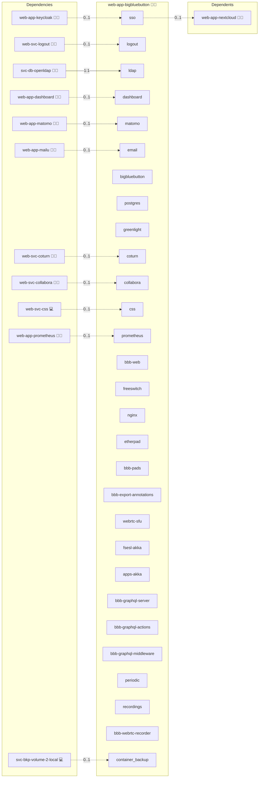

# BigBlueButton

## Description

This Ansible role deploys [BigBlueButton](https://bigbluebutton.org/) using Docker Compose. It includes support for Greenlight, OIDC, LDAP, TURN/STUN, health checks, and a modular `.env` setup. This role is ideal for educational institutions and teams requiring a self-hosted video conferencing solution.
> 🔧 **Note**: The database layer should be decoupled in a future release to improve modularity and integration.
>

## Overview

This role provides a fully automated deployment of [BigBlueButton](https://bigbluebutton.org/) using Docker Compose on Arch Linux. It manages the entire lifecycle of the deployment, from cloning the upstream Docker repository and generating the `.env` configuration to customizing `compose.yml` for volume usage, WebSocket proxying, and optional LDAP/OIDC integration.
The setup includes conditional Greenlight activation, WebRTC support via TURN/STUN, and various fixes for known container orchestration issues. The role is modular and integrates seamlessly with the Infinito.Nexus infrastructure, including reverse proxy configuration, domain management, and secrets templating.
By default, BigBlueButton is deployed with best-practice hardening, modular secrets, and support for multiple authentication methods and scalable storage backends.

## Cosmos

The diagram places BigBlueButton in the Infinito.Nexus cosmos: the components it deploys (capabilities), the central services it consumes (dependencies), and its outward reach (federation and bridged external networks).



Solid `1:1` edges are fixed relationships; dashed `0..1` edges are conditional (enabled only in matching deployments). Node markers show the role's deploy modes (💻 host, 🐳 compose, 🐝 swarm); ❌ marks a service that is explicitly turned off, and ⚙️ an Ansible role dependency declared in `meta/main.yml`.

## Features

- 🐳 **Docker-based** deployment via official [bigbluebutton/docker](https://github.com/bigbluebutton/docker)
- ✅ **Greenlight** (v3) frontend support
- 🔐 **SSO with OIDC & LDAP** (optional)
- 🧱 Automatic `.env` templating and domain/NGINX integration
- 🛠 Volume patching and Docker Compose customization
- 📬 SMTP integration and Greenlight admin creation
- 🧪 Workarounds for known Docker Compose or Etherpad issues

## Quick Setup

### Development

Clone, set up the workstation, and deploy BigBlueButton onto the local stack:

```bash
git clone https://github.com/infinito-nexus/core.git
cd core
make onboard
make compose-deploy mode=reinstall apps=web-app-bigbluebutton full_cycle=false
```

### Production

Run the published image to provision the inventory and deploy BigBlueButton to a managed server (the mounted volume persists the inventory):

```bash
APP=web-app-bigbluebutton
HOST=<your-server>
TLS_MODE=self_signed
SSH_PUBLIC_KEY="<your-ssh-public-key>"

docker run --rm -it \
  -v "$PWD/inventories:/etc/infinito.nexus/inventories" \
  -e APP="$APP" -e HOST="$HOST" -e TLS_MODE="$TLS_MODE" -e SSH_PUBLIC_KEY="$SSH_PUBLIC_KEY" \
  ghcr.io/infinito-nexus/core/debian bash -c '
    INVENTORY=/etc/infinito.nexus/inventories/production
    infinito administration inventory provision "$INVENTORY" \
      --inventory-file "$INVENTORY/devices.yml" \
      --host "$HOST" \
      --include "$APP" \
      --vars "{\"TLS_MODE\": \"$TLS_MODE\", \"users\": {\"administrator\": {\"authorized_keys\": [\"$SSH_PUBLIC_KEY\"]}}}" &&
    infinito administration deploy dedicated "$INVENTORY/devices.yml" \
      --password-file "$INVENTORY/.password" \
      --diff -vv'
```

## Single Sign-On (SSO)

- Docs: [External Authentication](https://docs.bigbluebutton.org/greenlight/v3/external-authentication/)
- Supports:
  - ✅ OpenID Connect (OIDC)
  - ✅ LDAP (with custom DN and filters)
  - 🧩 Custom OAuth2 flows via ENV vars

## System Requirements

- Arch Linux with Docker, Compose, and NGINX roles pre-installed
- DNS and reverse proxy configuration using `sys-svc-proxy`
- Functional email system for Greenlight SMTP

## Further Resources

- [BigBlueButton Docker Docs](https://docs.bigbluebutton.org/greenlight/v3/install/)
- [Networking Fixes & Issues](https://stackoverflow.com/questions/53347951/web-app-network-not-found)

## Credits

Implemented by **[Kevin Veen-Birkenbach](https://www.veen.world)**.
Part of the [Infinito.Nexus Project](https://s.infinito.nexus/code) and maintained by [Kevin Veen-Birkenbach](https://www.veen.world).
Licensed under the [Infinito.Nexus Community License (Non-Commercial)](https://s.infinito.nexus/license).
