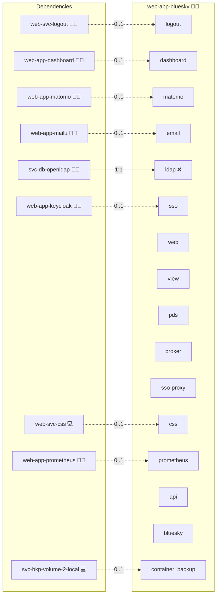

# Bluesky

## Description

[Bluesky](https://bsky.social/) is a decentralized social network that runs on the open AT Protocol. Each user account lives on a Personal Data Server (PDS) that holds the user's posts, replies, and follows as signed records, and any number of independent app views can read those records to render a timeline.

## Overview

This role deploys a self-hosted Bluesky stack on Docker Compose. It runs the official PDS container as the user-data layer, builds the upstream `@bluesky-social/social-app` web client as the user-facing UI, and adds an in-role login-broker sidecar that gates the web client through Keycloak via `web-app-keycloak`'s SSO-proxy sidecar. The broker auto-provisions PDS accounts for incoming OIDC users, holds the synthesised app-password AES-256-GCM-encrypted in a process-local cache, and drops a usable PDS session into the social-app's local storage so end users never see the synthesised credential.

For administration commands see [Administration.md](./Administration.md). For DNS setup see [Installation.md](./Installation.md). For the broker's environment contract see [README.md](./files/login-broker/README.md).

## Cosmos

The diagram places Bluesky in the Infinito.Nexus cosmos: the components it deploys (capabilities), the central services it consumes (dependencies), and its outward reach (federation and bridged external networks).



Solid `1:1` edges are fixed relationships; dashed `0..1` edges are conditional (enabled only in matching deployments). Node markers show the role's deploy modes (💻 host, 🐳 compose, 🐝 swarm); ❌ marks a service that is explicitly turned off, and ⚙️ an Ansible role dependency declared in `meta/main.yml`.

## Features

- **Decentralized social networking:** Self-host the AT Protocol PDS and serve user data under your own domain.
- **Containerized deployment:** Run PDS, social-app, and the login-broker through Docker Compose with the project's standard role-meta wiring.
- **Native Keycloak SSO:** Sit a `web-app-keycloak`'s SSO-proxy sidecar sidecar in front of the broker so unauthenticated visitors are redirected to Keycloak before they ever reach the web client.
- **PDS auto-provisioning:** Have the broker call `com.atproto.server.createAccount` on first login and cache the resulting handle and DID per Keycloak username.
- **Encrypted app-password cache:** Keep the synthesised PDS app-password in a process-local map only as AES-256-GCM ciphertext, with the key sourced from the project's credentials vault.
- **Pinned upstream client:** Build the `social-app` web client from a pinned tag so the broker's `BSKY_STORAGE` handoff stays in sync with the upstream persistence schema.

## Quick Setup

### Development

Clone, set up the workstation, and deploy Bluesky onto the local stack:

```bash
git clone https://github.com/infinito-nexus/core.git
cd core
make onboard
make compose-deploy mode=reinstall apps=web-app-bluesky full_cycle=false
```

### Production

Run the published image to provision the inventory and deploy Bluesky to a managed server (the mounted volume persists the inventory):

```bash
APP=web-app-bluesky
HOST=<your-server>
TLS_MODE=self_signed
SSH_PUBLIC_KEY="<your-ssh-public-key>"

docker run --rm -it \
  -v "$PWD/inventories:/etc/infinito.nexus/inventories" \
  -e APP="$APP" -e HOST="$HOST" -e TLS_MODE="$TLS_MODE" -e SSH_PUBLIC_KEY="$SSH_PUBLIC_KEY" \
  ghcr.io/infinito-nexus/core/debian bash -c '
    INVENTORY=/etc/infinito.nexus/inventories/production
    infinito administration inventory provision "$INVENTORY" \
      --inventory-file "$INVENTORY/devices.yml" \
      --host "$HOST" \
      --include "$APP" \
      --vars "{\"TLS_MODE\": \"$TLS_MODE\", \"users\": {\"administrator\": {\"authorized_keys\": [\"$SSH_PUBLIC_KEY\"]}}}" &&
    infinito administration deploy dedicated "$INVENTORY/devices.yml" \
      --password-file "$INVENTORY/.password" \
      --diff -vv'
```

## Single Sign-On

OIDC integration follows the variant A+ pattern documented in requirement 013: `web-app-keycloak`'s SSO-proxy sidecar is the gate, the in-role login-broker is the session-handoff agent, and the official `social-app` web client is the user-facing UI.

The broker MUST receive `X-Forwarded-User`, `X-Forwarded-Preferred-Username`, and `X-Forwarded-Email` from `oauth2-proxy`. On a user's first authenticated visit the broker calls the PDS `com.atproto.server.createAccount` endpoint with a synthesised app-password, encrypts that password with AES-256-GCM under a key from the project's credentials vault, and caches the ciphertext in the broker's in-process `sessionCache` keyed by Keycloak username. Subsequent visits decrypt the cached password in-broker, exchange it for a PDS session via `com.atproto.server.createSession`, and seed `localStorage["BSKY_STORAGE"]` so the social-app finds an authenticated session at boot. A broker restart drops the cache; the next SSO visit triggers a fresh `createAccount` and the previous app-password remains valid in PDS until rotated.

LDAP rides the same broker path: Keycloak federates LDAP via `svc-db-openldap` and the broker reads the resulting Keycloak headers via `oauth2-proxy`. Direct LDAP-to-PDS sync is NOT supported, the Keycloak federation layer is the single authority for user identity.

RBAC stays gating-only because the PDS has no in-app role concept beyond "account exists / does not exist". Membership in the `/roles/web-app-bluesky` Keycloak group lets a user past the oauth2-proxy gate. The documented SSO/RBAC exception per [lifecycle.md](../../docs/contributing/design/role/services/lifecycle.md) covers the in-app authorisation tier.

## Developer Notes

See [Administration.md](./Administration.md) for live container administration through `pdsadmin`. See [README.md](./files/login-broker/README.md) for the login-broker's environment contract and failure modes.

## Further Resources

- [Bluesky Official Website](https://bsky.social/)
- [AT Protocol Documentation](https://atproto.com/)
- [Bluesky PDS GitHub Repository](https://github.com/bluesky-social/pds)
- [Bluesky Social App GitHub Repository](https://github.com/bluesky-social/social-app)
- [Self-hosting Bluesky with Docker and SWAG](https://therobbiedavis.com/selfhosting-bluesky-with-web-app-and-swag/)
- [pdsadmin GitHub Repository](https://github.com/lhaig/pdsadmin)

## Credits

Implemented by **[Kevin Veen-Birkenbach](https://www.veen.world)**.
Part of the [Infinito.Nexus Project](https://s.infinito.nexus/code) and maintained by [Kevin Veen-Birkenbach](https://www.veen.world).
Licensed under the [Infinito.Nexus Community License (Non-Commercial)](https://s.infinito.nexus/license).
