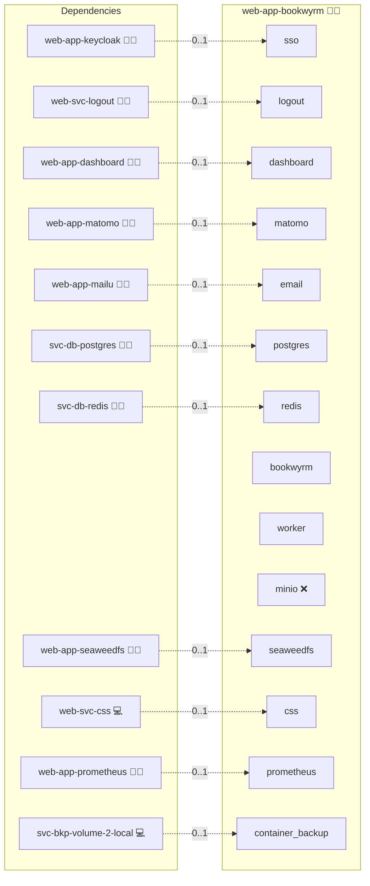

# BookWyrm

## Description

**BookWyrm** is a self-hosted social reading platform where users can share books, post reviews, follow each other, and join federated conversations across the Fediverse. It is a community-driven alternative to proprietary platforms like Goodreads. Readers can catalog their library, track reading progress, and discover new books through friends and federated timelines.

## Overview

BookWyrm provides a federated social network for books built on ActivityPub. Each instance can be private, invitation-only, or open for public registration. Users can import/export book lists, interact with others across the Fediverse, and maintain their own curated reading environment. As an admin, you can configure moderation tools, content rules, and federation policies to suit your community.

## Cosmos

The diagram places BookWyrm in the Infinito.Nexus cosmos: the components it deploys (capabilities), the central services it consumes (dependencies), and its outward reach (federation and bridged external networks).



Solid `1:1` edges are fixed relationships; dashed `0..1` edges are conditional (enabled only in matching deployments). Node markers show the role's deploy modes (💻 host, 🐳 compose, 🐝 swarm); ❌ marks a service that is explicitly turned off, and ⚙️ an Ansible role dependency declared in `meta/main.yml`.

## Features

- **Federated Social Network:** Connects with other BookWyrm instances and ActivityPub platforms.
- **Book Cataloging:** Add, search, and organize books; import/export libraries.
- **Reading Status & Reviews:** Mark books as “to read,” “reading,” or “finished,” and publish reviews or quotes.
- **Timelines & Interaction:** Follow other readers, comment on reviews, and engage in federated discussions.
- **Privacy & Moderation:** Fine-grained controls for content visibility, moderation, and federation settings.
- **Community Building:** Host a private club, classroom library, or large public community for readers.
- **Optional SSO Integration:** Can work with OIDC for unified login across platforms.

## Quick Setup

### Development

Clone, set up the workstation, and deploy BookWyrm onto the local stack:

```bash
git clone https://github.com/infinito-nexus/core.git
cd core
make onboard
make compose-deploy mode=reinstall apps=web-app-bookwyrm full_cycle=false
```

### Production

Run the published image to provision the inventory and deploy BookWyrm to a managed server (the mounted volume persists the inventory):

```bash
APP=web-app-bookwyrm
HOST=<your-server>
TLS_MODE=self_signed
SSH_PUBLIC_KEY="<your-ssh-public-key>"

docker run --rm -it \
  -v "$PWD/inventories:/etc/infinito.nexus/inventories" \
  -e APP="$APP" -e HOST="$HOST" -e TLS_MODE="$TLS_MODE" -e SSH_PUBLIC_KEY="$SSH_PUBLIC_KEY" \
  ghcr.io/infinito-nexus/core/debian bash -c '
    INVENTORY=/etc/infinito.nexus/inventories/production
    infinito administration inventory provision "$INVENTORY" \
      --inventory-file "$INVENTORY/devices.yml" \
      --host "$HOST" \
      --include "$APP" \
      --vars "{\"TLS_MODE\": \"$TLS_MODE\", \"users\": {\"administrator\": {\"authorized_keys\": [\"$SSH_PUBLIC_KEY\"]}}}" &&
    infinito administration deploy dedicated "$INVENTORY/devices.yml" \
      --password-file "$INVENTORY/.password" \
      --diff -vv'
```

## Further Resources

- [BookWyrm GitHub](https://github.com/bookwyrm-social/bookwyrm)
- [BookWyrm Documentation](https://docs.joinbookwyrm.com/)
- [ActivityPub (Wikipedia)](https://en.wikipedia.org/wiki/ActivityPub)
- [Fediverse (Wikipedia)](https://en.wikipedia.org/wiki/Fediverse)

## Credits

Implemented by **[Kevin Veen-Birkenbach](https://www.veen.world)**.
Part of the [Infinito.Nexus Project](https://s.infinito.nexus/code) and maintained by [Kevin Veen-Birkenbach](https://www.veen.world).
Licensed under the [Infinito.Nexus Community License (Non-Commercial)](https://s.infinito.nexus/license).
