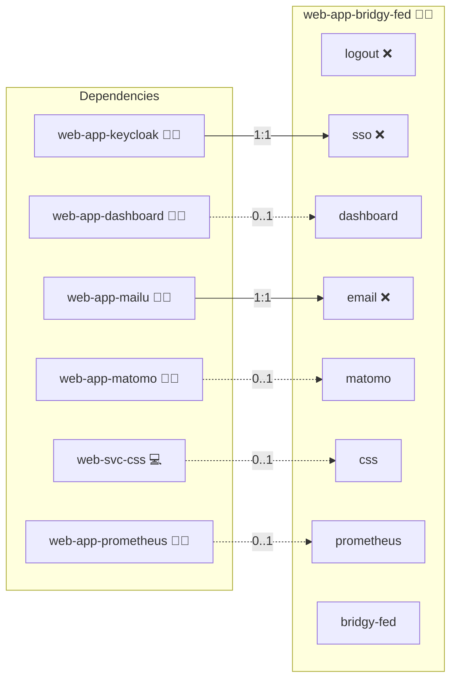

# Bridgy Fed

## Description

[Bridgy Fed](https://fed.brid.gy/) is a federation bridge between ActivityPub (the Fediverse), the AT Protocol (Bluesky), and the IndieWeb (webmentions and microformats2). It mirrors identities and cross-network interactions so a post on one network reaches followers on the others.

## Overview

This role builds and runs Bridgy Fed as a Docker container behind the project's front-proxy. An optional Firestore-emulator sidecar in Datastore mode provides the storage backend for non-production deployments.

## Cosmos

The diagram places Bridgy Fed in the Infinito.Nexus cosmos: the components it deploys (capabilities), the central services it consumes (dependencies), and its outward reach (federation and bridged external networks).



Solid `1:1` edges are fixed relationships; dashed `0..1` edges are conditional (enabled only in matching deployments). Node markers show the role's deploy modes (💻 host, 🐳 compose, 🐝 swarm); ❌ marks a service that is explicitly turned off.

## Features

- **Cross-network federation:** Mirror posts and interactions between ActivityPub, AT Protocol, and the IndieWeb.
- **Containerized deployment:** Run the upstream Flask app under gunicorn through Docker Compose.
- **Front-proxy integration:** Publish the app through `sys-stk-front-proxy` for TLS termination and per-domain routing.
- **Optional Firestore emulator:** Use the Datastore-mode emulator sidecar for non-production deployments.

## Quick Setup

### Development

Clone, set up the workstation, and deploy Bridgy Fed onto the local stack:

```bash
git clone https://github.com/infinito-nexus/core.git
cd core
make onboard
make compose-deploy mode=reinstall apps=web-app-bridgy-fed full_cycle=false
```

### Production

Run the published image to provision the inventory and deploy Bridgy Fed to a managed server (the mounted volume persists the inventory between the two runs):

```bash
docker run --rm -it \
  -v "$PWD/inventories:/etc/infinito.nexus/inventories" \
  ghcr.io/infinito-nexus/core/debian \
  infinito administration inventory provision /etc/infinito.nexus/inventories/prod \
  --inventory-file /etc/infinito.nexus/inventories/prod/devices.yml \
  --host <your-server> \
  --vars-file inventories/<env>/default.yml \
  --include 'web-app-bridgy-fed'

docker run --rm -it \
  -v "$PWD/inventories:/etc/infinito.nexus/inventories" \
  ghcr.io/infinito-nexus/core/debian \
  infinito administration deploy dedicated /etc/infinito.nexus/inventories/prod/devices.yml \
  --password-file /etc/infinito.nexus/inventories/prod/.password \
  --id web-app-bridgy-fed \
  --diff \
  -vv
```

## Single Sign-On

This role does NOT configure OIDC against `web-app-keycloak`, LDAP against `svc-db-openldap`, or any role-claim / LDAP-group RBAC mapping. Bridgy Fed authenticates users via their fediverse or atproto credentials at the source platform, not via local accounts. There is no local user table to bind an external IdP to, and no in-app authorisation tier to map a Keycloak role or LDAP group onto. Placing Bridgy Fed behind `web-app-keycloak`'s SSO-proxy sidecar would break inbound federation traffic and MUST NOT be done. This SSO and RBAC exception is documented per [lifecycle.md](../../docs/contributing/design/role/services/lifecycle.md).

## Further Resources

- [Bridgy Fed Official Site](https://fed.brid.gy/)
- [Bridgy Fed Documentation](https://bridgy-fed.readthedocs.io/)
- [Bridgy Fed Source on GitHub](https://github.com/snarfed/bridgy-fed)

## Credits

Implemented by **[Kevin Veen-Birkenbach](https://www.veen.world)**.
Part of the [Infinito.Nexus Project](https://s.infinito.nexus/code) and maintained by [Kevin Veen-Birkenbach](https://www.veen.world).
Licensed under the [Infinito.Nexus Community License (Non-Commercial)](https://s.infinito.nexus/license).
