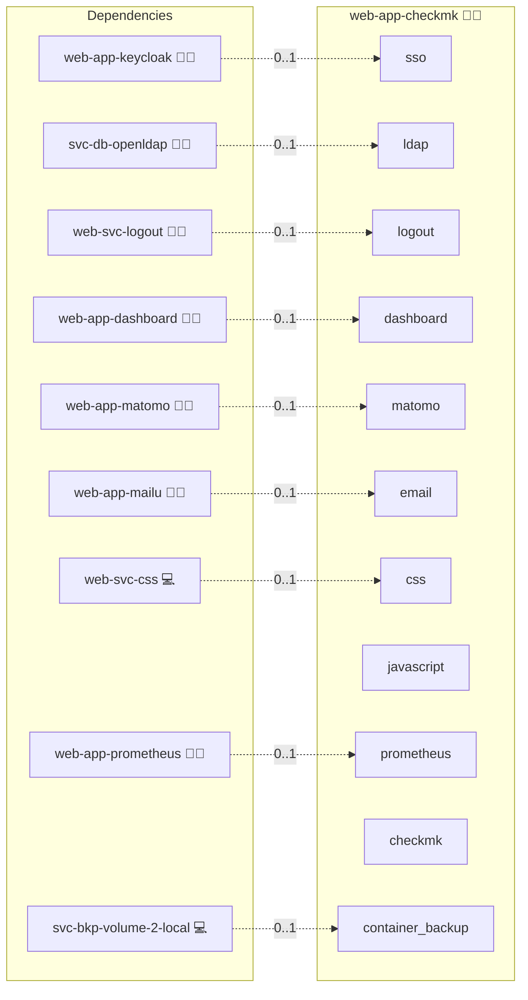

# Checkmk

## Description

[Checkmk](https://checkmk.com/) (Raw / Community edition, 100% open source) is an IT and application monitoring system. This role deploys the official all-in-one `checkmk/check-mk-raw` container behind the Infinito.Nexus reverse proxy, with Keycloak SSO via the oauth2-proxy gate and native LDAP user management.

## Overview

Checkmk Raw bundles its own monitoring core (Nagios), RRD storage, and an Apache-served web GUI, so it needs no external database. All state lives on one persistent volume mounted at `/omd/sites`, and the GUI is served under the OMD site path (`/cmk/check_mk/`). The image is pinned to `checkmk/check-mk-raw:2.4.0p32` in `meta/services.yml`; Checkmk renamed the Raw image to `check-mk-community` from 2.5, so bump the tag only after reviewing the upstream [version notes](https://docs.checkmk.com/latest/en/cmk_versions.html).

## Cosmos

The diagram places Checkmk in the Infinito.Nexus cosmos: the components it deploys (capabilities), the central services it consumes (dependencies), and its outward reach (federation and bridged external networks).



Solid `1:1` edges are fixed relationships; dashed `0..1` edges are conditional (enabled only in matching deployments). Node markers show the role's deploy modes (💻 host, 🐳 compose, 🐝 swarm); ❌ marks a service that is explicitly turned off, and ⚙️ an Ansible role dependency declared in `meta/main.yml`.

## Features

- **Open-source monitoring:**
  Hosts, services, metrics, and alerting from the Checkmk Raw all-in-one container.

- **Keycloak SSO:**
  Fronted by the platform oauth2-proxy gate; the authenticated user is passed to Checkmk via the trusted `X-Remote-User` header (`auth_by_http_header`), so no second login prompt appears.

- **Native LDAP:**
  A central-OpenLDAP connection supplies user records, roles, and contact groups; the header user (Keycloak `preferred_username`) resolves to a real Checkmk user.

- **No external database:**
  Self-contained on a single persistent volume.

- **Agent receiver:**
  Container port 8000 is mapped to a host port (`local.agent`); external proxying for remote-host TLS agent registration is a follow-up.

- **Break-glass `cmkadmin`:**
  Seeded on first run via `CMK_PASSWORD`; reachable via the local login form only when the SSO gate is absent.

## Quick Setup

### Development

Clone, set up the workstation, and deploy Checkmk onto the local stack:

```bash
git clone https://github.com/infinito-nexus/core.git
cd core
make onboard
make compose-deploy mode=reinstall apps=web-app-checkmk full_cycle=false
```

### Production

Run the published image to provision the inventory and deploy Checkmk to a managed server (the mounted volume persists the inventory):

```bash
APP=web-app-checkmk
HOST=<your-server>
TLS_MODE=self_signed
SSH_PUBLIC_KEY="<your-ssh-public-key>"

docker run --rm -it \
  -v "$PWD/inventories:/etc/infinito.nexus/inventories" \
  -e APP="$APP" -e HOST="$HOST" -e TLS_MODE="$TLS_MODE" -e SSH_PUBLIC_KEY="$SSH_PUBLIC_KEY" \
  ghcr.io/infinito-nexus/core/debian bash -c '
    INVENTORY=/etc/infinito.nexus/inventories/production
    infinito administration inventory provision "$INVENTORY" \
      --inventory-file "$INVENTORY/devices.yml" \
      --host "$HOST" \
      --include "$APP" \
      --vars "{\"TLS_MODE\": \"$TLS_MODE\", \"users\": {\"administrator\": {\"authorized_keys\": [\"$SSH_PUBLIC_KEY\"]}}}" &&
    infinito administration deploy dedicated "$INVENTORY/devices.yml" \
      --password-file "$INVENTORY/.password" \
      --diff -vv'
```

## Further Resources

- [Checkmk Docker docs](https://docs.checkmk.com/latest/en/introduction_docker.html)
- [LDAP user management](https://docs.checkmk.com/latest/en/ldap.html)
- [HTTP header authentication (Werk #7819)](https://checkmk.com/werk/7819)
- [Checkmk GitHub Repository](https://github.com/Checkmk/checkmk)

## Credits

Implemented by **[Kevin Veen-Birkenbach](https://www.veen.world)**.
Part of the [Infinito.Nexus Project](https://s.infinito.nexus/code) and maintained by [Kevin Veen-Birkenbach](https://www.veen.world).
Licensed under the [Infinito.Nexus Community License (Non-Commercial)](https://s.infinito.nexus/license).
