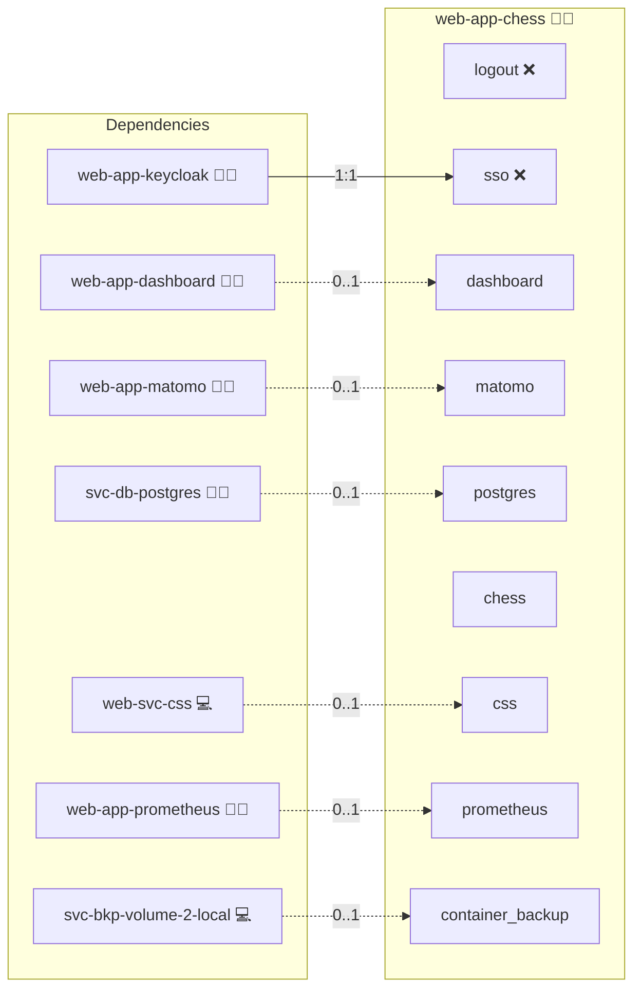

# Chess

## Description

**castling.club** is a federated chess server built on the ActivityPub protocol.  
It provides an open and decentralized way to play chess online, where games and moves are visible across the Fediverse.

## Overview

Instead of relying on closed platforms, castling.club uses an arbiter actor (“the King”) to validate moves and mediate matches.  
This ensures fair play, federation with platforms like Mastodon or Friendica, and community visibility of ongoing games.  
The service runs as a lightweight Node.js app backed by PostgreSQL.

## Cosmos

The diagram places Chess in the Infinito.Nexus cosmos: the components it deploys (capabilities), the central services it consumes (dependencies), and its outward reach (federation and bridged external networks).



Solid `1:1` edges are fixed relationships; dashed `0..1` edges are conditional (enabled only in matching deployments). Node markers show the role's deploy modes (💻 host, 🐳 compose, 🐝 swarm); ❌ marks a service that is explicitly turned off, and ⚙️ an Ansible role dependency declared in `meta/main.yml`.

## Features

- **Federated Chess Matches:** Challenge and play with others across the Fediverse.  
- **Rule Enforcement:** The arbiter validates each move for correctness.  
- **Open Identities:** Use your existing Fediverse account; no new silo account needed.  
- **Game Visibility:** Matches and moves can appear in social timelines.  
- **Lightweight Service:** Built with Node.js and PostgreSQL for efficiency.  

## Quick Setup

### Development

Clone, set up the workstation, and deploy Chess onto the local stack:

```bash
git clone https://github.com/infinito-nexus/core.git
cd core
make onboard
make compose-deploy mode=reinstall apps=web-app-chess full_cycle=false
```

### Production

Run the published image to provision the inventory and deploy Chess to a managed server (the mounted volume persists the inventory):

```bash
APP=web-app-chess
HOST=<your-server>
TLS_MODE=self_signed
SSH_PUBLIC_KEY="<your-ssh-public-key>"

docker run --rm -it \
  -v "$PWD/inventories:/etc/infinito.nexus/inventories" \
  -e APP="$APP" -e HOST="$HOST" -e TLS_MODE="$TLS_MODE" -e SSH_PUBLIC_KEY="$SSH_PUBLIC_KEY" \
  ghcr.io/infinito-nexus/core/debian bash -c '
    INVENTORY=/etc/infinito.nexus/inventories/production
    infinito administration inventory provision "$INVENTORY" \
      --inventory-file "$INVENTORY/devices.yml" \
      --host "$HOST" \
      --include "$APP" \
      --vars "{\"TLS_MODE\": \"$TLS_MODE\", \"users\": {\"administrator\": {\"authorized_keys\": [\"$SSH_PUBLIC_KEY\"]}}}" &&
    infinito administration deploy dedicated "$INVENTORY/devices.yml" \
      --password-file "$INVENTORY/.password" \
      --diff -vv'
```

## Further Resources

- [castling.club GitHub Repository](https://github.com/stephank/castling.club)  
- [ActivityPub Specification (W3C)](https://www.w3.org/TR/activitypub/)  

## Credits

Implemented by **[Kevin Veen-Birkenbach](https://www.veen.world)**.
Part of the [Infinito.Nexus Project](https://s.infinito.nexus/code) and maintained by [Kevin Veen-Birkenbach](https://www.veen.world).
Licensed under the [Infinito.Nexus Community License (Non-Commercial)](https://s.infinito.nexus/license).
