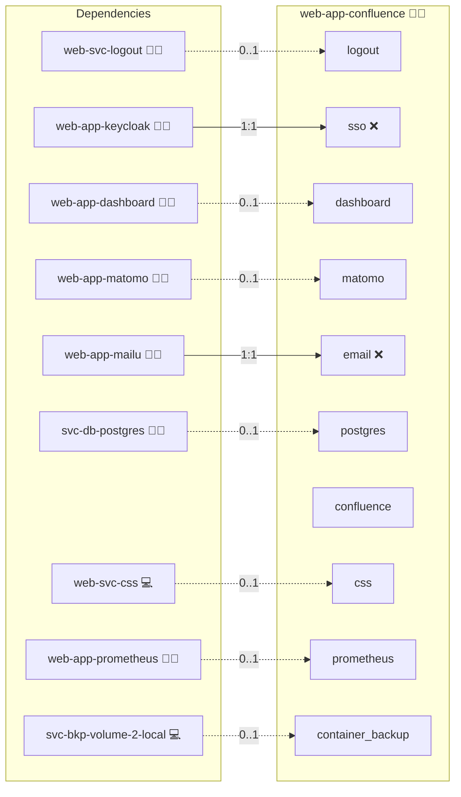

# Confluence

## Description

Confluence is Atlassian’s enterprise wiki and collaboration platform. This role deploys Confluence via Docker Compose, wires it to PostgreSQL, and integrates proxy awareness, optional OIDC SSO, health checks, and production-friendly defaults for Infinito.Nexus.

## Overview

The role builds a minimal custom image on top of the official Confluence image, prepares persistent volumes, and exposes the app behind your reverse proxy. Configuration is driven by variables (image, version, volumes, domains, OIDC). JVM heap sizing is auto-derived from host RAM with safe caps to avoid `Xms > Xmx`.

## Cosmos

The diagram places Confluence in the Infinito.Nexus cosmos: the components it deploys (capabilities), the central services it consumes (dependencies), and its outward reach (federation and bridged external networks).



Solid `1:1` edges are fixed relationships; dashed `0..1` edges are conditional (enabled only in matching deployments). Node markers show the role's deploy modes (💻 host, 🐳 compose, 🐝 swarm); ❌ marks a service that is explicitly turned off, and ⚙️ an Ansible role dependency declared in `meta/main.yml`.

## Features

* **Fully Dockerized:** Compose stack with a dedicated data volume (`confluence_data`) and a slim overlay image for future add-ons.
* **Reverse-Proxy Ready:** Sets `ATL_PROXY_NAME/PORT/SCHEME/SECURE` so Confluence generates correct external URLs behind HTTPS.
* **OIDC SSO (Optional):** Pre-templated vars for issuer, client, scopes, JWKS; compatible with Atlassian DC SSO/OIDC marketplace apps.
* **Central Database:** PostgreSQL integration (local or central DB) with bootstrap credentials from role vars.
* **JVM Auto-Tuning:** `JVM_MINIMUM_MEMORY` / `JVM_MAXIMUM_MEMORY` computed from host memory with upper bounds.
* **Health Checks:** Curl-based container healthcheck for early failure detection.
* **CSP & Canonical Domains:** Hooks into platform CSP/SSL/domain management to keep policies strict and URLs stable.
* **Backup Friendly:** Data isolated under `{{ CONFLUENCE_HOME }}`.

## Quick Setup

### Development

Clone, set up the workstation, and deploy Confluence onto the local stack:

```bash
git clone https://github.com/infinito-nexus/core.git
cd core
make onboard
make compose-deploy mode=reinstall apps=web-app-confluence full_cycle=false
```

### Production

Run the published image to provision the inventory and deploy Confluence to a managed server (the mounted volume persists the inventory):

```bash
APP=web-app-confluence
HOST=<your-server>
TLS_MODE=self_signed
SSH_PUBLIC_KEY="<your-ssh-public-key>"

docker run --rm -it \
  -v "$PWD/inventories:/etc/infinito.nexus/inventories" \
  -e APP="$APP" -e HOST="$HOST" -e TLS_MODE="$TLS_MODE" -e SSH_PUBLIC_KEY="$SSH_PUBLIC_KEY" \
  ghcr.io/infinito-nexus/core/debian bash -c '
    INVENTORY=/etc/infinito.nexus/inventories/production
    infinito administration inventory provision "$INVENTORY" \
      --inventory-file "$INVENTORY/devices.yml" \
      --host "$HOST" \
      --include "$APP" \
      --vars "{\"TLS_MODE\": \"$TLS_MODE\", \"users\": {\"administrator\": {\"authorized_keys\": [\"$SSH_PUBLIC_KEY\"]}}}" &&
    infinito administration deploy dedicated "$INVENTORY/devices.yml" \
      --password-file "$INVENTORY/.password" \
      --diff -vv'
```

## Further Resources

* Product page: [Atlassian Confluence](https://www.atlassian.com/software/confluence)
* Docker Hub (official image): [atlassian/confluence](https://hub.docker.com/r/atlassian/confluence)

## Credits

Implemented by **[Kevin Veen-Birkenbach](https://www.veen.world)**.
Part of the [Infinito.Nexus Project](https://s.infinito.nexus/code) and maintained by [Kevin Veen-Birkenbach](https://www.veen.world).
Licensed under the [Infinito.Nexus Community License (Non-Commercial)](https://s.infinito.nexus/license).
