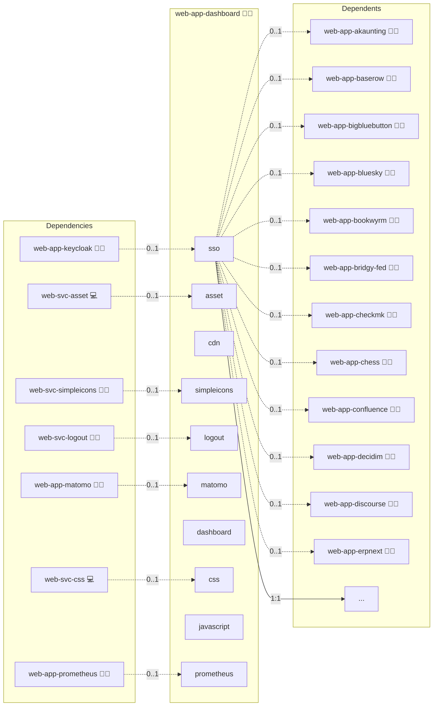

# Dashboard

## Description

A lightweight, Docker-powered UI framework that offers Infinito.Nexus users a unified interface to access all their applications in one intuitive dashboard. 🚀

## Overview

Tailored for creative professionals and developers, this role streamlines the process of setting up a portfolio site. It automates tasks such as Docker container configuration, dynamic routing via NGINX, and repository integration, so you can concentrate on perfecting your content and design. Enjoy a responsive layout and easy-to-modify YAML files that let you rapidly update your online presence without deep technical intervention.

## Cosmos

The diagram places Dashboard in the Infinito.Nexus cosmos: the components it deploys (capabilities), the central services it consumes (dependencies), and its outward reach (federation and bridged external networks).



Solid `1:1` edges are fixed relationships; dashed `0..1` edges are conditional (enabled only in matching deployments). Node markers show the role's deploy modes (💻 host, 🐳 compose, 🐝 swarm); ❌ marks a service that is explicitly turned off, and ⚙️ an Ansible role dependency declared in `meta/main.yml`.

## Purpose

The purpose of tthis role is to simplify the deployment and management of a personal or professional portfolio. By focusing on usability and a clean presentation, the role helps you:

- Quickly launch a professional-looking website.
- Customize and update your portfolio content effortlessly.
- Integrate seamlessly with complementary roles for Docker Compose and web server management.
- Reduce manual configuration and maintenance tasks.

## Features

- **Unified Navigation**: Central menu bar with dynamic categories for all registered applications.
- **Customizable Tiles**: Showcase applications with title, description, and icons, fully configurable via YAML.
- **Responsive Design**: Optimized for desktop, tablet & mobile, built on Bootstrap.
- **Interactive Icons**: Automatic integration of Simple Icons for popular brands and tools.
- **Seamless IFrame Embedding**: Launch apps directly within the UI or open in new tabs.
- **YAML-Driven Configuration**: Define all content & structure easily in `config.yaml`.
- **Fast Access**: Automatic cache management ensures lightning-fast load times.

## Quick Setup

### Development

Clone, set up the workstation, and deploy Dashboard onto the local stack:

```bash
git clone https://github.com/infinito-nexus/core.git
cd core
make onboard
make compose-deploy mode=reinstall apps=web-app-dashboard full_cycle=false
```

### Production

Run the published image to provision the inventory and deploy Dashboard to a managed server (the mounted volume persists the inventory):

```bash
APP=web-app-dashboard
HOST=<your-server>
TLS_MODE=self_signed
SSH_PUBLIC_KEY="<your-ssh-public-key>"

docker run --rm -it \
  -v "$PWD/inventories:/etc/infinito.nexus/inventories" \
  -e APP="$APP" -e HOST="$HOST" -e TLS_MODE="$TLS_MODE" -e SSH_PUBLIC_KEY="$SSH_PUBLIC_KEY" \
  ghcr.io/infinito-nexus/core/debian bash -c '
    INVENTORY=/etc/infinito.nexus/inventories/production
    infinito administration inventory provision "$INVENTORY" \
      --inventory-file "$INVENTORY/devices.yml" \
      --host "$HOST" \
      --include "$APP" \
      --vars "{\"TLS_MODE\": \"$TLS_MODE\", \"users\": {\"administrator\": {\"authorized_keys\": [\"$SSH_PUBLIC_KEY\"]}}}" &&
    infinito administration deploy dedicated "$INVENTORY/devices.yml" \
      --password-file "$INVENTORY/.password" \
      --diff -vv'
```

## Credits

Implemented by **[Kevin Veen-Birkenbach](https://www.veen.world)**.
Part of the [Infinito.Nexus Project](https://s.infinito.nexus/code) and maintained by [Kevin Veen-Birkenbach](https://www.veen.world).
Licensed under the [Infinito.Nexus Community License (Non-Commercial)](https://s.infinito.nexus/license).
