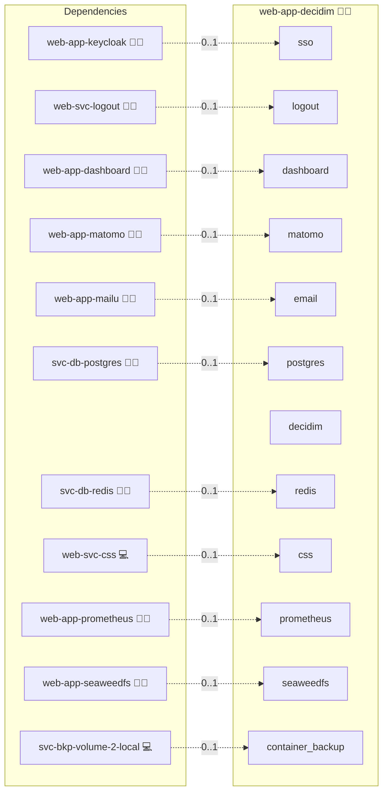

# Decidim

## Description

Deploys [Decidim](https://decidim.org/) (a free, open-source participatory democracy platform) as part of the Infinito.Nexus stack.

## Overview

This role deploy Decidim, an open-source participatory democracy platform for public consultations, civic processes, community voting, and collaborative policy creation.

## Cosmos

The diagram places Decidim in the Infinito.Nexus cosmos: the components it deploys (capabilities), the central services it consumes (dependencies), and its outward reach (federation and bridged external networks).



Solid `1:1` edges are fixed relationships; dashed `0..1` edges are conditional (enabled only in matching deployments). Node markers show the role's deploy modes (💻 host, 🐳 compose, 🐝 swarm); ❌ marks a service that is explicitly turned off, and ⚙️ an Ansible role dependency declared in `meta/main.yml`.

## Features

- Custom Docker image built on `ghcr.io/decidim/decidim` with OpenID Connect support
- PostgreSQL database via the shared platform instance
- Redis for caching and Action Cable
- OIDC SSO via Keycloak using `omniauth_openid_connect`
- Accessible at `https://decidim.<your-domain>`

## Quick Setup

### Development

Clone, set up the workstation, and deploy Decidim onto the local stack:

```bash
git clone https://github.com/infinito-nexus/core.git
cd core
make onboard
make compose-deploy mode=reinstall apps=web-app-decidim full_cycle=false
```

### Production

Run the published image to provision the inventory and deploy Decidim to a managed server (the mounted volume persists the inventory):

```bash
APP=web-app-decidim
HOST=<your-server>
TLS_MODE=self_signed
SSH_PUBLIC_KEY="<your-ssh-public-key>"

docker run --rm -it \
  -v "$PWD/inventories:/etc/infinito.nexus/inventories" \
  -e APP="$APP" -e HOST="$HOST" -e TLS_MODE="$TLS_MODE" -e SSH_PUBLIC_KEY="$SSH_PUBLIC_KEY" \
  ghcr.io/infinito-nexus/core/debian bash -c '
    INVENTORY=/etc/infinito.nexus/inventories/production
    infinito administration inventory provision "$INVENTORY" \
      --inventory-file "$INVENTORY/devices.yml" \
      --host "$HOST" \
      --include "$APP" \
      --vars "{\"TLS_MODE\": \"$TLS_MODE\", \"users\": {\"administrator\": {\"authorized_keys\": [\"$SSH_PUBLIC_KEY\"]}}}" &&
    infinito administration deploy dedicated "$INVENTORY/devices.yml" \
      --password-file "$INVENTORY/.password" \
      --diff -vv'
```

## SSO / Authentication

Decidim's base image does not include an OpenID Connect OmniAuth strategy. This role builds a custom image that:

- Installs the `omniauth_openid_connect` gem via Bundler
- Patches decidim-core's `omniauth.rb` initializer to register the provider gated on `ENV["OIDC_ENABLED"]` (Rails 7.2 no longer uses `config/secrets.yml`)
- Patches decidim-core's `omniauth_helper.rb` to return the correct icon

Credentials (`OIDC_CLIENT_ID`, `OIDC_CLIENT_SECRET`, `OIDC_ISSUER`) are read from env vars at runtime (never stored in the database) to avoid `ActiveSupport::MessageEncryptor::InvalidMessage` errors on container rebuild.

To enable SSO, set `services.sso.enabled: true` in your inventory.

## Configuration

Key settings in `meta/services.yml` and `meta/server.yml`:

| Key | Default | Description |
|-----|---------|-------------|
| `services.sso.enabled` | `true` | Enable Keycloak SSO via OpenID Connect |
| `services.postgres.shared` | `true` | Use the shared PostgreSQL service |
| `domains.canonical` | `decidim.{{ DOMAIN_PRIMARY }}` | Public domain |

## References

- [Decidim documentation](https://docs.decidim.org/)
- [Decidim Docker image](https://ghcr.io/decidim/decidim)
- [omniauth_openid_connect](https://github.com/omniauth/omniauth_openid_connect)

## Credits

Implemented by **[Prageeth Panicker](https://github.com/pragepani)**.
Part of the [Infinito.Nexus Project](https://s.infinito.nexus/code) and maintained by [Kevin Veen-Birkenbach](https://www.veen.world).
Licensed under the [Infinito.Nexus Community License (Non-Commercial)](https://s.infinito.nexus/license).
