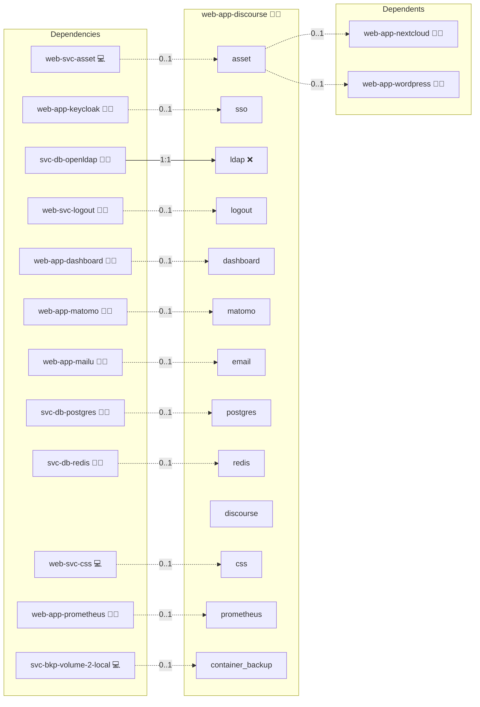

# Discourse

## Description

Discourse is a popular open-source discussion platform designed to foster community engagement through modern, user-friendly features and robust moderation tools. It creates a dynamic space for discussions, offering seamless notifications and customizable interfaces to keep your community active and engaged.

## Overview

This role deploys Discourse using Docker, automating tasks such as container orchestration, service configuration, and routine administrative operations. It integrates key components like Redis and PostgreSQL, sets up domain routing with NGINX, and ensures streamlined updates for a reliable forum experience.

## Cosmos

The diagram places Discourse in the Infinito.Nexus cosmos: the components it deploys (capabilities), the central services it consumes (dependencies), and its outward reach (federation and bridged external networks).



Solid `1:1` edges are fixed relationships; dashed `0..1` edges are conditional (enabled only in matching deployments). Node markers show the role's deploy modes (💻 host, 🐳 compose, 🐝 swarm); ❌ marks a service that is explicitly turned off, and ⚙️ an Ansible role dependency declared in `meta/main.yml`.

## Features

- **Modern Forum Experience:** Engage in interactive, real-time discussions with a responsive, mobile-friendly design.
- **Robust Moderation Tools:** Benefit from comprehensive tools for content management and community moderation.
- **Customizable Layouts & Themes:** Tailor your forum’s look and functionality to suit your community’s unique style.
- **Scalable Architecture:** Utilize a Docker-based deployment that adapts easily to increasing traffic and community size.
- **Extensive Plugin Support:** Enhance your forum with a wide range of plugins and integrations for additional functionality.

## Quick Setup

### Development

Clone, set up the workstation, and deploy Discourse onto the local stack:

```bash
git clone https://github.com/infinito-nexus/core.git
cd core
make onboard
make compose-deploy mode=reinstall apps=web-app-discourse full_cycle=false
```

### Production

Run the published image to provision the inventory and deploy Discourse to a managed server (the mounted volume persists the inventory):

```bash
APP=web-app-discourse
HOST=<your-server>
TLS_MODE=self_signed
SSH_PUBLIC_KEY="<your-ssh-public-key>"

docker run --rm -it \
  -v "$PWD/inventories:/etc/infinito.nexus/inventories" \
  -e APP="$APP" -e HOST="$HOST" -e TLS_MODE="$TLS_MODE" -e SSH_PUBLIC_KEY="$SSH_PUBLIC_KEY" \
  ghcr.io/infinito-nexus/core/debian bash -c '
    INVENTORY=/etc/infinito.nexus/inventories/production
    infinito administration inventory provision "$INVENTORY" \
      --inventory-file "$INVENTORY/devices.yml" \
      --host "$HOST" \
      --include "$APP" \
      --vars "{\"TLS_MODE\": \"$TLS_MODE\", \"users\": {\"administrator\": {\"authorized_keys\": [\"$SSH_PUBLIC_KEY\"]}}}" &&
    infinito administration deploy dedicated "$INVENTORY/devices.yml" \
      --password-file "$INVENTORY/.password" \
      --diff -vv'
```

## Addons

Addons are declared in [`meta/addons/`](./meta/addons/) and read at deploy time via `lookup('config', application_id, 'addons')`.

| Addon | Mechanism | Default state | Bridges |
|---|---|---|---|
| `docker_manager` | plugin | enabled | none |
| `discourse-activity-pub` | plugin | enabled | none |
| `discourse-akismet` | plugin | enabled | none |
| `discourse-ldap-auth` | plugin | follows `services.ldap.enabled` (currently off) | `ldap` |

The `ldap` service block in [`meta/services.yml`](./meta/services.yml) is intentionally pinned to literal `false` (see [TODO.md](./TODO.md)): the `jonmbake/discourse-ldap-auth` plugin breaks Discourse bootstrap on recent versions. `discourse-ldap-auth` therefore resolves to disabled until that block is flipped back to the dynamic group-membership form.

## Further Resources

- [Discourse Official Website](https://www.discourse.org/)
- [Discourse GitHub Repository](https://github.com/discourse/discourse_docker.git)
- [Discourse Meta Forum](https://meta.discourse.org/)
- [Discourse Documentation](https://meta.discourse.org/t/discourse-setup-guide/21966)

## Credits

Implemented by **[Kevin Veen-Birkenbach](https://www.veen.world)**.
Part of the [Infinito.Nexus Project](https://s.infinito.nexus/code) and maintained by [Kevin Veen-Birkenbach](https://www.veen.world).
Licensed under the [Infinito.Nexus Community License (Non-Commercial)](https://s.infinito.nexus/license).
