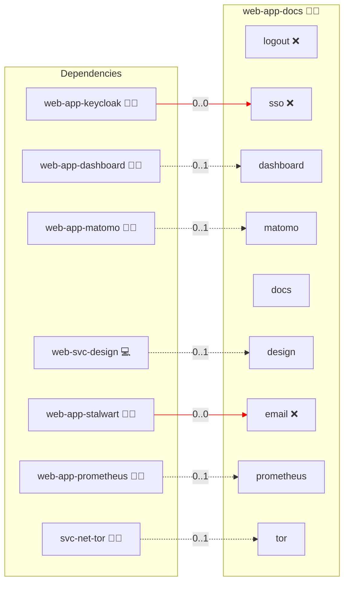

# Documentation

## Description

This role publishes the Infinito.Nexus documentation for the latest commit and for every release tag. It builds the repository's Markdown, reStructuredText and role READMEs into an HTML site with [Sphinx](https://www.sphinx-doc.org/) and the [Awesome Sphinx Theme](https://sphinxawesome.xyz/). There is no database.

## Overview

One `python:<version>-slim` container runs the service in `files/python/infinito_docs/`:

1. It keeps a git mirror of `services.docs.source_repository` in the `docs_sites` volume and fetches it every `services.docs.fetch_interval` seconds, or later when a build is still running.
2. `latest` is the last commit of the default branch. It is built at start and rebuilt whenever a fetch finds a new commit; the previous build stays online until the new one replaces it.
3. A release tag (`vX.Y.Z`) is built the first time someone opens it. The browser shows a progress bar and reloads once the build is done. Tags never change, so each tag is built only once.
4. Up to `services.docs.build.parallel` builds run at once, each with `services.docs.build.jobs` parallel Sphinx processes. `jobs` defaults to half the host's CPUs, `parallel` to the same number capped at 2. A free slot claims a translated site only once its version is current, so a version and its first language run in sequence.
5. Every replica serves from the shared `docs_sites` volume. The replica holding `builder.lock` in that volume fetches and builds; the queue (`queue/`) and the build states (`states/`) are files beside the sites, so a new lock holder resumes the queue when the builder dies. Cross-node locking relies on NFSv4, the default of `svc-storage-nfs-client`.

| Path | Content |
|---|---|
| `/` | Redirect to `/latest/` |
| `/<version>/...` | The built site, or its build progress |
| `/versions/` | Every version with its build status and progress |
| `/api/versions` | The same as JSON |

Every page carries a version switcher in its sidebar. Switching keeps the current page and falls back to the start page of a version that lacks it.

## Cosmos

The diagram places Documentation in the Infinito.Nexus cosmos: the components it deploys (capabilities), the central services it consumes (dependencies), and its outward reach (federation and bridged external networks).



Solid `1:1` edges are fixed relationships; dashed `0..1` edges are conditional (enabled only in matching deployments); red `0..0` edges are turned off in this role. Node markers show the role's deploy modes (💻 host, 🐳 compose, 🐝 swarm); ❌ marks a service that is explicitly turned off, and ⚙️ an Ansible role dependency declared in `meta/main.yml`.

## Features

- **Every release:** The latest commit is the default, each release tag is selectable and built on demand.
- **Generated reference:** API pages via `sphinx-apidoc`, one page per role from its `meta/main.yml` and README, and an index of every YAML file.
- **Folder navigation:** The sidebar mirrors the repository tree and highlights the current page and heading.

## Quick Setup

### Development

Clone, set up the workstation, and deploy Documentation onto the local stack:

```bash
git clone https://github.com/infinito-nexus/core.git
cd core
make onboard
make compose-deploy mode=reinstall apps=web-app-docs full_cycle=false
```

### Production

Run the published image to provision the inventory and deploy Documentation to a managed server (the mounted volume persists the inventory):

```bash
APP=web-app-docs
HOST="<your-server>"
DOMAIN="<your-domain>"
TLS_MODE=self_signed
SSH_PUBLIC_KEY="<your-ssh-public-key>"

docker run --rm -it \
  -v "$PWD/inventories:/etc/infinito.nexus/inventories" \
  -e APP="$APP" -e HOST="$HOST" -e DOMAIN="$DOMAIN" -e TLS_MODE="$TLS_MODE" -e SSH_PUBLIC_KEY="$SSH_PUBLIC_KEY" \
  ghcr.io/infinito-nexus/core/debian:latest bash -c '
    INVENTORY=/etc/infinito.nexus/inventories/production
    infinito administration inventory provision "$INVENTORY" \
      --inventory-file "$INVENTORY/devices.yml" \
      --host "$HOST" \
      --include "$APP" \
      --vars "{\"TLS_MODE\": \"$TLS_MODE\", \"DOMAIN_PRIMARY\": \"$DOMAIN\", \"users\": {\"administrator\": {\"authorized_keys\": [\"$SSH_PUBLIC_KEY\"]}}}" &&
    infinito administration deploy dedicated "$INVENTORY/devices.yml" \
      --password-file "$INVENTORY/.password" \
      --diff -vv'
```

## Configuration

Override these keys of `services.docs` in the inventory:

| Key | Purpose |
|---|---|
| `source_repository` | Repository to document, e.g. a fork |
| `fetch_interval` | Seconds between two fetches of new commits and tags |
| `build.jobs` | Parallel Sphinx processes per build; defaults to half the host's CPUs, raise `cpus` and `mem_limit` with it |
| `build.parallel` | Builds running at once; defaults to half the host's CPUs capped at 2, and each one costs another scratch tree on disk |
| `cpus` | Container CPU cap; also takes a percentage of the host, e.g. `50%`, see [sys-svc-container](../sys-svc-container/README.md#resource-limits) |

```yaml
applications:
  web-app-docs:
    services:
      docs:
        source_repository: https://git.example.com/your-org/core.git
        build:
          jobs: 4
          parallel: 2
        cpus: "4"
        mem_limit: 8g
```

Delete `sites/<version>` inside the `docs_sites` volume to rebuild a version on its next visit.

## Further Resources

- [Sphinx Official Website](https://www.sphinx-doc.org/)
- [Awesome Sphinx Theme](https://sphinxawesome.xyz/)

## Credits

Implemented by **Marko Pjevac, Kevin Veen-Birkenbach**.
Part of the [Infinito.Nexus Project](https://s.infinito.nexus/code) and maintained by [Kevin Veen-Birkenbach](https://www.veen.world).
Licensed under the [Infinito.Nexus Community License (Non-Commercial)](https://s.infinito.nexus/license).

## Persona contract opt-outs

The role publishes a public documentation site. [`meta/services.yml`](./meta/services.yml) pins `sso.enabled` and `sso.shared` to `false`, and the role ships no `meta/users.yml` and no account provisioning; [`templates/env.j2`](./templates/env.j2) only configures the build service. [`tasks/main.yml`](./tasks/main.yml) only wires the container and proxy stack and stages the Sphinx tooling into the build context.
There is no account and no auth chain for the `biber` or `administrator` persona, so [`templates/playwright.env.j2`](./templates/playwright.env.j2) declares `PERSONA_BIBER_BLOCKED=true` and `PERSONA_ADMINISTRATOR_BLOCKED=true`. The `guest` persona and the baseline reachability and CSP assertions run unconditionally.
