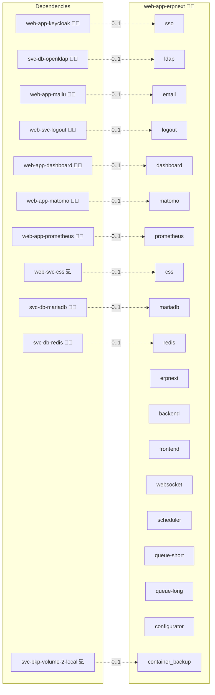

# ERPNext

## Description

[ERPNext](https://erpnext.com/) is an open-source ERP suite built on the [Frappe Framework](https://frappeframework.com/). It covers finance, CRM, inventory, manufacturing, HR, sales, projects, and websites in one self-hosted stack.

## Overview

This role deploys ERPNext as an Infinito.Nexus web app using the upstream `frappe/erpnext` single-image multi-role pattern from [frappe_docker](https://github.com/frappe/frappe_docker): one Docker image, different commands per container (backend gunicorn, frontend nginx, websocket socketio, scheduler, two queue workers, plus a one-shot configurator). MariaDB and Redis come from the central `svc-db-mariadb` and `svc-db-redis` providers — the three Frappe Redis logical roles (`cache`, `queue`, `socketio`) share one central Redis instance via DB-number split (0 / 1 / 2). Authentication uses Frappe's built-in Social Login Key against the shared Keycloak OIDC client without an oauth2-proxy sidecar; LDAP federation and outbound SMTP via Stalwart are wired when their providers are present.

## Cosmos

The diagram places ERPNext in the Infinito.Nexus cosmos: the components it deploys (capabilities), the central services it consumes (dependencies), and its outward reach (federation and bridged external networks).



Solid `1:1` edges are fixed relationships; dashed `0..1` edges are conditional (enabled only in matching deployments). Node markers show the role's deploy modes (💻 host, 🐳 compose, 🐝 swarm); ❌ marks a service that is explicitly turned off, and ⚙️ an Ansible role dependency declared in `meta/main.yml`.

## Features

- **ERP / CRM / inventory desk** — full ERPNext frontend at `next.erp.{{ DOMAIN_PRIMARY }}`.
- **Direct OIDC SSO** — Frappe's Social Login Key talks to the shared Keycloak client; redirect URI auto-registered via the `redirect_uris` filter (no per-app Keycloak entry needed).
- **Keycloak group → Frappe role mapping** — three tiers: `roles/web-app-erpnext/administrator` → `System Manager`, `roles/web-app-erpnext/manager` → `{Sales, Purchase, Stock, Accounts} User`, default → `Customer`. Reconciled on each login by a hook reading the persisted map.
- **LDAP federation** — when `svc-db-openldap` is present, Frappe's LDAP Settings doctype is auto-configured. End-to-end LDAP login (auto-create Frappe user from LDAP bind) is deferred to a follow-up requirement; v1 ships the Settings doctype only. The LDAP-login Playwright specs are intentionally absent for v1.
- **Outbound mail (v1)** — when `web-app-stalwart` is present, Frappe's outbound Email Account is auto-configured against the central SMTP endpoint. **IMAP inbound (mail-to-Communication) is deferred to a follow-up requirement** (no precedent in the repo for auto-provisioning role-owned Stalwart mailboxes yet).
- **Wizard bypass** — first deploy seeds the API-bot user, marks `setup_complete=1` in System Settings, and skips the Frappe setup wizard entirely.

## Quick Setup

### Development

Clone, set up the workstation, and deploy ERPNext onto the local stack:

```bash
git clone https://github.com/infinito-nexus/core.git
cd core
make onboard
make compose-deploy mode=reinstall apps=web-app-erpnext full_cycle=false
```

### Production

Run the published image to provision the inventory and deploy ERPNext to a managed server (the mounted volume persists the inventory):

```bash
APP=web-app-erpnext
HOST=<your-server>
TLS_MODE=self_signed
SSH_PUBLIC_KEY="<your-ssh-public-key>"

docker run --rm -it \
  -v "$PWD/inventories:/etc/infinito.nexus/inventories" \
  -e APP="$APP" -e HOST="$HOST" -e TLS_MODE="$TLS_MODE" -e SSH_PUBLIC_KEY="$SSH_PUBLIC_KEY" \
  ghcr.io/infinito-nexus/core/debian bash -c '
    INVENTORY=/etc/infinito.nexus/inventories/production
    infinito administration inventory provision "$INVENTORY" \
      --inventory-file "$INVENTORY/devices.yml" \
      --host "$HOST" \
      --include "$APP" \
      --vars "{\"TLS_MODE\": \"$TLS_MODE\", \"users\": {\"administrator\": {\"authorized_keys\": [\"$SSH_PUBLIC_KEY\"]}}}" &&
    infinito administration deploy dedicated "$INVENTORY/devices.yml" \
      --password-file "$INVENTORY/.password" \
      --diff -vv'
```

## Image & version policy

- **Image**: `frappe/erpnext` (the official single-image, multi-role build from [frappe_docker](https://github.com/frappe/frappe_docker)).
- **Pin**: a concrete stable v15.x semver (no `:latest`, no `:edge`, no v14 LTS, no v16 pre-release line).
- **Bump path**: update `services.erpnext.version` in `meta/services.yml`, redeploy. Schema migrations run automatically on first start of the new image (Frappe ships `bench migrate` in the backend container's entrypoint).

## Central-service consumer pattern

| Frappe role | Provided by | Notes |
|---|---|---|
| MariaDB primary DB | `svc-db-mariadb` | `bench new-site` uses the central MariaDB's `root` to create the per-site DB on first deploy. |
| Redis `cache` | `svc-db-redis` (DB 0) | URL `redis://redis:6379/0` — `redis` is the in-compose network alias for the shared service. |
| Redis `queue` | `svc-db-redis` (DB 1) | URL `redis://redis:6379/1` |
| Redis `socketio` | `svc-db-redis` (DB 2) | URL `redis://redis:6379/2` |

The DB-number split is stable for v1. If `svc-db-redis` later partitions tenants differently, this role gets swept by the same migration.

## Variants

`meta/variants.yml` defines three variants (mirrors the `web-app-kix` / `web-app-zammad` pattern):

| # | SSO | LDAP | Email | Use |
|---|---|---|---|---|
| V1 | ✓ | ✓ | ✓ | Full stack — everything that can be true, is true. |
| V2 | ✗ | ✗ | ✗ | No auth — bare ERPNext, local-user only (break-glass / dev). |
| V3 | ✗ | ✓ | ✗ | LDAP-only — sign in against the central OpenLDAP. |

## Backup & restore (operator command, v1)

A `svc-bkp-*` pre-backup hook for `bench backup` is NOT wired in v1 (deferred to a follow-up requirement). The v1 backup story relies on the standard `svc-bkp-*` driver picking up the central MariaDB DB and the role's named volumes. To make a Frappe-aware snapshot in flight, run:

```bash
make compose-exec service=erpnext-backend \
  cmd="bench --site next.erp.<DOMAIN_PRIMARY> backup --with-files"
```

The artefacts (`*.sql.gz`, `*-files.tar`, `*-private-files.tar`) land under `/home/frappe/frappe-bench/sites/next.erp.<DOMAIN_PRIMARY>/private/backups/` inside the backend container.

Restore is the inverse:

```bash
make compose-exec service=erpnext-backend \
  cmd="bench --site next.erp.<DOMAIN_PRIMARY> restore <path-to-sql-gz> --with-public-files <files.tar> --with-private-files <private-files.tar>"
```

## Developer Notes

- Variant matrix lives in [variants.yml](./meta/variants.yml). Service flags and image pins in [services.yml](./meta/services.yml). Credentials declared in [schema.yml](./meta/schema.yml).
- Site name MUST match the HTTP Host header. The Frappe site is created with `bench new-site next.erp.<DOMAIN_PRIMARY>` and `FRAPPE_SITE_NAME_HEADER` on the frontend nginx maps Host → site.
- All post-bootstrap configuration (OIDC Social Login Key, LDAP Settings, outbound Email Account, group-role mapping) runs as Python scripts piped to `python` inside the backend container (see `files/scripts/`).

## Further Resources

- [ERPNext Official Website](https://erpnext.com/)
- [Frappe Framework Documentation](https://docs.frappe.io/)
- [frappe_docker (upstream container reference)](https://github.com/frappe/frappe_docker)
- [Frappe Social Login Key](https://docs.frappe.io/framework/user/en/guides/integration/social_login_key)

## Credits

Implemented by **[Kevin Veen-Birkenbach](https://www.veen.world)**.
Part of the [Infinito.Nexus Project](https://s.infinito.nexus/code) and maintained by [Kevin Veen-Birkenbach](https://www.veen.world).
Licensed under the [Infinito.Nexus Community License (Non-Commercial)](https://s.infinito.nexus/license).
