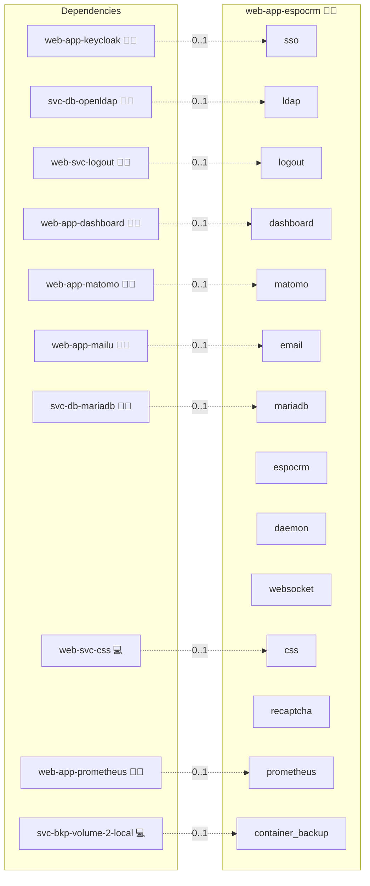

# EspoCRM

## Description

Enhance your sales and service processes with EspoCRM, an open-source CRM featuring workflow automation, LDAP/OIDC single sign-on, and a sleek, lightweight UI! 🚀💼

## Overview

This Ansible role deploys EspoCRM using Docker. It handles:

- MariaDB database provisioning via the `sys-svc-rdbms` role  
- NGINX domain setup with WebSocket and reverse-proxy configuration  
- Environment variable management through Jinja2 templates  
- Docker Compose orchestration for **web**, **daemon**, and **websocket** services  
- Automatic OIDC scope configuration within the EspoCRM container  

With this role, you'll have a production-ready CRM environment that's secure, scalable, and real-time.

## Cosmos

The diagram places EspoCRM in the Infinito.Nexus cosmos: the components it deploys (capabilities), the central services it consumes (dependencies), and its outward reach (federation and bridged external networks).



Solid `1:1` edges are fixed relationships; dashed `0..1` edges are conditional (enabled only in matching deployments). Node markers show the role's deploy modes (💻 host, 🐳 compose, 🐝 swarm); ❌ marks a service that is explicitly turned off, and ⚙️ an Ansible role dependency declared in `meta/main.yml`.

## Features

- **Workflow Automation:** Create and manage automated CRM processes with ease 🛠️  
- **LDAP/OIDC SSO:** Integrate with corporate identity providers for seamless login 🔐  
- **WebSocket Notifications:** Real-time updates via ZeroMQ and WebSockets 🌐  
- **Config via Templates:** Fully customizable `.env` and `compose.yml` with Jinja2 ⚙️  
- **Health Checks & Logging:** Monitor service health and logs with built-in checks and journald 📈  
- **Modular Role Composition:** Leverages central roles for database and NGINX, ensuring consistency across deployments 🔄  

## Quick Setup

### Development

Clone, set up the workstation, and deploy EspoCRM onto the local stack:

```bash
git clone https://github.com/infinito-nexus/core.git
cd core
make onboard
make compose-deploy mode=reinstall apps=web-app-espocrm full_cycle=false
```

### Production

Run the published image to provision the inventory and deploy EspoCRM to a managed server (the mounted volume persists the inventory):

```bash
APP=web-app-espocrm
HOST=<your-server>
TLS_MODE=self_signed
SSH_PUBLIC_KEY="<your-ssh-public-key>"

docker run --rm -it \
  -v "$PWD/inventories:/etc/infinito.nexus/inventories" \
  -e APP="$APP" -e HOST="$HOST" -e TLS_MODE="$TLS_MODE" -e SSH_PUBLIC_KEY="$SSH_PUBLIC_KEY" \
  ghcr.io/infinito-nexus/core/debian bash -c '
    INVENTORY=/etc/infinito.nexus/inventories/production
    infinito administration inventory provision "$INVENTORY" \
      --inventory-file "$INVENTORY/devices.yml" \
      --host "$HOST" \
      --include "$APP" \
      --vars "{\"TLS_MODE\": \"$TLS_MODE\", \"users\": {\"administrator\": {\"authorized_keys\": [\"$SSH_PUBLIC_KEY\"]}}}" &&
    infinito administration deploy dedicated "$INVENTORY/devices.yml" \
      --password-file "$INVENTORY/.password" \
      --diff -vv'
```

## Further Resources

- [EspoCRM Official Website](https://www.espocrm.com/) 🌍  
- [EspoCRM Documentation](https://docs.espocrm.com/) 📖  
- [Infinito.Nexus Project Repository](https://s.infinito.nexus/code) 🔗  

## Credits

Implemented by **[Kevin Veen-Birkenbach](https://www.veen.world)**.
Part of the [Infinito.Nexus Project](https://s.infinito.nexus/code) and maintained by [Kevin Veen-Birkenbach](https://www.veen.world).
Licensed under the [Infinito.Nexus Community License (Non-Commercial)](https://s.infinito.nexus/license).
