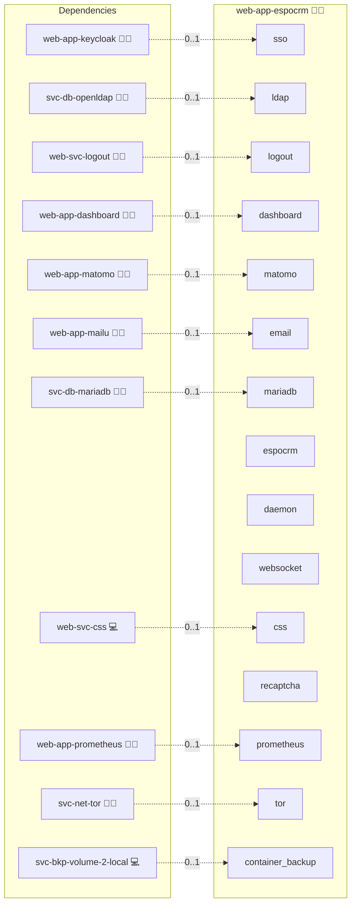

# EspoCRM

## Description

Enhance your sales and service processes with EspoCRM, an open-source CRM featuring workflow automation, LDAP/OIDC single sign-on, and a sleek, lightweight UI! 🚀💼

## Overview

This Ansible role deploys EspoCRM using Docker. It handles:

- MariaDB database provisioning via the `sys-svc-rdbms` role  
- NGINX domain setup with WebSocket and reverse-proxy configuration  
- Environment variable management through Jinja2 templates  
- Docker Compose orchestration for **web**, **daemon**, and **websocket** services  
- Automatic OIDC scope configuration within the EspoCRM container  

With this role, you'll have a production-ready CRM environment that's secure, scalable, and real-time.

## Cosmos

The diagram places EspoCRM in the Infinito.Nexus cosmos: the components it deploys (capabilities), the central services it consumes (dependencies), and its outward reach (federation and bridged external networks).


```mermaid
flowchart LR
    subgraph deps [Dependencies]
        dep_svc_bkp_volume_2_local["svc-bkp-volume-2-local 💻"]
        dep_svc_db_mariadb["svc-db-mariadb 🐳🐝"]
        dep_svc_db_openldap["svc-db-openldap 🐳🐝"]
        dep_svc_net_tor["svc-net-tor 🐳🐝"]
        dep_web_app_dashboard["web-app-dashboard 🐳🐝"]
        dep_web_app_keycloak["web-app-keycloak 🐳🐝"]
        dep_web_app_mailu["web-app-mailu 🐳🐝"]
        dep_web_app_matomo["web-app-matomo 🐳🐝"]
        dep_web_app_prometheus["web-app-prometheus 🐳🐝"]
        dep_web_svc_css["web-svc-css 💻"]
        dep_web_svc_logout["web-svc-logout 🐳🐝"]
    end
    subgraph role [web-app-espocrm 🐳🐝]
        svc_sso["sso"]
        svc_ldap["ldap"]
        svc_logout["logout"]
        svc_dashboard["dashboard"]
        svc_matomo["matomo"]
        svc_email["email"]
        svc_mariadb["mariadb"]
        svc_espocrm["espocrm"]
        svc_daemon["daemon"]
        svc_websocket["websocket"]
        svc_css["css"]
        svc_recaptcha["recaptcha"]
        svc_prometheus["prometheus"]
        svc_tor["tor"]
        svc_container_backup["container_backup"]
    end
    dep_svc_bkp_volume_2_local -. "0..1" .-> svc_container_backup
    dep_svc_db_mariadb -. "0..1" .-> svc_mariadb
    dep_svc_db_openldap -. "0..1" .-> svc_ldap
    dep_svc_net_tor -. "0..1" .-> svc_tor
    dep_web_app_dashboard -. "0..1" .-> svc_dashboard
    dep_web_app_keycloak -. "0..1" .-> svc_sso
    dep_web_app_mailu -. "0..1" .-> svc_email
    dep_web_app_matomo -. "0..1" .-> svc_matomo
    dep_web_app_prometheus -. "0..1" .-> svc_prometheus
    dep_web_svc_css -. "0..1" .-> svc_css
    dep_web_svc_logout -. "0..1" .-> svc_logout
```

Solid `1:1` edges are fixed relationships; dashed `0..1` edges are conditional (enabled only in matching deployments); red `0..0` edges are turned off in this role. Node markers show the role's deploy modes (💻 host, 🐳 compose, 🐝 swarm); ❌ marks a service that is explicitly turned off, and ⚙️ an Ansible role dependency declared in `meta/main.yml`.

## Features

- **Workflow Automation:** Create and manage automated CRM processes with ease 🛠️  
- **LDAP/OIDC SSO:** Integrate with corporate identity providers for seamless login 🔐  
- **WebSocket Notifications:** Real-time updates via ZeroMQ and WebSockets 🌐  
- **Config via Templates:** Fully customizable `.env` and `compose.yml` with Jinja2 ⚙️  
- **Health Checks & Logging:** Monitor service health and logs with built-in checks and journald 📈  
- **Modular Role Composition:** Leverages central roles for database and NGINX, ensuring consistency across deployments 🔄  

## Quick Setup

### Development

Clone, set up the workstation, and deploy EspoCRM onto the local stack:

```bash
git clone https://github.com/infinito-nexus/core.git
cd core
make onboard
make compose-deploy mode=reinstall apps=web-app-espocrm full_cycle=false
```

### Production

Run the published image to provision the inventory and deploy EspoCRM to a managed server (the mounted volume persists the inventory):

```bash
APP=web-app-espocrm
HOST=<your-server>
DOMAIN=<your-domain>
TLS_MODE=self_signed
SSH_PUBLIC_KEY="<your-ssh-public-key>"

docker run --rm -it \
  -v "$PWD/inventories:/etc/infinito.nexus/inventories" \
  -e APP="$APP" -e HOST="$HOST" -e DOMAIN="$DOMAIN" -e TLS_MODE="$TLS_MODE" -e SSH_PUBLIC_KEY="$SSH_PUBLIC_KEY" \
  ghcr.io/infinito-nexus/core/debian bash -c '
    INVENTORY=/etc/infinito.nexus/inventories/production
    infinito administration inventory provision "$INVENTORY" \
      --inventory-file "$INVENTORY/devices.yml" \
      --host "$HOST" \
      --include "$APP" \
      --vars "{\"TLS_MODE\": \"$TLS_MODE\", \"DOMAIN_PRIMARY\": \"$DOMAIN\", \"users\": {\"administrator\": {\"authorized_keys\": [\"$SSH_PUBLIC_KEY\"]}}}" &&
    infinito administration deploy dedicated "$INVENTORY/devices.yml" \
      --password-file "$INVENTORY/.password" \
      --diff -vv'
```

## AI Assistance

This role deploys no AI surface and declares no `litellm` service, because EspoCRM's open-source distribution does not ship one. At the pinned version `10.0.4`, `application/Espo/Modules` contains only `Crm`, `application/Espo/Resources/metadata/app/config.json` declares no AI key, and the release ZIP the image is built from leaves `custom/Espo/Modules` empty. The AI features (Summary, Intelligent Paste, AI Email Composer, AI formula functions) live exclusively in the commercial [Intelligence extension](https://www.espocrm.com/extensions/intelligence/), which is closed source, requires a purchased license, and is published in no `espocrm` GitHub repository. Bumping the version does not change this: the extension is documented as requiring EspoCRM 10.0.3 or greater, so newer cores stay hosts for it rather than absorbing it.

To connect EspoCRM to the platform gateway once a license is available:

1. Obtain the extension ZIP and make it reachable from the stack host at deploy time.
2. Install it inside the container with `bin/command extension --file="path/to/package.zip"`, or through Administration > Extensions, and confirm it with `bin/command extension --list`.
3. Create the AI model entry under Administration > Intelligence panel > Settings, selecting the `Custom OpenAI-compatible` provider, and enter the API credentials under Administration > Integrations.
4. Use `LITELLM_OPENAI_BASE_LOCAL_URL` as the base URL, `LITELLM_CHAT_MODEL` as the model name, and the role's own virtual key from `lookup('config', application_id, 'credentials.litellm_api_key')` as the API key. Re-add that credential to `meta/secrets.yml` and the `litellm` service to `meta/services.yml` in the same change, so the gateway mints the key only once a consumer presents it.

The field names on the provider record are only discoverable by unpacking the purchased artifact, so step 3 has to be measured against the extension actually installed rather than assumed from this note.

## Further Resources

- [EspoCRM Official Website](https://www.espocrm.com/) 🌍  
- [EspoCRM Documentation](https://docs.espocrm.com/) 📖  
- [Infinito.Nexus Project Repository](https://s.infinito.nexus/code) 🔗  

## Persona contract opt-outs

`biber` only ever exists inside EspoCRM through OIDC auto-provisioning (`ESPOCRM_CONFIG_OIDC_CREATE_USER=true`, [`templates/env.j2`](./templates/env.j2)); the role itself seeds only the administrator account. In the `services.sso.enabled: false` matrix variants that provisioning path is gone and no native `biber` user exists, so [`templates/playwright.env.j2`](./templates/playwright.env.j2) renders `PERSONA_BIBER_BLOCKED=true`. The `administrator` and `guest` personas run in every variant.

## Credits

Implemented by **[Kevin Veen-Birkenbach](https://www.veen.world)**.
Part of the [Infinito.Nexus Project](https://s.infinito.nexus/code) and maintained by [Kevin Veen-Birkenbach](https://www.veen.world).
Licensed under the [Infinito.Nexus Community License (Non-Commercial)](https://s.infinito.nexus/license).
