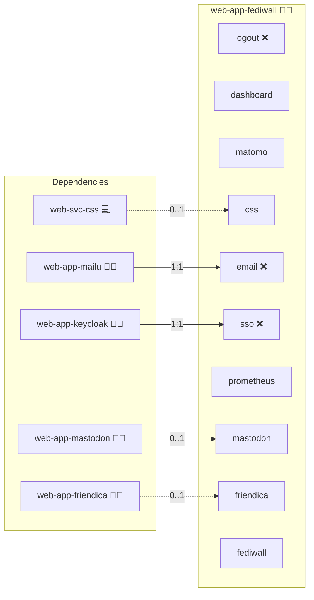

# Fediwall

## Description

**Fediwall** is a self-hosted *media wall* for the Fediverse: it follows hashtags or accounts on Mastodon-compatible servers and shows the most recent public posts in a screen-filling, self-updating masonry grid.

## Overview

Fediwall is a static, single-page web application with no backend, no database, and no user accounts. Configuration lives in a `wall-config.json` next to `index.html` and can be overridden per-visitor through URL parameters.

This role bakes the upstream release artefact into a small `nginx:alpine` image and supports **multiple walls per deployment**: every entry under [`meta/services.yml.fediwall.walls`](meta/services.yml) materializes as its own path under `https://fediwall.<DOMAIN_PRIMARY>/<slug>/` with its own baked-in `wall-config.json`. The root `/` shows a link list of all configured walls.

A wall's `config.servers` may be left empty to auto-fill with the active Mastodon-API-compatible Fediverse siblings (`web-app-mastodon`, `web-app-pixelfed`, `web-app-friendica`) that are present in the current host's `group_names`. Every other field of `wall-config.json` is read verbatim from the wall's `config` block.

## Cosmos

The diagram places Fediwall in the Infinito.Nexus cosmos: the components it deploys (capabilities), the central services it consumes (dependencies), and its outward reach (federation and bridged external networks).



Solid `1:1` edges are fixed relationships; dashed `0..1` edges are conditional (enabled only in matching deployments). Node markers show the role's deploy modes (💻 host, 🐳 compose, 🐝 swarm); ❌ marks a service that is explicitly turned off, and ⚙️ an Ansible role dependency declared in `meta/main.yml`.

## Features

- **Follow hashtags, accounts, or trends** across multiple Mastodon-compatible servers.
- **Visually pleasing**, screen-filling masonry grid that scales from tablets to LED walls.
- **Dark mode** and customizable theme.
- **Privacy-friendly**: no server-side state, no tracking, all logic runs in the browser.
- **Live customization**: viewers can override every setting through URL parameters and bookmark or share their personalized wall.
- **Multi-wall**: declare multiple purpose-built walls (per event, hashtag, account set, …) under one deployment.

## Quick Setup

### Development

Clone, set up the workstation, and deploy Fediwall onto the local stack:

```bash
git clone https://github.com/infinito-nexus/core.git
cd core
make onboard
make compose-deploy mode=reinstall apps=web-app-fediwall full_cycle=false
```

### Production

Run the published image to provision the inventory and deploy Fediwall to a managed server (the mounted volume persists the inventory):

```bash
APP=web-app-fediwall
HOST=<your-server>
TLS_MODE=self_signed
SSH_PUBLIC_KEY="<your-ssh-public-key>"

docker run --rm -it \
  -v "$PWD/inventories:/etc/infinito.nexus/inventories" \
  -e APP="$APP" -e HOST="$HOST" -e TLS_MODE="$TLS_MODE" -e SSH_PUBLIC_KEY="$SSH_PUBLIC_KEY" \
  ghcr.io/infinito-nexus/core/debian bash -c '
    INVENTORY=/etc/infinito.nexus/inventories/production
    infinito administration inventory provision "$INVENTORY" \
      --inventory-file "$INVENTORY/devices.yml" \
      --host "$HOST" \
      --include "$APP" \
      --vars "{\"TLS_MODE\": \"$TLS_MODE\", \"users\": {\"administrator\": {\"authorized_keys\": [\"$SSH_PUBLIC_KEY\"]}}}" &&
    infinito administration deploy dedicated "$INVENTORY/devices.yml" \
      --password-file "$INVENTORY/.password" \
      --diff -vv'
```

## Further Resources

- [Fediwall GitHub Repository](https://github.com/defnull/fediwall)
- [Public demo: fediwall.social](https://fediwall.social/)

## Credits

Implemented by **[Kevin Veen-Birkenbach](https://www.veen.world)**.
Part of the [Infinito.Nexus Project](https://s.infinito.nexus/code) and maintained by [Kevin Veen-Birkenbach](https://www.veen.world).
Licensed under the [Infinito.Nexus Community License (Non-Commercial)](https://s.infinito.nexus/license).
