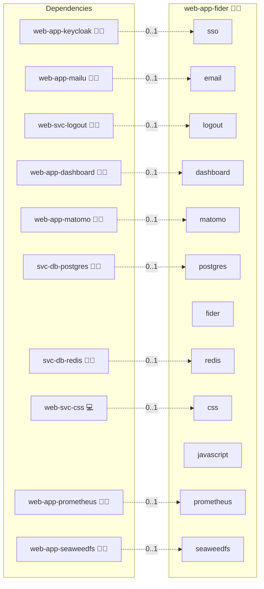

# Fider

## Description

[Fider](https://getfider.com/) is an open-source community feedback and voting platform that allows teams to collect, prioritize, and track feature requests and ideas.

## Overview

This role deploys Fider as part of the Infinito.Nexus stack using a single Docker Compose container backed by PostgreSQL. It configures SSO via Keycloak automatically on first deploy, optional email notifications via Mailu, and HTTPS via NGINX reverse proxy.

The setup tasks handle the full first-deploy bootstrap automatically:

1. **Tenant bootstrap:** calls Fider's `POST /_api/tenants` API to create the initial tenant.
2. **Admin user creation:** inserts the admin user directly into the `users` table, bypassing email verification. Idempotent via `WHERE NOT EXISTS`.
3. **Tenant activation:** sets `status=1` on the tenant row so Fider serves the public page.
4. **OIDC provider:** inserts the Keycloak provider into `oauth_providers`. Idempotent via `ON CONFLICT (tenant_id, provider) DO UPDATE`.

When a user logs in via Keycloak for the first time, Fider matches their email to the existing admin user and links the OIDC provider automatically. To enable SSO, set `services.sso.enabled: true` (the default) and ensure `OIDC.CLIENT.SECRET` is configured.

## Cosmos

The diagram places Fider in the Infinito.Nexus cosmos: the components it deploys (capabilities), the central services it consumes (dependencies), and its outward reach (federation and bridged external networks).



Solid `1:1` edges are fixed relationships; dashed `0..1` edges are conditional (enabled only in matching deployments). Node markers show the role's deploy modes (💻 host, 🐳 compose, 🐝 swarm); ❌ marks a service that is explicitly turned off, and ⚙️ an Ansible role dependency declared in `meta/main.yml`.

## Features

- **Single-container deployment** via Docker Compose.
- **PostgreSQL database:** all data including attachments stored in the database, no extra volumes needed.
- **SSO via Keycloak:** configured automatically on first deploy.
- **Email notifications** via Mailu (optional).
- **HTTPS** enforced via NGINX reverse proxy.

## Quick Setup

### Development

Clone, set up the workstation, and deploy Fider onto the local stack:

```bash
git clone https://github.com/infinito-nexus/core.git
cd core
make onboard
make compose-deploy mode=reinstall apps=web-app-fider full_cycle=false
```

### Production

Run the published image to provision the inventory and deploy Fider to a managed server (the mounted volume persists the inventory):

```bash
APP=web-app-fider
HOST=<your-server>
TLS_MODE=self_signed
SSH_PUBLIC_KEY="<your-ssh-public-key>"

docker run --rm -it \
  -v "$PWD/inventories:/etc/infinito.nexus/inventories" \
  -e APP="$APP" -e HOST="$HOST" -e TLS_MODE="$TLS_MODE" -e SSH_PUBLIC_KEY="$SSH_PUBLIC_KEY" \
  ghcr.io/infinito-nexus/core/debian bash -c '
    INVENTORY=/etc/infinito.nexus/inventories/production
    infinito administration inventory provision "$INVENTORY" \
      --inventory-file "$INVENTORY/devices.yml" \
      --host "$HOST" \
      --include "$APP" \
      --vars "{\"TLS_MODE\": \"$TLS_MODE\", \"users\": {\"administrator\": {\"authorized_keys\": [\"$SSH_PUBLIC_KEY\"]}}}" &&
    infinito administration deploy dedicated "$INVENTORY/devices.yml" \
      --password-file "$INVENTORY/.password" \
      --diff -vv'
```

## Configuration

Key settings in `meta/services.yml` and `meta/server.yml`:

| Key | Default | Description |
|-----|---------|-------------|
| `services.sso.enabled` | `true` | Automate Keycloak OIDC setup |
| `services.postgres.enabled` | `true` | Enable PostgreSQL for Fider |
| `services.postgres.shared` | `true` | Reuse the shared PostgreSQL provider |
| `services.fider.version` | `stable` | Docker image tag |
| `domains.canonical` | `fider.{{ DOMAIN_PRIMARY }}` | Public domain |
| `server.status_codes.default` | `[200, 301, 302, 405]` | Expected HTTP codes for health check (405 because Fider returns 405 on HEAD requests to `/`) |

## Further resources

- [Fider GitHub](https://github.com/getfider/fider)

## Credits

Implemented by **[Alejandro Roman Ibanez](https://github.com/AlejandroRomanIbanez)**.
Part of the [Infinito.Nexus Project](https://s.infinito.nexus/code) and maintained by [Kevin Veen-Birkenbach](https://www.veen.world).
Licensed under the [Infinito.Nexus Community License (Non-Commercial)](https://s.infinito.nexus/license).
