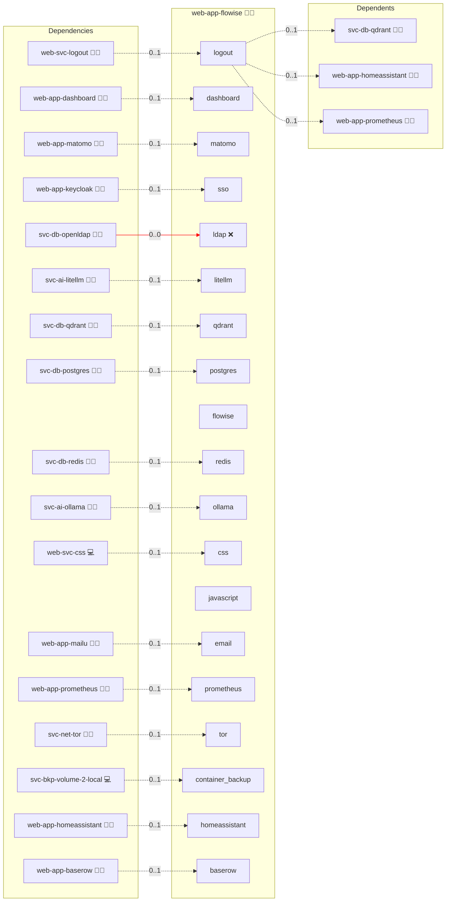

# Flowise

## Description

**Flowise** is a visual builder for AI workflows. Create, test, and publish chains that combine LLMs, your documents, tools, and vector search, without writing glue code.

## Overview

Users design flows on a drag-and-drop canvas (LLM, RAG, tools, webhooks), test them interactively, and publish endpoints that applications or bots can call. Flowise works well with local backends such as **Ollama** (directly or via **LiteLLM**) and **Qdrant** for retrieval.

## Cosmos

The diagram places Flowise in the Infinito.Nexus cosmos: the components it deploys (capabilities), the central services it consumes (dependencies), and its outward reach (federation and bridged external networks).



Solid `1:1` edges are fixed relationships; dashed `0..1` edges are conditional (enabled only in matching deployments); red `0..0` edges are turned off in this role. Node markers show the role's deploy modes (💻 host, 🐳 compose, 🐝 swarm); ❌ marks a service that is explicitly turned off, and ⚙️ an Ansible role dependency declared in `meta/main.yml`.

## Features

* No/low-code canvas to build assistants and pipelines
* Publish flows as HTTP endpoints for easy integration
* Retrieval-augmented generation (RAG) with vector DBs (e.g., Qdrant)
* Pluggable model backends via OpenAI-compatible API or direct Ollama
* Keep data and prompts on your own infrastructure
* **MCP client contract:** With an MCP server deployed alongside it, the role declares the MCP client side of the platform contract as an internal streamable-HTTP client with a read-only tool policy. The deploy registers every discovered provider in the instance-level `/api/v1/custom-mcp-servers` registry under an `infinito:` name, stores the bearer as an encrypted `CUSTOM_HEADERS` `authConfig`, authorizes each entry and compares the discovered tools against the provider's declared allowlist. `CUSTOM_MCP_PROTOCOL=sse` pins the deployment to URL-based MCP servers, so no flow can spawn a local stdio command. Reaching an MCP server whose URL resolves inside the container network requires `HTTP_SECURITY_CHECK=false` plus an `HTTP_DENY_LIST` that keeps loopback and the cloud-metadata addresses denied; both are rendered only while MCP servers are discovered, and the deploy proves the list is live by pointing a throwaway entry at each denied address. One managed Agentflow fixture calls a single named tool with fixed arguments and is executed on every deploy. Wiring a provider into a flow of your own stays an operator step.

## Quick Setup

### Development

Clone, set up the workstation, and deploy Flowise onto the local stack:

```bash
git clone https://github.com/infinito-nexus/core.git
cd core
make onboard
make compose-deploy mode=reinstall apps=web-app-flowise full_cycle=false
```

### Production

Run the published image to provision the inventory and deploy Flowise to a managed server (the mounted volume persists the inventory):

```bash
APP=web-app-flowise
HOST=<your-server>
TLS_MODE=self_signed
SSH_PUBLIC_KEY="<your-ssh-public-key>"

docker run --rm -it \
  -v "$PWD/inventories:/etc/infinito.nexus/inventories" \
  -e APP="$APP" -e HOST="$HOST" -e TLS_MODE="$TLS_MODE" -e SSH_PUBLIC_KEY="$SSH_PUBLIC_KEY" \
  ghcr.io/infinito-nexus/core/debian bash -c '
    INVENTORY=/etc/infinito.nexus/inventories/production
    infinito administration inventory provision "$INVENTORY" \
      --inventory-file "$INVENTORY/devices.yml" \
      --host "$HOST" \
      --include "$APP" \
      --vars "{\"TLS_MODE\": \"$TLS_MODE\", \"users\": {\"administrator\": {\"authorized_keys\": [\"$SSH_PUBLIC_KEY\"]}}}" &&
    infinito administration deploy dedicated "$INVENTORY/devices.yml" \
      --password-file "$INVENTORY/.password" \
      --diff -vv'
```

## Further Resources

* Flowise: [flowiseai.com](https://flowiseai.com)
* Qdrant: [qdrant.tech](https://qdrant.tech)
* LiteLLM: [litellm.ai](https://www.litellm.ai)
* Ollama: [ollama.com](https://ollama.com)

## MCP Client

Flowise consumes MCP through the *Custom MCP* tool node, which is configured
**inside a flow**. It exposes no instance-level registry API, so the role
prepares the instance and leaves the per-flow wiring to the operator.

### What the role does

| Property | Value |
| --- | --- |
| Direction | `client` |
| Transport | Streamable HTTP |
| `CUSTOM_MCP_PROTOCOL` | `sse`, so no flow can spawn a local stdio command |
| `HTTP_SECURITY_CHECK` | `false` while MCP servers are discovered |
| `HTTP_DENY_LIST` | loopback and cloud-metadata addresses stay denied |

Relaxing the security check is what lets a Custom MCP node reach a container
hostname such as `http://baserow:80/mcp`; the deny list keeps loopback and the
metadata endpoints unreachable.

### What the role does not do

It does not preregister servers and it ships no MCP Playwright spec, because
neither has an instance-level surface to act on. Selecting a server inside a flow
is a deliberate operator step.

### Default state

Off. `mcp.enabled` is false unless an MCP server role is part of the
deployment.

### How to disable

Remove the MCP server roles, or pin `mcp.enabled: false` for this role.
The security-check and deny-list overrides are then not rendered.

## Persona contract opt-outs

The shared `biber` and `administrator` persona journeys are opted out via `PERSONA_BIBER_BLOCKED` / `PERSONA_ADMINISTRATOR_BLOCKED` in `templates/playwright.env.j2`.
Flowise has no in-app OIDC adapter: SSO is an oauth2-proxy sidecar (`services.sso.flavor: oauth2`), and behind that gate Flowise still presents its own sign-in form for the single instance account seeded from `FLOWISE_USERNAME` / `FLOWISE_PASSWORD` in `templates/env.j2`.
`biber` has no Flowise identity at all, and the shared helpers only drive Keycloak forms while `services.sso` is enabled, so neither persona can reach an authenticated Flowise surface; the OIDC gate itself is covered by `files/playwright/test-oidc-login.js`.

## Credits

Implemented by **[Kevin Veen-Birkenbach](https://www.veen.world)**.
Part of the [Infinito.Nexus Project](https://s.infinito.nexus/code) and maintained by [Kevin Veen-Birkenbach](https://www.veen.world).
Licensed under the [Infinito.Nexus Community License (Non-Commercial)](https://s.infinito.nexus/license).
