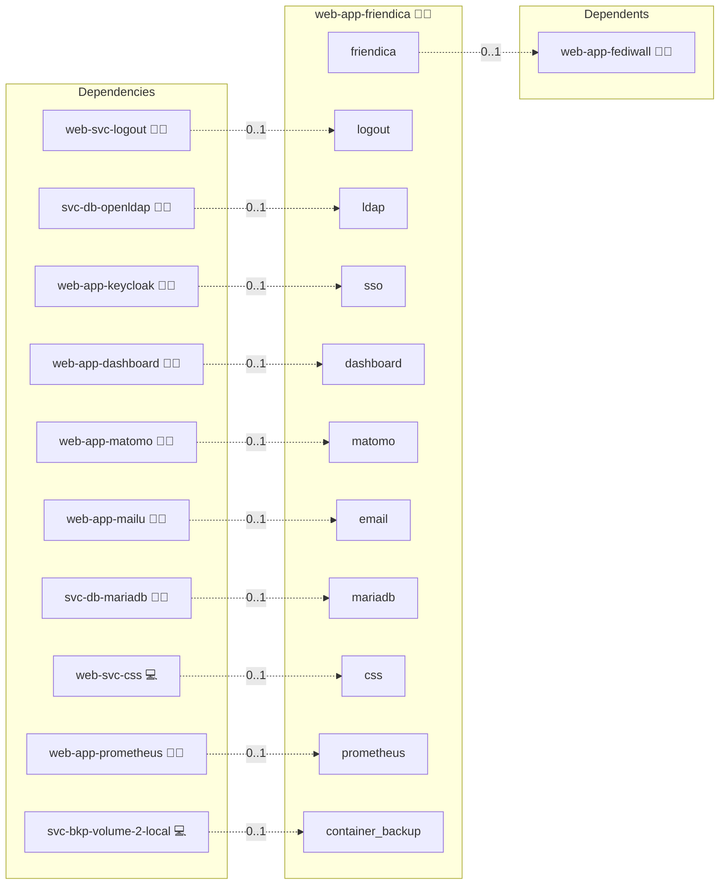

# Friendica

## Description

Empower your decentralized social networking with Friendica, a platform designed to foster communication and community building with ease. Experience a robust, containerized deployment that streamlines installation, configuration, and maintenance for your Friendica instance.

## Overview

This role deploys Friendica using Docker, managing the Friendica application container alongside a central MariaDB instance. It provides tools for full resets, manual and automatic database reinitialization, email and general configuration debugging, and autoinstall processes, all to ensure your Friendica installation remains reliable and easy to maintain.

## Cosmos

The diagram places Friendica in the Infinito.Nexus cosmos: the components it deploys (capabilities), the central services it consumes (dependencies), and its outward reach (federation and bridged external networks).



Solid `1:1` edges are fixed relationships; dashed `0..1` edges are conditional (enabled only in matching deployments). Node markers show the role's deploy modes (💻 host, 🐳 compose, 🐝 swarm); ❌ marks a service that is explicitly turned off, and ⚙️ an Ansible role dependency declared in `meta/main.yml`.

## Features

- **Decentralized Social Networking:** Facilitate a distributed network for seamless peer-to-peer communication.
- **Containerized Deployment:** Leverage Docker for streamlined setup, management, and scalability.
- **Robust Reset and Recovery Tools:** Easily reset and reinitialize both the application and its underlying database.
- **Configuration Debugging:** Quickly inspect environment variables, volume data, and configuration files to troubleshoot issues.
- **Autoinstall Capability:** Automate initial installation steps to rapidly deploy a working Friendica instance.

## Quick Setup

### Development

Clone, set up the workstation, and deploy Friendica onto the local stack:

```bash
git clone https://github.com/infinito-nexus/core.git
cd core
make onboard
make compose-deploy mode=reinstall apps=web-app-friendica full_cycle=false
```

### Production

Run the published image to provision the inventory and deploy Friendica to a managed server (the mounted volume persists the inventory):

```bash
APP=web-app-friendica
HOST=<your-server>
TLS_MODE=self_signed
SSH_PUBLIC_KEY="<your-ssh-public-key>"

docker run --rm -it \
  -v "$PWD/inventories:/etc/infinito.nexus/inventories" \
  -e APP="$APP" -e HOST="$HOST" -e TLS_MODE="$TLS_MODE" -e SSH_PUBLIC_KEY="$SSH_PUBLIC_KEY" \
  ghcr.io/infinito-nexus/core/debian bash -c '
    INVENTORY=/etc/infinito.nexus/inventories/production
    infinito administration inventory provision "$INVENTORY" \
      --inventory-file "$INVENTORY/devices.yml" \
      --host "$HOST" \
      --include "$APP" \
      --vars "{\"TLS_MODE\": \"$TLS_MODE\", \"users\": {\"administrator\": {\"authorized_keys\": [\"$SSH_PUBLIC_KEY\"]}}}" &&
    infinito administration deploy dedicated "$INVENTORY/devices.yml" \
      --password-file "$INVENTORY/.password" \
      --diff -vv'
```

## Addons

Role-level extensions are declared in [`meta/addons/`](./meta/addons/)
(unified addon contract, requirement 026):

| Addon | Mechanism | Default state | Bridges |
|-------|-----------|---------------|---------|
| `ldapauth` | `addon` | enabled whenever the `ldap` service is present (`svc-db-openldap` co-deployed) | `ldap` → `svc-db-openldap` |

`ldapauth` is the only path that materialises a `friendica.user` row, so its enablement derives directly from the `ldap` service flag.
The oauth2-proxy `sso` gate in front of the vhost is a front-door auth gate, not an addon bridge, and stays in [`meta/services.yml`](./meta/services.yml).
The LDAP login path is covered by the existing LDAP Playwright spec (requirement 018), so no addon-specific spec is added.

## Further Resources

- [Friendica Docker Hub](https://hub.docker.com/_/friendica)
- [Friendica Installation Documentation](https://wiki.friendi.ca/docs/install)
- [Friendica GitHub Repository](https://github.com/friendica/docker)
- [Relevant Issue Tracker](https://github.com/friendica/friendica/issues)

## Credits

Implemented by **[Kevin Veen-Birkenbach](https://www.veen.world)**.
Part of the [Infinito.Nexus Project](https://s.infinito.nexus/code) and maintained by [Kevin Veen-Birkenbach](https://www.veen.world).
Licensed under the [Infinito.Nexus Community License (Non-Commercial)](https://s.infinito.nexus/license).
