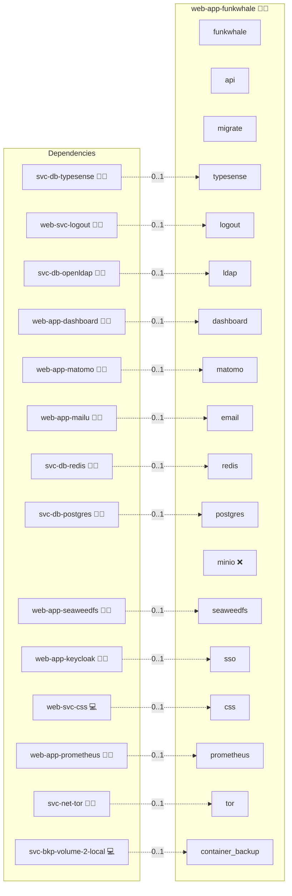

# Funkwhale

## Description

Dive into a world of rhythm and sound with [Funkwhale](https://www.funkwhale.audio/), an innovative self-hosted music sharing platform that celebrates creativity and community. Experience an energetic soundscape and seamless music streaming that amplifies your passion for tunes.

## Overview

This role deploys Funkwhale using Docker. It orchestrates multiple services (including the API, Frontend, Celery Worker, Celery Beat, and Typesense) integrating with centralized PostgreSQL and Redis services for a fully containerized music sharing experience.

## Cosmos

The diagram places Funkwhale in the Infinito.Nexus cosmos: the components it deploys (capabilities), the central services it consumes (dependencies), and its outward reach (federation and bridged external networks).



Solid `1:1` edges are fixed relationships; dashed `0..1` edges are conditional (enabled only in matching deployments); red `0..0` edges are turned off in this role. Node markers show the role's deploy modes (💻 host, 🐳 compose, 🐝 swarm); ❌ marks a service that is explicitly turned off, and ⚙️ an Ansible role dependency declared in `meta/main.yml`.

## Features

- **Self-hosted Music Sharing:** Enjoy a secure and private platform to share and stream your favorite tunes.
- **Scalable Service Architecture:** Leverage the robust orchestration of multiple services to power your Funkwhale instance.
- **Centralized Data Management:** Benefit from integrated PostgreSQL and Redis, ensuring smooth and efficient operation.
- **Customizable Media Handling:** Configure media roots, static assets, and music directories tailored to your deployment.
- **User-Friendly Configuration:** Manage your instance effortlessly using environment variables and Docker Compose templates.

## Quick Setup

### Development

Clone, set up the workstation, and deploy Funkwhale onto the local stack:

```bash
git clone https://github.com/infinito-nexus/core.git
cd core
make onboard
make compose-deploy mode=reinstall apps=web-app-funkwhale full_cycle=false
```

### Production

Run the published image to provision the inventory and deploy Funkwhale to a managed server (the mounted volume persists the inventory):

```bash
APP=web-app-funkwhale
HOST=<your-server>
TLS_MODE=self_signed
SSH_PUBLIC_KEY="<your-ssh-public-key>"

docker run --rm -it \
  -v "$PWD/inventories:/etc/infinito.nexus/inventories" \
  -e APP="$APP" -e HOST="$HOST" -e TLS_MODE="$TLS_MODE" -e SSH_PUBLIC_KEY="$SSH_PUBLIC_KEY" \
  ghcr.io/infinito-nexus/core/debian bash -c '
    INVENTORY=/etc/infinito.nexus/inventories/production
    infinito administration inventory provision "$INVENTORY" \
      --inventory-file "$INVENTORY/devices.yml" \
      --host "$HOST" \
      --include "$APP" \
      --vars "{\"TLS_MODE\": \"$TLS_MODE\", \"users\": {\"administrator\": {\"authorized_keys\": [\"$SSH_PUBLIC_KEY\"]}}}" &&
    infinito administration deploy dedicated "$INVENTORY/devices.yml" \
      --password-file "$INVENTORY/.password" \
      --diff -vv'
```

## Persona contract opt-outs

[`templates/playwright.env.j2`](./templates/playwright.env.j2) renders `PERSONA_BIBER_BLOCKED=true` and `PERSONA_ADMINISTRATOR_BLOCKED=true` in every matrix variant, because the shared persona helper cannot drive this role's sign-in in any of them. Three independent reasons, each sufficient on its own:

1. The oauth2 ACL in [`meta/services.yml`](./meta/services.yml) blacklists only `/login`, and `sys-svc-proxy` renders a blacklist as *expose everything by default, then protect the listed paths*. The helper lands on `/`, which is public, so the proxy never intercepts it and the Keycloak round trip never starts.
2. Funkwhale renders its sign-in control as a bare `div`. The helper matches `getByRole("link"|"button")`, which cannot select it, so the in-app fallback misses as well.
3. Application-level authentication is Funkwhale's own LDAP form ([`templates/env.j2`](./templates/env.j2), `LDAP_ENABLED`), not OIDC. Even a completed Keycloak round trip at the proxy leaves the Funkwhale session anonymous, so no authenticated surface appears.

Earlier revisions gated these blocks on `services.sso.enabled`, which unblocked the personas in exactly the variant where the chain still does not work.

The journey itself is not dropped. [`files/playwright/test-native-login.js`](./files/playwright/test-native-login.js) drives both personas through Funkwhale's own chain: `/login`, the Keycloak round trip whenever the proxy gates that route, then Funkwhale's own sign-in form, an authenticated-surface assertion, and sign-out back to the anonymous state. It is skipped when `services.ldap.enabled` is false, because no persona holds a Funkwhale account in that variant. The `guest` persona and the baseline assertions run unconditionally.

## Credits

Implemented by **[Kevin Veen-Birkenbach](https://www.veen.world)**.
Part of the [Infinito.Nexus Project](https://s.infinito.nexus/code) and maintained by [Kevin Veen-Birkenbach](https://www.veen.world).
Licensed under the [Infinito.Nexus Community License (Non-Commercial)](https://s.infinito.nexus/license).
