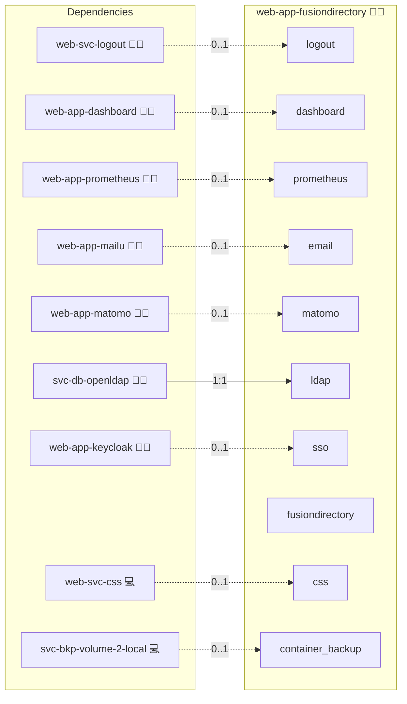

# FusionDirectory

## Description

[FusionDirectory](https://www.fusiondirectory.org/) is a web-based LDAP administration tool that manages users, groups, and other directory objects through a pluggable interface. The application stores all of its data in an external LDAP directory, which makes it the natural front-end for the project's `svc-db-openldap` backend.

## Overview

This role deploys FusionDirectory on Docker Compose against the project's central `svc-db-openldap` server. The OIDC variant gates the FusionDirectory web UI through `web-app-keycloak`'s SSO-proxy sidecar for SSO; the LDAP variant relies on the same FusionDirectory binding to `svc-db-openldap` as its primary auth path. RBAC follows the LDAP group model that FusionDirectory already understands natively, so no glue layer is required for authorisation mapping.

## Cosmos

The diagram places FusionDirectory in the Infinito.Nexus cosmos: the components it deploys (capabilities), the central services it consumes (dependencies), and its outward reach (federation and bridged external networks).



Solid `1:1` edges are fixed relationships; dashed `0..1` edges are conditional (enabled only in matching deployments). Node markers show the role's deploy modes (💻 host, 🐳 compose, 🐝 swarm); ❌ marks a service that is explicitly turned off, and ⚙️ an Ansible role dependency declared in `meta/main.yml`.

## Features

- **LDAP-native administration:** Manage users, groups, and posix attributes directly against `svc-db-openldap`.
- **Containerized deployment:** Run FusionDirectory through Docker Compose with the project's standard role-meta wiring.
- **Native OIDC SSO via SSO-proxy sidecar:** Gate the FusionDirectory web UI through the project's SSO-proxy sidecar (provided by `web-app-keycloak`) for OIDC-authenticated entry.
- **Front-proxy integration:** Publish the app through `sys-stk-front-proxy` for TLS termination and per-domain routing.

## Quick Setup

### Development

Clone, set up the workstation, and deploy FusionDirectory onto the local stack:

```bash
git clone https://github.com/infinito-nexus/core.git
cd core
make onboard
make compose-deploy mode=reinstall apps=web-app-fusiondirectory full_cycle=false
```

### Production

Run the published image to provision the inventory and deploy FusionDirectory to a managed server (the mounted volume persists the inventory):

```bash
APP=web-app-fusiondirectory
HOST=<your-server>
TLS_MODE=self_signed
SSH_PUBLIC_KEY="<your-ssh-public-key>"

docker run --rm -it \
  -v "$PWD/inventories:/etc/infinito.nexus/inventories" \
  -e APP="$APP" -e HOST="$HOST" -e TLS_MODE="$TLS_MODE" -e SSH_PUBLIC_KEY="$SSH_PUBLIC_KEY" \
  ghcr.io/infinito-nexus/core/debian bash -c '
    INVENTORY=/etc/infinito.nexus/inventories/production
    infinito administration inventory provision "$INVENTORY" \
      --inventory-file "$INVENTORY/devices.yml" \
      --host "$HOST" \
      --include "$APP" \
      --vars "{\"TLS_MODE\": \"$TLS_MODE\", \"users\": {\"administrator\": {\"authorized_keys\": [\"$SSH_PUBLIC_KEY\"]}}}" &&
    infinito administration deploy dedicated "$INVENTORY/devices.yml" \
      --password-file "$INVENTORY/.password" \
      --diff -vv'
```

## Further Resources

- [FusionDirectory Official Website](https://www.fusiondirectory.org/)

## Credits

Implemented by **[Kevin Veen-Birkenbach](https://www.veen.world)**.
Part of the [Infinito.Nexus Project](https://s.infinito.nexus/code) and maintained by [Kevin Veen-Birkenbach](https://www.veen.world).
Licensed under the [Infinito.Nexus Community License (Non-Commercial)](https://s.infinito.nexus/license).
