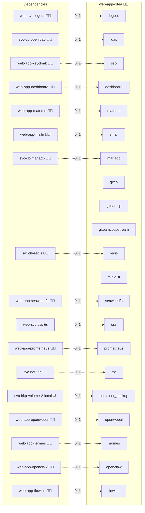

# Gitea

## Description

Boost your development journey with Gitea, a lightweight and energetic self-hosted Git service that offers efficient code collaboration, intuitive version control, and an agile environment for your projects. Ignite your coding spirit, innovate faster, and code with confidence!

## Overview

This role deploys Gitea using Docker. It automates the setup and update processes for your self-hosted Git service, integrating with a central MariaDB for the database. With functionalities for updating, recreating the container, variable management, database access, and shell access to the application container, this role streamlines the management of your Gitea instance. With Hermes Agent or OpenClaw deployed alongside it, the role adds a `gitea-mcp` sidecar and declares it as the MCP server of the deployment: an internal `/mcp` endpoint on the container network plus the Gitea personal access token that MCP clients present.

## Cosmos

The diagram places Gitea in the Infinito.Nexus cosmos: the components it deploys (capabilities), the central services it consumes (dependencies), and its outward reach (federation and bridged external networks).



Solid `1:1` edges are fixed relationships; dashed `0..1` edges are conditional (enabled only in matching deployments); red `0..0` edges are turned off in this role. Node markers show the role's deploy modes (💻 host, 🐳 compose, 🐝 swarm); ❌ marks a service that is explicitly turned off, and ⚙️ an Ansible role dependency declared in `meta/main.yml`.

## Features

- **Lightweight and Fast:** Enjoy a minimal yet efficient Git service tailored for development teams.
- **Efficient Code Collaboration:** Manage repositories and workflows with an intuitive interface.
- **Automated Updates & Re-creation:** Simplify maintenance with automated update and container recreation procedures.
- **Built-in Database Access:** Seamlessly interact with the underlying MariaDB for your Git service.
- **Integrated Configuration:** Easily manage settings via environment variables and Docker Compose templates.
- **MCP server contract:** Declares the `/mcp` path over streamable HTTP as an internal, bearer-token-authenticated endpoint served by the `svc-ai-mcp-adapter` instance running as compose service `giteamcp`. The adapter listens on container port `8080` and is never published to a host port or fronted by the public reverse proxy; clients reach it as `http://giteamcp:8080/mcp` on the container network. It is off by default and switches on only where Hermes Agent or OpenClaw is part of the deployment.
- **Adapter in front of the sidecar:** The `gitea-mcp` sidecar runs as compose service `giteamcpupstream` on the role's own network only, so nothing but the adapter reaches it. It answers `initialize` and `tools/list` to any caller because it holds no credential of its own and expects each client to supply a Gitea token per request, which makes it unsafe to expose directly. The adapter is what authenticates: a client presents the `mcp_bearer` credential and is refused with 401 otherwise, and the adapter presents the minted Gitea token upstream via `ADAPTER_UPSTREAM_KEY`.
- **Administrator-issued token:** The role mints a Gitea personal access token named `gitea-mcp` for the `administrator` account with the read-only scope set `read:repository,read:issue,read:user,read:organization,read:notification`, and persists it in the token store MCP clients read. Every deploy asks the API whether the stored token still authenticates, revokes the stale entry under that name, and re-mints when the API rejects it. The deploy fails if the fresh token is rejected too.
- **Read-only tool surface:** The sidecar runs with `-r` and `GITEA_READONLY=true`, which hides every write tool. What remains are the read categories `user`, `repository`, `issue`, `pull_request`, `search`, `file`, `branch`, `tag`, `commit` and `release`, pinned through `GITEA_SCOPES`. Making the instance mutate anything through MCP is an explicit operator change to the command line and the token scopes.
- **Handshake verified against the sidecar:** After minting, the deploy sends a JSON-RPC `initialize` to `http://giteamcpupstream:8080/mcp` with that bearer and fails when the endpoint does not answer.
- **Contract probe:** The `svc-ai-mcp-adapter` probe presents the `mcp_bearer`, asserts the served tool surface matches the pinned contract, and separately asserts that an unauthenticated `initialize` is refused with a 4xx and discloses no tool inventory.
- **Pinned tool surface:** `files/mcp/tools.json` holds the 24 read-only tools captured from the sidecar, pinned twice: `tools.schema_sha256` over the parsed mapping the adapter rehashes at startup, and `adapter.specification_sha256` over the file bytes.

## Quick Setup

### Development

Clone, set up the workstation, and deploy Gitea onto the local stack:

```bash
git clone https://github.com/infinito-nexus/core.git
cd core
make onboard
make compose-deploy mode=reinstall apps=web-app-gitea full_cycle=false
```

### Production

Run the published image to provision the inventory and deploy Gitea to a managed server (the mounted volume persists the inventory):

```bash
APP=web-app-gitea
HOST=<your-server>
TLS_MODE=self_signed
SSH_PUBLIC_KEY="<your-ssh-public-key>"

docker run --rm -it \
  -v "$PWD/inventories:/etc/infinito.nexus/inventories" \
  -e APP="$APP" -e HOST="$HOST" -e TLS_MODE="$TLS_MODE" -e SSH_PUBLIC_KEY="$SSH_PUBLIC_KEY" \
  ghcr.io/infinito-nexus/core/debian bash -c '
    INVENTORY=/etc/infinito.nexus/inventories/production
    infinito administration inventory provision "$INVENTORY" \
      --inventory-file "$INVENTORY/devices.yml" \
      --host "$HOST" \
      --include "$APP" \
      --vars "{\"TLS_MODE\": \"$TLS_MODE\", \"users\": {\"administrator\": {\"authorized_keys\": [\"$SSH_PUBLIC_KEY\"]}}}" &&
    infinito administration deploy dedicated "$INVENTORY/devices.yml" \
      --password-file "$INVENTORY/.password" \
      --diff -vv'
```

## Further Resources

- [Gitea Official Website](https://gitea.io/)
- [Gitea LDAP integration](https://docs.gitea.com/administration/authentication/)

## MCP Server

Gitea has no built-in MCP server. The role runs the project-owned `gitea-mcp`
package as a sidecar container next to Gitea and points it at the instance over
the container network. Because that sidecar authenticates nothing itself, the
`svc-ai-mcp-adapter` instance sits in front of it and is what clients address.

### Endpoint

| Property | Value |
| --- | --- |
| Transport | Streamable HTTP |
| URL | `http://giteamcp:8080/mcp` |
| Upstream | `http://giteamcpupstream:8080/mcp`, own network only |
| Exposure | `internal`, container network only |
| Implementation | `adapter` |

The image ships no `ENTRYPOINT`, so the compose `command` carries the binary
path followed by its flags.

### Auth

Clients present a Gitea personal access token as `Authorization: Bearer <token>`.
The token is issued against the administrator account and kept in
`sys-token-store`. Its `auth_subject` is `administrator`, so MCP calls run with
administrator rights rather than as the requesting user.

### Tool categories

The sidecar starts with `-r` (read-only) and a scope list covering user,
repository, issue, pull request, search, file, branch, tag, commit and release.

### Default state

Off. `mcp.enabled` is false unless `web-app-hermes` or
`web-app-openclaw` is deployed alongside.

### Public vhost

The sidecar is never routed publicly. A bearerless probe of `/mcp` on the public
vhost is answered with an SSO redirect, never with an MCP response.

### How to disable

Remove the MCP client roles from the deployment, or pin
`mcp.enabled: false` for this role. The `giteamcp` service is then not
rendered into the compose file.

## Persona contract opt-outs

The shared `biber` and `administrator` persona journeys are opted out via `PERSONA_BIBER_BLOCKED` / `PERSONA_ADMINISTRATOR_BLOCKED` in `templates/playwright.env.j2`.
As soon as an IAM source is wired, the role sets `GITEA__service__DISABLE_REGISTRATION` (`templates/env.j2`, driven by `GITEA_IAM_ENABLED` in `vars/main.yml`), and `tasks/setup/oidc.yml` registers only the auth source — never a Gitea user — so a Keycloak identity without a pre-linked Gitea account is bounced back to `/user/login`.
The opt-out lapses once the deploy provisions (or auto-links) Gitea accounts for the persona identities.

## Credits

Implemented by **[Kevin Veen-Birkenbach](https://www.veen.world)**.
Part of the [Infinito.Nexus Project](https://s.infinito.nexus/code) and maintained by [Kevin Veen-Birkenbach](https://www.veen.world).
Licensed under the [Infinito.Nexus Community License (Non-Commercial)](https://s.infinito.nexus/license).
